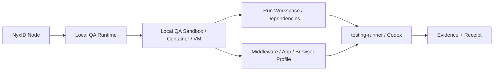
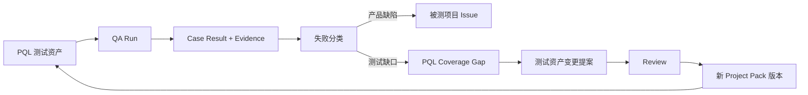
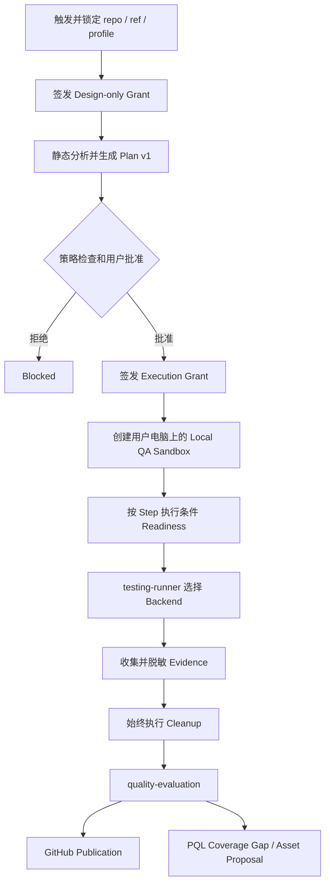

# FKST Host → NyxID → 用户本地自动化 QA 架构评审

> 评审对象：历史 v2 流程图（旧产物已清理；当前版本见 `fkst-host-nyxid-local-qa-flow.svg`）  
> 评审结论：**有条件通过（Conditional Pass）**  
> 评审日期：2026-07-24

## 1. 总体结论

这套结构的整体方向是对的，可以作为目标架构继续推进。

当前最合理的地方，是已经把以下职责拆成独立 Module：

- `fkst-hosted` monorepo：云端 QA Run、状态持久化、调度、恢复、Local QA Runtime、testing modules 和 GitHub Adapter；云端控制面与本地 Runtime 是独立部署目标。
- `NyxID`：设备身份、用户批准、安全反向连接、凭据代理和审计。
- `PQL`：跨项目测试策略、Project Pack、测试用例、Fixture、Selector 和回归资产。

另外，`testing-runner` 而不是 Codex 负责最终 Pass/Fail，这一点必须保留。

但是，这张图目前更适合作为“目标架构草案”，还不能直接按图进入生产实现。进入实现前，需要先解决六个 P0 问题：

1. 审批发生在测试计划生成之前。
2. Immutable Plan 与 Codex 可以补充测试步骤互相冲突。
3. 用户电脑上的 Local QA Sandbox 边界不够明确。
4. Cleanup 仍然是普通顺序节点，而不是失败补偿阶段。
5. Artifacts 与 Publication 之间缺少质量裁决层。
6. PQL 只有测试资产输入，没有结果驱动的学习回路。

## 2. 当前结构中建议保留的设计

### 2.1 `workflow-qa` 覆盖完整 QA Run

`workflow-qa` 应该继续作为外层 Durable Orchestration，覆盖：

```text
Create
→ Design
→ Approval
→ Dispatch
→ Prepare
→ Readiness
→ Execute
→ Evidence
→ Cleanup
→ Quality Evaluation
→ Publish
→ Finalize
```

它不应该被实现成执行链中的一个同步测试命令。

### 2.2 NyxID 不执行测试

NyxID 的边界应保持为：

- 设备身份。
- 用户批准。
- Node 主动建立的反向连接。
- 一次性 Grant 传输。
- 凭据代理。
- 状态与 Receipt 回传。
- 审计记录。

NyxID 不应该：

- Checkout 代码。
- 安装依赖。
- 启动被测服务。
- 运行 Shell 或测试框架。
- 调用 Codex 执行测试。
- 判断测试是否通过。

### 2.3 Local QA Runtime 作为本地控制宿主

Local QA Runtime 负责：

- 校验 Grant。
- 锁定 QA Run。
- 启动本地 FKST Session。
- 管理进程组、端口、超时和取消。
- 调用 Deterministic、Browser 或 Codex Backend。
- 收集状态、Receipt 和 Artifact 指针。

实际的 PR 代码、构建、服务、Shell、浏览器和 Agent Action 在用户电脑上的 Local QA Sandbox 中执行，由 Local QA Runtime 管理 Sandbox、Workspace、进程组、端口、权限范围、超时、取消和 Cleanup。

### 2.4 PQL 保持为跨项目测试资产层

PQL 继续负责：

- Product Map。
- Test Catalog。
- Project Pack。
- Regression Suite。
- 用户真实场景。
- Fixture。
- Selector。
- Scope Policy。
- Coverage Gap。
- 测试资产变更提案。

PQL 不负责通用调度、设备通道、本地进程管理和 GitHub 发布。

## 3. P0 阻断问题

### P0-01：审批对象与审批时序不正确

当前图中的顺序近似为：

```text
Create → Approve → Dispatch → Prepare → Design
```

但用户批准时，`testing-design` 还没有生成最终 Structured Plan。用户无法知道真正会执行哪些命令、访问哪些文件、连接哪些网络以及使用哪些 Secret。

建议改为双阶段授权。

#### Design-only Grant

只允许：

- Checkout 指定 commit。
- 读取规定范围的源码。
- 静态分析。
- 读取 PQL 测试资产。
- 生成 Structured Plan。

不允许：

- 启动服务。
- 执行测试。
- 调用高权限 Shell。
- 访问长期 Secret。
- 写入被测项目仓库。

#### Execution Grant

在 Plan 生成并经过策略检查和用户批准后签发。

它必须绑定：

- `plan_digest`
- `commit`
- `device_id`
- `project_profile`
- `policy_digest`
- 允许的文件范围
- 允许的网络目的地
- Secret 引用
- 资源上限
- TTL
- 防重放 nonce

### P0-02：Immutable Plan 与 Codex 补充步骤冲突

如果 Plan 是不可变的，Codex 就不能直接向正在执行的 Plan 增加新 Step。

建议采用 Plan Amendment：

```text
Plan v1
→ Codex 发现需要新动作
→ 返回 amendment_required
→ 生成 Plan v2 和结构化 Diff
→ 重新经过策略检查和审批
→ 撤销旧 Grant
→ 使用新 Grant 从 Checkpoint 恢复
```

Codex 可以在已批准 Step 的 action envelope 内探索，但以下变化必须重新审批：

- 增加测试 Step。
- 扩大文件读写范围。
- 增加网络目的地。
- 引入新的 Secret。
- 提升执行权限。
- 增加明显的资源预算。

### P0-03：Local QA Sandbox 边界不明确

目标模型是在用户电脑上创建 Local QA Sandbox。它是本地执行环境，不是云端远程 Sandbox；PR 代码、依赖、Middleware、App、Shell、浏览器和 Agent Action 都在其中运行。

NyxID Grant 证明“用户允许这次执行”；Local QA Runtime 负责创建 Sandbox，并把批准范围落实到具体挂载、命令、网络、Secret 和资源生命周期。

建议结构：



Local QA Sandbox 至少要保证：

- 只挂载本次 Run 的 Workspace、effective ref 和必要目录。
- 默认不能读取用户主目录和未批准的本地文件。
- 网络目的地、Secret 和资源预算写入 Structured Plan 与 Execution Grant。
- Secret 按 Step 注入，Run 结束后撤销临时授权。
- 限制 CPU、内存、磁盘、进程数和总时长。
- Local QA Runtime 统一管理 Sandbox、进程组、端口和子进程。
- 取消、超时或断线时终止整个 Sandbox 或本次 Run 的进程组。
- Cleanup 只清理本次 Run 的 Sandbox 和登记资源。
- 外部 Fork PR 默认没有长期凭据和生产环境访问权。

### P0-04：Cleanup 必须是补偿阶段

Cleanup 不能依赖 Execute 和 Artifacts 成功。

以下状态都应该触发 Cleanup：

- `Succeeded`
- `Failed`
- `Cancelled`
- `TimedOut`
- `Lost`
- Runtime 重启后的恢复流程

Cleanup 必须：

- 幂等。
- 可单独重试。
- 不误删其他 Run 的资源。
- 输出 Cleanup Receipt。
- 记录未能释放的残留资源。

建议将结果拆开：

```yaml
execution_outcome: passed | failed | cancelled | timed_out | lost
cleanup_outcome: succeeded | partially_succeeded | failed
evidence_outcome: sufficient | partial | insufficient
publication_outcome: published | partially_published | failed | skipped
final_quality_outcome: pass | fail | blocked | inconclusive
```

### P0-05：增加 `quality-evaluation`

当前结构从 `test-artifacts` 基本直接进入 `test-publication`。

建议增加：

```text
test-artifacts
→ quality-evaluation
→ test-publication
```

`quality-evaluation` 负责：

- 聚合 Case Result。
- 检查覆盖率和 Scope 要求。
- 判断 Evidence 是否充分。
- 分类失败原因。
- 生成最终 Quality Gate。
- 决定是否创建产品缺陷 Issue。
- 生成稳定的 dedup key。

至少区分：

```text
product_defect
test_failure
coverage_gap
environment_failure
flaky
policy_blocked
insufficient_evidence
```

不能把所有测试失败都直接转成被测项目的产品 Issue。

### P0-06：补齐 PQL 学习回路

建议形成下面的闭环：



自动生成的新用例应该先保持 `design_only`，经过 Review 后才能升级为可执行测试资产。

## 4. P1 重要问题

| 编号 | 问题 | 建议 |
|---|---|---|
| P1-01 | `browser-readiness` 固定出现在主执行链 | 按 Structured Plan 条件启用；API、CLI、单元测试不准备浏览器 |
| P1-02 | Artifact Pointer 语义不明确 | 定义本地保留、加密上传、访问权限、脱敏和过期策略 |
| P1-03 | PR 实际测试版本不明确 | 明确测试 head SHA、GitHub merge ref，还是 base + head 临时合并 |
| P1-04 | 数据契约缺少兼容规则 | Plan、Grant、Receipt、Evidence 都包含 `schema_version` 和 `content_digest` |
| P1-05 | Run 只有单一 Failed 状态 | 拆分执行、清理、证据、发布和最终质量结果 |
| P1-06 | workflow 定义和运行承载边界不够明确 | workflow 定义可在 testing packages；持久状态、调度与恢复由 hosted 承载 |
| P1-07 | Publication 可能重复创建对象 | Check、Comment 和 Issue 使用稳定 dedup key，并支持幂等重试 |

## 5. 建议后的完整流程



其中：

- `testing-runner` 选择 Deterministic、Browser 或 Codex Backend。
- Codex 只执行 Plan 已批准的 action。
- 新 Step 通过 Plan Amendment 重新审批。
- Cleanup 从任何终态触发。
- Publication 只消费 `quality-evaluation` 的结构化结论。

## 6. 核心数据契约

| 对象 | 生产者 | 主要消费者 | 关键字段 |
|---|---|---|---|
| `RunSpec` | `fkst-hosted` | workflow / Local Runtime | repo、base/head/effective ref、profile、policy、device、trigger |
| `StructuredPlan` | `testing-design` | Policy Gate / Runner | steps、backend、capabilities、assertions、dependencies、digest |
| `Grant` | 授权服务 | NyxID / Local Runtime | scope、plan digest、device、TTL、nonce、approval ref |
| `ReadinessReceipt` | Environment Factory | workflow / Runner | resources、endpoint、health、attempt、digest |
| `CaseResult` | `testing-runner` | Artifacts / Quality | case id、assertions、outcome、duration、evidence refs |
| `EvidenceManifest` | `test-artifacts` | Quality / Publication | type、digest、redaction、location、retention、access scope |
| `CleanupReceipt` | Environment Factory | workflow | resource inventory、released、residual、retryable |
| `QualityEvaluation` | `quality-evaluation` | Publication / PQL | classification、coverage、evidence status、gate、reason codes |
| `CoverageGap` | PQL Feedback Adapter | PQL Review | source run、gap type、affected scope、proposal、evidence refs |

所有对象建议统一包含：

```yaml
schema_version: "..."
content_digest: "..."
run_id: "..."
created_at: "..."
producer_version: "..."
```

## 7. Issue 路由建议

| 分类 | 发布位置 | 条件 |
|---|---|---|
| 产品缺陷 | 被测项目 Issue | 可复现、Evidence 充分、已排除环境和测试资产问题 |
| 测试代码或 Fixture 问题 | PQL Issue | 测试实现、数据或 Oracle 错误 |
| 覆盖缺口 | PQL Issue / Asset Proposal | 真实场景、Scope、Suite 或 Case 缺失 |
| Selector 失效 | PQL Issue | 页面结构变化导致 UI 用例失效 |
| Flaky | PQL Flaky 记录 | 同一 commit、环境和输入下结果不稳定 |
| 环境失败 | Run 记录；重复发生时建平台 Issue | 构建环境、网络、设备或依赖不可用 |
| 权限阻断 | Run 记录 | Grant 或 Policy 不允许继续执行 |
| Evidence 不足 | Run 记录 + PQL Gap | 缺少日志、Trace、截图或结构化断言 |

## 8. 仓库职责建议

### `ChronoAIProject/fkst-hosted` monorepo

#### `apps/hosted-control-plane`

- QA Run 持久状态。
- Durable Orchestration 承载。
- 调度与设备选择。
- Checkpoint、恢复、取消、终态和 TTL。
- Policy Gate 协调。
- NyxID Cloud Adapter。
- GitHub Adapter。

#### `apps/local-qa-runtime`

- NyxID Node Adapter 与 Grant 校验。
- 本地 Run Lock 和 Checkpoint 恢复。
- Local QA Sandbox 生命周期。
- Workspace、进程组、端口、超时和取消。
- Runner Backend 承载。
- Evidence、ReadinessReceipt 和 CleanupReceipt 回传。

#### `packages/`

- `qa-contracts`：RunSpec、Plan、Grant、Receipt、Evidence 和 Outcome Schema。
- `workflow-qa`：完整 QA Run 的 workflow 定义。
- `testing-design`：生成 Structured Plan。
- `testing-runner`：Backend 选择与结构化断言。
- `backend-contract`：Deterministic、Browser 和 Codex Backend Interface。
- `environment-factory`：Prepare、Readiness 和 Cleanup Interface。
- `test-artifacts`：Case Result、EvidenceManifest 与脱敏。
- `quality-evaluation`：失败分类与最终质量裁决。
- `test-publication`：Publication Plan、Issue 路由和 dedup key。

`apps/hosted-control-plane` 与 `apps/local-qa-runtime` 必须独立构建和发布；testing packages 不得依赖任何 `apps/` 实现。

### `ChronoAIProject/NyxID`

- 设备身份。
- 用户批准。
- 安全反向连接。
- Grant 传输。
- 凭据代理。
- 审计记录。

### `YueZh127/product-quality-loop`

- Product Map。
- Project Pack。
- Test Catalog。
- Regression Suite。
- Fixture 和 Selector。
- Scope Policy。
- Coverage Gap。
- 测试资产变更提案与 Review。

## 9. 建议实施顺序

### M0：冻结数据契约

- 定义 RunSpec、Plan、Grant、Receipt、Evidence 和 Outcome Schema。
- 增加版本、摘要和兼容策略。

### M1：完成用户本地 Sandbox 执行边界

- 双阶段授权。
- Local QA Sandbox / Container / VM。
- Workspace 挂载、网络、文件、Secret 和资源策略。
- Sandbox、进程组、端口、超时、取消和 Cleanup 管理。
- 外部 Fork PR 默认无敏感凭据。

### M2：完成可恢复编排

- Checkpoint。
- 幂等 effect。
- Compensation Cleanup。
- 独立 Outcome。
- 断线和 Runtime 重启恢复。

### M3：完成质量裁决与发布

- `quality-evaluation`。
- 失败分类。
- Evidence Gate。
- GitHub 去重发布。
- 产品 Issue 与 PQL Issue 路由。

### M4：完成 PQL Loop

- Coverage Gap。
- Asset Change Proposal。
- Review Gate。
- Project Pack 新版本。
- 下一轮回归验证。

## 10. 上线前验收清单

- [ ] 审批发生在 Plan 生成之后。
- [ ] Execution Grant 与 `plan_digest`、commit、设备和权限范围绑定。
- [ ] Plan 变化会暂停 Run，并走 Amendment 和重新审批。
- [ ] PR 代码、Shell、浏览器和 Codex Action 都在用户电脑上的 Local QA Sandbox 内执行。
- [ ] Sandbox 默认不能读取用户主目录和未批准的本地文件。
- [ ] Local QA Runtime 只清理本次 Run 的 Sandbox、进程、端口和临时资源。
- [ ] 外部 Fork PR 默认不获得长期凭据和生产环境访问权。
- [ ] 未声明的挂载、命令、网络和 Secret 使用会触发 Policy Block 或 Plan Amendment。
- [ ] 任意失败、超时、断线和取消都会触发 Cleanup。
- [ ] Cleanup 幂等、可重试，并输出 Cleanup Receipt。
- [ ] `testing-runner` 而不是 Codex 决定 Pass/Fail。
- [ ] `quality-evaluation` 能区分产品、测试、环境、Flaky、Policy 和 Evidence 问题。
- [ ] GitHub Publication 可重试、可去重并完成脱敏。
- [ ] 产品缺陷进入被测仓库，测试缺口进入 PQL。
- [ ] PQL Gap 可以经过 Review 形成新的 Project Pack 版本。
- [ ] 同一 Run 重放不会重复启动服务、上传 Artifact 或创建 Issue。

## 11. 最终建议

建议批准这张图所表达的分层方向，但把 P0-01 至 P0-06 设为进入生产实现的强制 Gate。

第一批实现应优先完成：

1. 数据契约。
2. 双阶段授权。
3. 用户本地 Sandbox 隔离与进程管理。
4. 可恢复编排。
5. 补偿式 Cleanup。
6. 质量裁决。

之后再接 GitHub 自动发布和 PQL 自动学习。

完成这些调整后，这套系统才不只是“把测试任务从云端派发到用户电脑”，而是一条具备授权可验证、本地 Sandbox 执行可隔离、状态可恢复、结果可裁决、缺口可学习的长期自动化质量 Loop。
