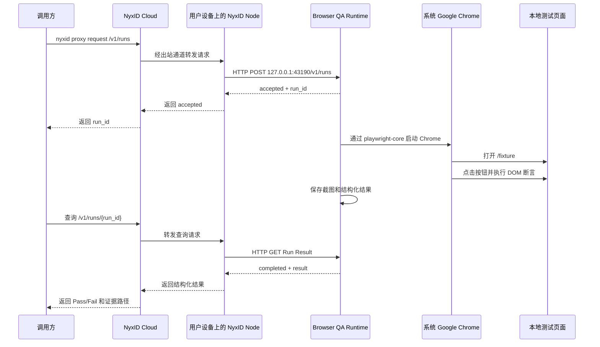

# NyxID 到本地 Google Chrome 最小闭环验证报告

> 验证日期：2026-07-24  
> 验证状态：**PASS**  
> 验证性质：最小纵向闭环 POC，不代表完整 FKST QA 已实现

## 1. 验证目标

本次验证聚焦于整个 FKST QA 架构中最关键、最不确定的一段：

> 云端请求能否通过 NyxID Node 到达用户电脑，并让用户电脑上的本地程序启动真实 Google Chrome 完成自动化测试，再把结构化结果沿原路径返回。

本次目标不是一次性完成 `workflow-qa`、PQL、Environment Factory、Codex CLI、质量裁决和 GitHub 发布等完整能力，而是先确认“云端触发本地浏览器测试”这条基础链路在技术上能够跑通。

## 2. 验证结论

结论：**可以实现，并且已经真实跑通。**

已经验证的准确链路为：

```text
NyxID Cloud
→ NyxID Node
→ 已运行的本地 Browser QA Runtime
→ 系统 Google Chrome
→ 浏览器点击与 DOM 断言
→ 截图和结构化结果
→ NyxID Node
→ 调用方
```

这里需要特别区分：

- NyxID Node 负责把 Cloud 请求转发到用户电脑上的本地 HTTP 服务。
- Browser QA Runtime 负责接收 Run 请求、启动 Chrome、执行测试和生成结果。
- Google Chrome 是本次实际被控制的浏览器。
- NyxID Node 本身不启动 Chrome，也不执行测试断言。
- 本次没有使用 NyxID Oracle、IDE 或 ego-browser。

## 3. 实际测试链路

```text
nyxid proxy request
    ↓
NyxID Cloud
    ↓
NyxID Node v0.8.0
    ↓
Node Proxy
    ↓
用户电脑 http://127.0.0.1:43190
    ↓
Browser QA Runtime
    ↓
系统 Google Chrome（playwright-core）
    ↓
本地测试页面
    ↓
点击 + DOM 断言 + 截图
    ↓
结构化 Run Result
    ↓
NyxID Node
    ↓
调用方
```

对应的数据流如下：



## 4. 各组件在 POC 中的职责

| 组件 | 本次实际职责 | 不负责的内容 |
| --- | --- | --- |
| 调用方 | 发起 `nyxid proxy request`，创建 Run 并查询结果 | 不直接访问用户本地端口 |
| NyxID Cloud | 找到目标 Node，将请求路由到在线设备 | 不启动本地服务和 Chrome |
| NyxID Node | 维持出站连接，将请求转发到 `127.0.0.1:43190`，再回传响应 | 不执行测试、不作 Pass/Fail 判断 |
| Browser QA Runtime | 暴露 Run API，启动 Chrome，执行测试，保存截图，产生结果 | 不承担 Cloud 调度和设备身份管理 |
| Google Chrome | 打开页面并执行真实浏览器交互 | 不负责工作流编排 |
| 本地测试页面 | 提供被点击和断言的最小 Fixture | 不是实际 FKST 产品或 Middleware |

## 5. 测试环境

```text
操作系统：macOS
NyxID CLI：v0.8.0
Node profile：fkst-qa-poc
Node ID：39d9b872-822f-43ae-b03d-97140816186f
Node 状态：online / dispatchable
Runtime 地址：http://127.0.0.1:43190
浏览器：系统 Google Chrome
浏览器驱动：playwright-core
```

本地 Runtime 仅监听 loopback 地址，没有向公网开放本地端口。

## 6. POC 接口

Browser QA Runtime 提供了以下最小接口：

```text
GET  /health
GET  /fixture
POST /v1/runs
GET  /v1/runs/{run_id}
```

其中：

- `GET /health` 用于确认 Cloud、Node 和本地 Runtime 的连通性。
- `POST /v1/runs` 创建异步测试任务，立即返回 `accepted` 和 `run_id`。
- `GET /v1/runs/{run_id}` 用于轮询 Run 状态并读取最终结果。
- `GET /fixture` 是本次测试使用的最小本地页面。

本次在 NyxID 中创建的临时 node-routed custom service 为：

```text
Service slug：fkst-browser-poc-20260724
Endpoint：http://127.0.0.1:43190
Node ID：39d9b872-822f-43ae-b03d-97140816186f
Auth method：none（仅用于 POC）
```

## 7. 实际执行过程

1. 将 NyxID CLI 升级到 `v0.8.0`，并完成登录。
2. 创建隔离的 `fkst-qa-poc` Node profile。
3. 启动 NyxID Node，并确认 Cloud 侧状态为 `online / dispatchable`。
4. 在用户电脑上启动只监听 `127.0.0.1:43190` 的 Browser QA Runtime。
5. 创建绑定该 Node 的临时 NyxID custom service。
6. 通过 `nyxid proxy request` 调用 `/health`，验证 Cloud 到本地 Runtime 的链路。
7. 通过 NyxID Proxy 调用 `POST /v1/runs`，获取 `run_id`。
8. Runtime 在后台通过 `playwright-core` 启动系统 Google Chrome。
9. Chrome 打开本地 `/fixture` 页面，并验证页面标题。
10. Chrome 真实点击 `Run browser assertion` 按钮。
11. 测试断言 `#status` 文本变为 `Browser QA Passed`。
12. 测试断言 `body[data-state]` 变为 `passed`。
13. Runtime 保存 `1280 x 800` 截图，然后关闭 Chrome。
14. 调用方通过同一个 NyxID Proxy 查询 Run，取回结构化终态。

## 8. 有效 Run 与结果

```text
Run ID：qa_64ee74e9-1c4d-45c6-b6e2-516dff9a9b37
Status：completed
Browser：Google Chrome via playwright-core
Page title：FKST Browser QA Fixture
Final status：Browser QA Passed
Final state：passed
Execution time：约 2.5 秒
```

返回的核心结果为：

```json
{
  "run_id": "qa_64ee74e9-1c4d-45c6-b6e2-516dff9a9b37",
  "status": "completed",
  "result": {
    "passed": true,
    "browser": "Google Chrome via playwright-core",
    "page_title": "FKST Browser QA Fixture",
    "final_status": "Browser QA Passed",
    "final_state": "passed",
    "target_url": "http://127.0.0.1:43190/fixture"
  }
}
```

## 9. 验证证据

- [POC Runtime 源码](poc/nyxid-browser-loop/server.mjs)
- [POC 使用和复现说明](poc/nyxid-browser-loop/README.md)
- [POC 原始结果报告](poc/nyxid-browser-loop/RESULT.md)
- [Google Chrome 测试截图](poc/nyxid-browser-loop/artifacts/qa_64ee74e9-1c4d-45c6-b6e2-516dff9a9b37.png)

NyxID Node 最终记录的请求指标为：

```text
total_requests：5
success_count：4
error_count：1
success_rate：80%
last_success_at：2026-07-24T07:28:02Z
```

其中一次错误来自初始路由配置，不是 Chrome 自动化测试失败。

## 10. 测试中发现的 NyxID 行为

临时 custom service 配置为 `auth_method=none`，但当前 Node Agent 仍要求本地 credential store 中存在与 service slug 对应的路由条目。

缺少该条目时，Cloud 请求能够到达 Node，但 Node 返回：

```text
HTTP 502 Bad Gateway
Node credential missing
```

添加本地 loopback 路由条目后，健康检查、创建 Run 和查询 Run 结果全部成功。

这个行为意味着生产实现至少需要二选一：

1. 为 Local QA Runtime 配置真实的本地认证凭据，并由 NyxID Node 在本地注入。
2. 在 NyxID 中明确并修正 `auth_method=none` 的 node-routed service 行为，使无凭据的本地服务无需伪造 credential 条目。

生产环境更建议采用第一种方案，因为 Local QA Runtime 具备启动进程和浏览器的高权限能力，不应暴露为无认证本地控制接口。

## 11. 本次验证已经证明的内容

- NyxID Cloud 可以通过在线 Node 到达用户电脑上的 loopback-only Runtime。
- 用户电脑不需要开放公网入站端口。
- NyxID Node 可以作为 Cloud 到用户私有设备的 Execution Transport Adapter。
- 已经运行的 Local QA Runtime 可以接收经 NyxID 转发的 Run 请求。
- Local QA Runtime 可以在不打开 IDE 的情况下启动并控制系统 Google Chrome。
- Chrome 可以执行真实页面访问、点击、DOM 断言和截图。
- Runtime 可以使用 `POST /v1/runs + GET /v1/runs/{id}` 的异步 Run 协议。
- 结构化 Pass/Fail 结果可以沿 NyxID Node Proxy 原路返回调用方。
- 这条执行链路不依赖 NyxID Oracle。

## 12. 本次验证尚未证明的内容

- NyxID Node 能在 Runtime 尚未运行时自动安装或启动 Runtime。
- Environment Factory 能启动独立 Middleware 或真实产品 App。
- Run Workspace、独立 Git Worktree、端口分配和进程组隔离。
- 用户批准、Design-only Grant 和 Execution Grant。
- PQL 测试策略和资产能够生成 Structured Plan。
- Local QA Runtime 能够非交互式调用 Codex CLI。
- Environment Factory 能够在成功、失败、超时和取消后可靠 Cleanup。
- Artifact 上传、质量裁决和 GitHub Check Run、Issue 或 PR Comment 发布。
- `fkst-hosted workflow-qa` 能够完成端到端编排、重试和恢复。

所以，本次验证不能被描述为“完整 FKST QA 已经实现”，只能得出以下结论：

> `NyxID Cloud → NyxID Node → 已运行的 Local QA Runtime → Google Chrome → 浏览器断言 → 结果回传` 已经真实跑通。

## 13. 清理状态

验证结束后已经删除或停止以下临时资源：

- 临时 NyxID custom service。
- 临时 Node routing credential。
- `fkst-qa-poc` profile-aware Node daemon。
- 临时 Cloud Node 记录。
- Local Browser QA Runtime。
- 本地 `127.0.0.1:43190` 监听端口。

为了保留复测能力，以下内容仍保存在项目中：

- POC Runtime 源码。
- Node.js 依赖和锁文件。
- POC 原始结果报告。
- Google Chrome 测试截图。

## 14. 对 FKST QA 架构的意义

这次 POC 验证了 NyxID 作为可选本地执行传输通道的可行性，但没有改变各组件的职责边界：

```text
fkst-hosted / workflow-qa
    负责云端编排、状态、审批、重试和发布

NyxID Cloud + Node
    负责安全到达用户私有设备并转发请求

FKST Local QA Runtime
    负责本地 Run 生命周期和执行控制

Environment Factory
    负责 Prepare、启动服务、Readiness 和 Cleanup

Codex CLI / Deterministic Executors
    负责按照测试计划执行测试

Google Chrome
    负责真实浏览器交互

PQL
    负责跨项目测试策略和测试资产
```

NyxID 应保持为可选的 `Execution Transport Adapter`。同一套 Local QA Runtime 在其他场景下也可以通过本机 CLI、企业 Device Agent 或自托管通道触发，不应把 FKST QA 的核心执行协议绑定到 NyxID 私有接口。

## 15. 下一步最小闭环

下一次验证应把 Runtime 内置的 `/fixture` 替换为由 Environment Factory 临时启动的独立 App 或 Middleware，并覆盖完整的本地生命周期：

```text
NyxID
→ Local QA Runtime
→ 创建隔离 Run Workspace
→ Environment Factory: Prepare
→ 启动 App / Middleware
→ Readiness Check
→ 启动 Google Chrome
→ 执行测试与截图
→ Environment Factory: Cleanup
→ 返回结构化结果
```

建议该阶段优先补齐：

1. Local QA Runtime 的安装、注册、启动和健康检查机制。
2. 带作用域、过期时间和用户批准的 Execution Grant。
3. Environment Factory 的进程组、端口、日志和 Cleanup 管理。
4. 固定 schema 的 Run、Step、Artifact 和 Result 协议。
5. Codex CLI 非交互调用及其权限、超时和输出约束。
6. Artifact 上传以及 GitHub Check Run 或 PR Comment 发布。
