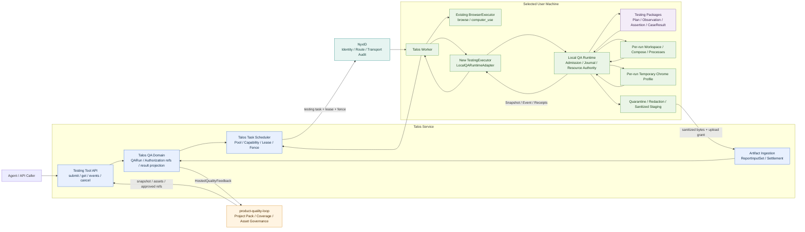
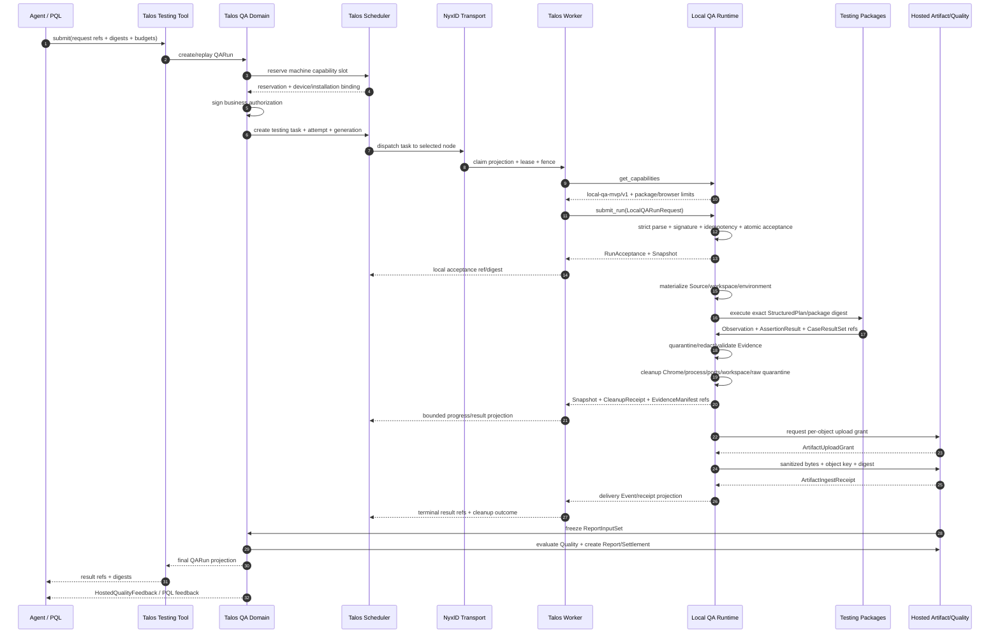
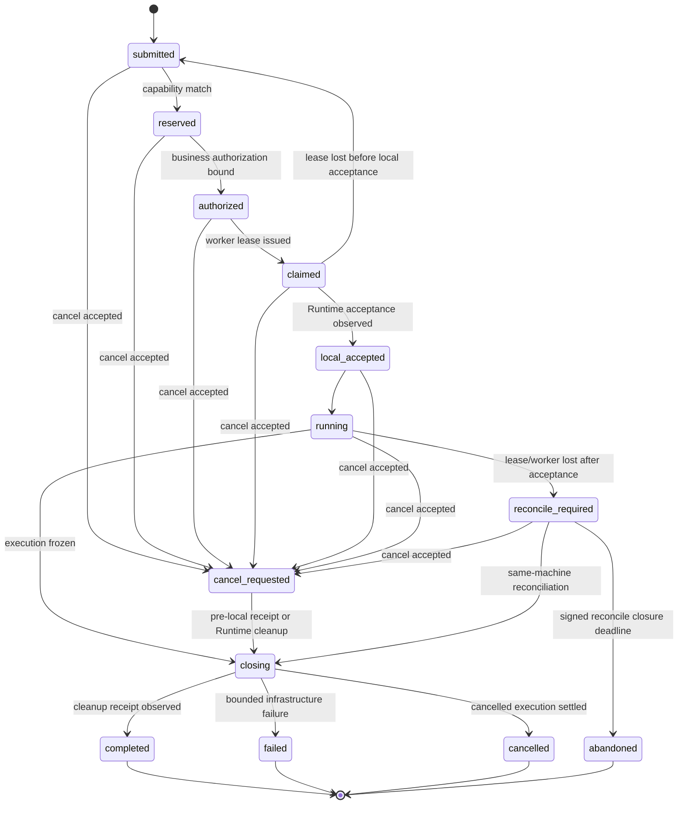
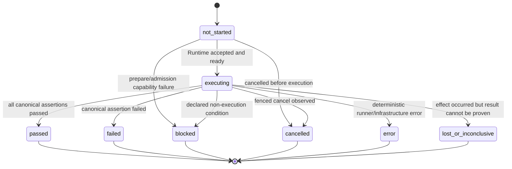
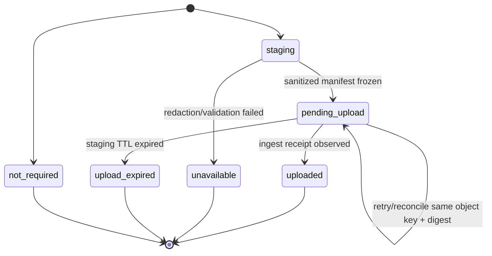
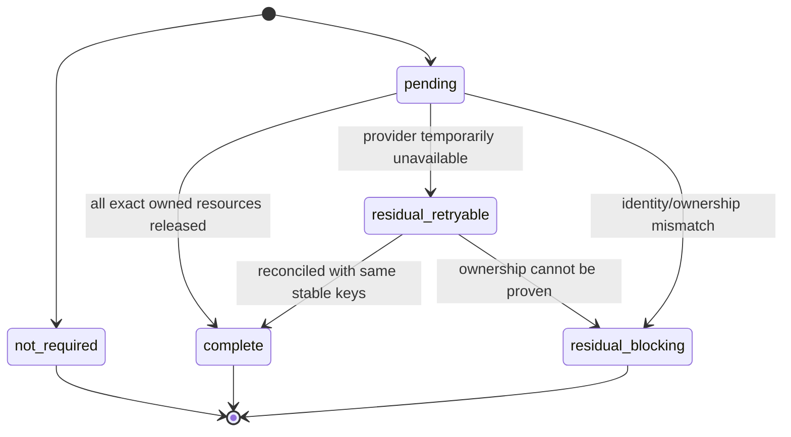

# Talos 有界 Testing 工具与本地 QA 执行架构设计提案

> **状态：** 目标架构提案（Draft for Review）
>
> **基线日期：** 2026-08-14
>
> **外部观察基线：** `talos-worker v0.4.1`
>
> **权威范围：** 本文定义 Talos Testing 集成的目标职责分配、接口、状态与失败语义、安全不变量、迁移顺序和验收门槛。本文不表示 Talos `testing` task kind、Testing Tool、Local QA Runtime 生产执行链路或跨 Repo contract 已经实现。
>
> **证据边界：** 本地可以精确核对 Talos worker bundle 的 claim/action/result/auth 行为，但没有 Talos Control Plane 源码、OpenAPI、source map 或 plugin SDK。因此本文对 worker v0.4.1 的描述属于实现事实；对 Control Plane 的 `testing` API、Scheduler 和持久化模型属于目标设计。
>
> **冲突处理：** 本文不修改既有规范和 fixture。若本文发现既有文档或 fixture 语义冲突，则同时记录当前事实和目标语义，并把契约修正列为后续独立工作。
>
> **Hosted 边界状态：** Hosted Authorization Authority 和最小 ArtifactStore 仍为 **Proposed / Decision pending**，详见 [Hosted Authorization 与 MVP ArtifactStore 边界决策](hosted-authorization-artifact-boundary-decision.zh-CN.md)。本文对它们只定义候选 contract，不表示 owner、storage provider 或 production authority 已被接受。

---

## 1. 执行摘要

本提案把现有 Testing 相关能力设计为 **Talos 服务上的第一方有界 Tool**，而不是把 Talos 改造成通用插件平台。

目标形态是：

1. Agent、Hosted QA 或 product-quality-loop 通过一个严格版本化的 `testing` Tool 提交 QA Run。
2. Talos 负责机器池、能力匹配、任务投递、lease、heartbeat、cancel 和 worker fencing。
3. Talos worker 对 `kind=testing` 使用专用 `TestingExecutor` / `LocalQARuntimeAdapter`，不经过当前 Browser autonomous planner，也不执行任意 shell。
4. Local QA Runtime 继续负责本机 admission、执行 Journal、Source/workspace、Compose/process/port、临时 Chrome、Evidence、取消恢复和精确 Cleanup。
5. Testing Packages 继续负责 Structured Plan 解释、typed actions、Observation、AssertionResult、CaseResult 和 EvidenceManifest 领域语义。
6. Proposed Hosted Authorization/Artifact domain（owner 为 Decision pending）负责候选 Artifact ingestion；Hosted Quality、Report、Publication 和 Settlement 保留为 Post-MVP。
7. product-quality-loop 继续负责 Project Pack、测试资产、coverage、review、promotion 和执行反馈闭环，不进入机器执行热路径。
8. NyxID 只负责受认证 transport、route identity 和 transport audit，不拥有 QA state、业务授权、Pass/Fail 或 Artifact bytes。

本设计明确禁止：

- generic plugin ABI；
- arbitrary shell、arbitrary filesystem 或用户提供任意可执行代码；
- 把测试 spec 塞进自由文本 `goal`；
- `testing` 不可用时降级为 `browse`、`computer_use` 或 shell；
- 使用 Talos 跨任务持久 Chrome Profile 执行确定性回归测试；
- 由 Talos、Chrome、NyxID 或 Local QA Runtime 推断最终产品 Quality。

---

## 2. 当前事实、PoC 与目标设计

### 2.1 证据等级

| 标记 | 含义 |
| --- | --- |
| **当前实现事实** | 可以从固定源码、fixture、测试或已运行 PoC 直接定位 |
| **Walking skeleton / PoC** | 单个组件或最小链路已经运行，但未形成生产闭环 |
| **目标设计** | 本文规定需要实现的行为，不得描述为已完成 |
| **外部未验证** | 依赖当前不可见的 Talos Control Plane 源码/OpenAPI，只能形成待实现合同 |

### 2.2 Talos worker v0.4.1 当前实现事实

本地安装的 `talos-worker v0.4.1` 是 Node.js + Playwright Chromium bundle。可确认：

- claimed task 只有 `kind="browse" | "computer_use"`；
- `interaction` 只有 `autonomous | interactive`；
- 两种 kind 都进入同一个固定 `BrowserExecutor`，runtime 当前不按 kind dispatch；
- action union 只有 screenshot、click、type、key、scroll、wait、navigate、structured DOM 提取和 a11y node action；
- 没有 shell、filesystem、test runner、plugin registry、manifest loader 或稳定 exported executor API；
- autonomous planner 当前只执行一次 screenshot，然后以空 findings 完成；
- artifact client 只登记 `name/content_type/size/uri`，没有 bytes upload、digest、redaction、retention 和 receipt，而且 worker runtime 没有调用它；
- BrowserExecutor 使用固定 `profilePath` 的 persistent context，cookie/local storage 可以跨 task 保留；
- worker 已有 claim、lease token、heartbeat、cancel detection、interactive action polling、terminal result 和后台 daemon 生命周期。

以上事实来自本机外部快照：

- `/Users/hayleewang/.talos-worker/versions/worker-v0.4.1/talos-worker.js`
- `/Users/hayleewang/.talos-worker/versions/worker-v0.4.1/WORKER.md`
- `/Users/hayleewang/.claude/skills/talos-worker-setup/SKILL.md`

这些本地路径不是本仓库发布契约，后续必须由 Talos owning repo 的稳定 tag、OpenAPI 和 conformance tests 替代。

### 2.3 当前本地 QA 实现事实

现有实现和审计显示，Local QA 方向已经有可复用组件：

- loopback API；
- SQLite WAL acceptance/replay/event 基础；
- Browser adapter、独立 Chrome process/profile/download 基础；
- framed worker capability protocol；
- bounded atomic Evidence stager；
- Rust/TypeScript contract validator 和组件测试。

但当前 production 路径仍属于 walking skeleton：真实 executor spine、Source/workspace、Compose/readiness、完整 admission/auth、资源 ownership、cancel/restart reconcile、CleanupReceipt、upload reconcile 和完整 `Host → Worker → Chrome → CaseResult → Evidence → Cleanup` command 尚未闭合。

详见：

- [Local QA Host MVP 设计](../local-qa-host-mvp-design.zh-CN.md)
- [Local QA Runtime 实现缺口](../repo-gaps/local-qa-runtime-gap-analysis.zh-CN.md)
- [跨 Repo 缺口总结](../cross-repo-gap-analysis.zh-CN.md)

### 2.4 Testing Packages 当前事实

Testing Packages 已有可复用的真实能力：

- `testing-design.v1`；
- `testing-runner.module-test-plan.v1`；
- `testing-structured-plan.v2`；
- direct argv、CLI/HTTP execution、Local PEP 和 replay；
- Browser controller 和 typed browser actions；
- Environment Factory、cleanup、artifact summary 和 publication 基础。

当前主要缺口不是测试算法，而是跨 route 的公共合同没有唯一化：CLI/HTTP、旧 executor、Browser route 和 publication 仍存在不同 result shape、私有 validator 和重复 translation。

详见 [Testing Packages 缺口分析](../repo-gaps/fkst-packages-testing-gap-analysis.zh-CN.md)。

### 2.5 product-quality-loop 当前事实

固定参考版本：[`e540127388981c0d3e3249f7a43aa569350abb5b`](https://github.com/YueZh127/product-quality-loop/commit/e540127388981c0d3e3249f7a43aa569350abb5b)。

当前 PQL 已包含 Project Pack、PR/changed-file 分类、确定性 test plan、coverage review、test asset design/review、report 和 FKST handoff 等能力，形态是 CLI / Agent Skill / JSON artifacts，而不是常驻 HTTP 执行服务。

本设计不把 PQL 移入 Talos worker。PQL 通过版本化输入和反馈 projection 接入 Testing Tool。

---

## 3. 目标、非目标与设计不变量

### 3.1 目标

1. 给 Agent 和 Hosted QA 提供一个稳定、有界、异步的 Testing Tool。
2. 复用 Talos 的 machine pool、capability placement、lease、heartbeat、cancel 和 worker daemon。
3. 保留 Local QA Runtime 对本地执行状态和资源的唯一权威。
4. 保留 Testing Packages 对测试语义和 Case 判定的唯一权威。
5. 统一 Observation、AssertionResult、CaseResultSet 和 EvidenceManifest。
6. 把控制流、Artifact bytes、Quality/Report 和 PQL feedback 分离。
7. 对 lease loss、cancel、worker crash、Runtime crash、uncertain action、cleanup residual 和 upload lost-ack 给出确定规则。
8. 允许未来在不扩大 v1 攻击面的前提下增加 API、performance、mobile 或 hardened executor。

### 3.2 非目标

v1 不负责：

- 通用 worker plugin 平台；
- 动态下载并执行任意插件；
- arbitrary shell、任意 argv、任意 Compose YAML 或任意 filesystem path；
- 通用桌面级 computer-use；
- 使用个人 Chrome、默认浏览器 Profile 或跨 Run persistent profile；
- 在 Talos worker 内实现完整 PQL、Quality 或 Report；
- 在 NyxID 中增加 QA scheduler、QA state、Pass/Fail 或 Artifact 协议；
- 把 future `hardened_untrusted_code` Profile 伪装成已经实现；
- 因机器不支持 Hardened Profile 而自动降级到 MVP；
- 自动修复产品代码、自动 merge 或自动修改产品 GitHub。

### 3.3 不变量

| 不变量 | 约束 |
| --- | --- |
| 单一事实权威 | 每类事实只能有一个 authoritative owner，其他模块只保存 projection/receipt |
| Strict contract | 外部 payload 必须 bounded、版本化、拒绝未知字段和未知 discriminator |
| Digest-bound input | Source、Plan、Environment、Package、Policy 和 Artifact 都使用 exact ref + digest |
| 先接受后副作用 | Runtime acceptance 原子持久化后才允许创建 workspace/process/Chrome 等资源 |
| 执行与交付分离 | 测试执行冻结后，Artifact delivery 可以 repair，但不得重跑测试 |
| Cleanup 不等云端 | 本地执行资源先清理；只允许 sanitized staging 在 bounded TTL 内等待 |
| 不猜测通过 | action 成功、Chrome 退出、transport 200 或 Talos completed 都不等于 Case passed |
| 不猜测重跑 | acceptance 后出现不确定性时保持 lost/inconclusive，禁止自动转移或重跑 |
| Secret 不进入 transport body | v1 `secret_refs=[]`；未来也只能传引用/授权，不传明文 |
| Unsupported fail closed | contract major、profile、capability、package digest 或 policy 不支持时拒绝 |

---

## 4. 调整后的系统上下文



### 4.1 部署和逻辑边界

Talos Service 可以把 Testing Tool、QA Domain 和 machine task scheduler 部署在同一控制面，但必须保持以下逻辑边界：

- `QARun` 是 QA 业务对象；
- `TestingTask` 是一次机器执行 attempt；
- 一个 QARun 可以因 acceptance 前失败产生多个 dispatch attempts；
- Runtime acceptance 后，当前 attempt 不得自动切换到另一机器；
- Quality、Report 和 Settlement 不能由 generic task status 推导；
- Artifact bytes 不进入 task heartbeat、NyxID response 或 worker findings。

### 4.2 权威表

| 事实 | 唯一权威 | 其他模块只能保存 |
| --- | --- | --- |
| QARun operational state、输入冻结、snapshot/events/cancel | Talos Testing Tool / QA Domain | task/run projection、receipt |
| pool、machine capability、task placement、lease、fence | Talos Task Scheduler | worker-local lease cache |
| 业务执行授权 | Proposed Hosted Authorization Authority（Decision pending） | signed authorization ref/digest |
| transport caller/node/machine identity | NyxID + Talos enrollment binding | verified transport context |
| 本地 acceptance、resource ownership、attempt、cleanup | Local QA Runtime Journal | Snapshot/Event/CleanupReceipt |
| Case Pass/Fail/Blocked/Error | Testing Packages | canonical CaseResultSet |
| Evidence 安全投影和本地 staging | Local QA Runtime | EvidenceManifest ref/digest |
| 长期 Artifact | Proposed Hosted ArtifactStore（Decision pending） | ArtifactIngestReceipt |
| Final Quality | Hosted `quality-evaluation` | QualityEvaluation ref/digest |
| Report / Publication | Hosted Report/Publication | ReportRecord/PublicationReceipt |
| Final Settlement | Hosted Settlement module | settlement ref/status projection |
| Test asset Review / Promotion | product-quality-loop | snapshot/asset/receipt refs |

---

## 5. 各模块功能调整

### 5.1 调整总表

| 模块 | 保留/复用 | 必须新增或调整 | 删除/降级 | 明确禁止 |
| --- | --- | --- | --- | --- |
| Agent-facing Testing Tool | 异步 task/control 模式 | strict request、capability、submit/get/events/cancel、bounded result refs | 自由文本 goal 驱动执行 | arbitrary shell/plugin/filesystem |
| Talos Control Plane / Scheduler | pool、tags、capacity、lease、heartbeat、cancel、worker enrollment | `testing` kind、QARun/Task mapping、durable placement、reservation、fence、repair queues、schema/OpenAPI | 把 current generic findings 当 QA result | 解释 Assertion、判 Quality、用 NyxID failover 选设备 |
| Talos worker | daemon、outbound polling、auth、claim、heartbeat、shutdown | discriminated task dispatch、TestingExecutor、cancel abort、bounded result、cleanup receipt projection | autonomous screenshot planner 用于 testing | generic plugin registry、任意命令、直接加载 Testing Package |
| Local QA Host / Runtime MVP | loopback API、SQLite WAL、Browser adapter、worker protocol、Evidence stager | 真实 executor spine、Source/workspace、Compose/readiness、admission/auth、OwnedHandle、cancel/restart/cleanup/upload | synthetic PassingExecutor、固定 digest、无 effect 的伪状态 | 最终 Quality、长期 Report、个人 Chrome、模糊资源删除 |
| Hardened Runtime | 目标 Profile、Ledger/EffectGate/VM/Recovery 设计 | 后续独立实现并通过 capability gate | 不作为 v1 首发依赖 | 降级到 MVP、声称已有强隔离 |
| Testing Packages | design、StructuredPlan、CLI/HTTP、Browser controller、Local PEP、replay | canonical results/evidence、PQL input adapter、Hosted projection、route 一致性 | 私有 result shape、publication 私有 validator、第三套 translation | 设备选择、本地资源 ownership、最终 Quality |
| Proposed Hosted Artifact/Quality/Report（MVP Artifact owner pending） | generic storage、publication/aggregate 基础 | grant/ingest receipt、ReportInputSet、QualityEvaluation、ReportRecord、repair/settlement | GitHub aggregate report 作为最终系统记录 | 接收 raw observation、触发本地测试重跑；不得把 pending owner 写成已接受 authority |
| product-quality-loop | Project Pack、classification、coverage、asset design/review | Snapshot/Asset/Proposal/Decision/PromotionReceipt、Hosted feedback ingestion | 直接执行或直接调用 Host | 设备选择、签发运行授权、拥有 Runtime state |
| NyxID | identity、node-pinned route、transport audit、local credential adapter | 新 operation/scope 的 transport exposure，不新增 QA domain | transport 200 作为 RunAcceptance | QA scheduler、QA state、Pass/Fail、Artifact bytes |

### 5.2 Agent-facing Testing Tool

#### 5.2.1 逻辑操作

| Tool operation | 目标语义 | 是否改变状态 |
| --- | --- | --- |
| `talos.testing.get_capabilities` | 返回版本化、非敏感、bounded testing capability | 否 |
| `talos.testing.submit` | 创建或幂等重放 QARun，异步返回 acceptance | 是 |
| `talos.testing.get` | 返回当前业务 Snapshot 和最新执行/delivery projection | 否 |
| `talos.testing.events` | 使用稳定 cursor 返回 bounded Event batch | 否 |
| `talos.testing.cancel` | 接受取消意图，返回 CancelAck；不承诺已停止或已清理 | 是 |

建议 REST 映射仅作为目标合同示例：

```text
GET  /v1/tools/testing/capabilities
PUT  /v1/tools/testing/runs/{run_id}
GET  /v1/tools/testing/runs/{run_id}
GET  /v1/tools/testing/runs/{run_id}/events?after_sequence=N&limit=M
POST /v1/tools/testing/runs/{run_id}:cancel
```

Talos owning repo 可以采用不同路由，但必须保持相同语义、idempotency 和 bounded response。

#### 5.2.2 Request 示例

```json
{
  "schema_version": "talos.testing-tool-request/v1",
  "run_id": "qa_run_01...",
  "idempotency_key": "project:revision:plan:policy",
  "goal": "human-readable display text only",
  "project_pack_snapshot": {
    "ref": "artifact://pql/project-pack-snapshot/...",
    "digest": "sha256:..."
  },
  "source": {
    "repository_id": "repo_...",
    "exact_revision": "0123456789abcdef...",
    "object_ref": "artifact://source/...",
    "digest": "sha256:..."
  },
  "structured_plan": {
    "schema_version": "testing-structured-plan.v2",
    "ref": "artifact://plans/...",
    "digest": "sha256:..."
  },
  "environment_profile": {
    "ref": "artifact://environments/...",
    "digest": "sha256:..."
  },
  "execution_profile": "local_qa_agent_mvp",
  "testing_packages": [
    {
      "package_id": "testing-runner",
      "version": "exact-version",
      "digest": "sha256:...",
      "capability": "browser.case-result.v2"
    }
  ],
  "placement_requirements": {
    "policy_ref": "talos-policy://testing/local-qa-agent-mvp/v1",
    "policy_digest": "sha256:...",
    "required_capabilities": [
      "browser.chromium",
      "testing_runtime.local-qa-mvp/v1"
    ]
  },
  "policy": {
    "network_scope": "environment_owned_loopback_exact_origins",
    "environment_port_handle_policy": {
      "source": "current_run_owned_handles",
      "allow_unowned_loopback": false
    },
    "allowed_actions": ["navigate", "click", "type", "key", "scroll", "screenshot", "extract-structured-dom"],
    "allowed_evidence_media": ["image/png", "application/vnd.fkst.testing.sanitized+json"],
    "secret_refs": [],
    "budgets": {
      "wall_time_ms": 600000,
      "max_actions": 200,
      "max_events": 2000,
      "max_screenshots": 20,
      "max_screenshot_bytes": 5242880,
      "max_json_evidence_bytes": 1048576,
      "max_total_artifact_bytes": 52428800,
      "max_error_bytes": 4096
    }
  },
  "artifact_policy": {
    "staging_ttl_seconds": 86400,
    "redaction_policy_ref": "policy://redaction/v1",
    "redaction_policy_digest": "sha256:..."
  },
  "authorization": {
    "ref": "authorization://local-qa-request/...",
    "digest": "sha256:..."
  }
}
```

Caller 只能提交 schema allowlist 内的 bounded capability requirements 或 Talos-owned policy ref/digest，不能提交 `pool_id`、`machine_id`、tag expression、priority override 或 placement fallback。Talos Scheduler 根据 caller/project policy、capacity 和 worker capability 自行选择 pool/machine；PQL 与 NyxID 路由均不能覆盖该决定。

Loopback origin 不能用 `http://127.0.0.1:*` 之类通配符。Environment ready 后，Runtime 必须从当前 Run inventory 中 active Environment-owned port handles 推导 exact origins，并把逻辑 service alias 解析到这些 origin；Browser Provider 只允许访问这些 concrete ports。释放、替换或 fence handle 会立即撤销对应 origin，且禁止扫描或探测用户在其他 loopback port 上运行的服务。

示例数值不是最终默认值。R0 contract freeze 必须把所有 bounds 固定成 machine-readable 常量和 fixture。

#### 5.2.3 Tool response 原则

Tool response 只返回：

- acceptance / replay / rejection；
- QARun ID、Task/Attempt refs；
- bounded Snapshot/Event；
- CaseResultSet、EvidenceManifest、CleanupReceipt、QualityEvaluation、ReportRecord 的 opaque ref + digest；
- bounded SafeError。

禁止 inline 返回：

- screenshot base64；
- raw DOM、trace、network body 或 download；
- cookie、header、Secret、argv；
- 本地绝对路径；
- 完整 runner.log；
- 未经 redaction 的错误堆栈。

### 5.3 Talos Control Plane / Scheduler

#### 5.3.1 新增 `testing` task kind

当前 worker schema 是：

```text
{id, kind: browse|computer_use, goal, interaction: autonomous|interactive}
```

目标必须改为 strict discriminated union，而不是只给 enum 增加字符串：

```text
TalosTask = BrowserTask | TestingTask

TestingTask:
  schema_version = talos.testing-task/v1
  id
  kind = testing
  interaction = managed
  qa_run_id
  dispatch_attempt_id
  generation
  source_ref/digest
  plan_ref/digest
  environment_ref/digest
  package_set_ref/digest
  policy_ref/digest
  authorization_ref/digest
  expected_runtime_capability
  deadline
```

`goal` 可以保留作 UI 展示，但禁止参与 authorization、runner selection 或本地 effect。

#### 5.3.2 Durable placement

Talos/Hosted 必须新增或冻结：

1. durable QARun；
2. device slot 和 testing capability inventory；
3. capability/profile matching；
4. 先 reservation，再签发绑定 reservation/device/installation 的业务授权；
5. dispatch attempt ledger；
6. `task_id + attempt_id + lease_id + generation + fence_token` 绑定；
7. bounded retry policy；
8. Snapshot/Event cursor；
9. execution repair、artifact repair、publication repair 分离的 queue。

NyxID failover 不能代替 QA placement。NyxID route 成功也不能创建本地执行授权。

#### 5.3.3 Lease 与 fence

- lease 只代表当前 worker 可以为当前 attempt 报告进度；
- fence token 防止 stale worker 在 lease 失效后更新状态或创建新 effect；
- Runtime acceptance 必须绑定 `qa_run_id`、attempt、lease claim ref、machine、worker、generation、fence 和 request digest；MVP Host 通过配置好的 Talos current-claim resolver 在 admission 时验证 claim 签名、TTL、未撤销状态与 current fence，不能只信任 worker 提交的 opaque digest；
- acceptance 前 lease 丢失，可以创建新 attempt；
- acceptance 后 lease 丢失，进入 `reconcile_required`，禁止自动转移到另一 machine；
- 同一个 QARun 永远不能有两个 execution-bearing accepted attempts；
- heartbeat 不能承载 Artifact bytes 或完整 CaseResult。

### 5.4 Talos worker

#### 5.4.1 Dispatcher

目标 worker 结构：

```text
WorkerDaemon
  ├─ BrowserTaskRuntime
  │    └─ BrowserExecutor
  └─ TestingTaskRuntime
       └─ TestingExecutor
            └─ LocalQARuntimeAdapter
```

必须按 task kind dispatch。`testing` 不能进入当前 `ScriptedPlanner`，也不能复用一次 screenshot + empty findings 的完成行为。

#### 5.4.2 `TestingExecutor` 责任

负责：

- 验证 worker 认识 task contract major；
- 检查本机已广告 `local-qa-mvp/v1` capability；
- 把 task projection 映射为严格的 `LocalQARunRequest`；
- 调用 Runtime get-capabilities / submit / get-events / cancel；
- 转发 heartbeat 所需的 bounded progress；
- 在 cancel、lease loss 或 deadline 时发出 fenced cancel；
- 上传或返回 immutable result/receipt refs；
- terminal submission 幂等；
- daemon shutdown 时停止接收新 testing task，并与 Runtime reconcile 已接受 Run。

不负责：

- checkout、build、Compose、Chrome、Testing Package 执行；
- 解释 Plan；
- 计算 Assertion/CaseResult；
- 直接读取 raw Evidence；
- 保存 Secret；
- 生成 Quality/Report；
- 动态加载 executor plugin。

#### 5.4.3 Cancel 与 in-flight effect

当前 v0.4.1 只通过 heartbeat error 发现 cancel，且无法中止已经开始的 Playwright action。`testing` v1 必须补充：

- task-scoped AbortSignal；
- deadline timer；
- cancel/fence 变化在每个 effect 前重检；
- 可中断 Runtime request 和本地 polling；
- 已进入 Runtime 的 effect 由 Runtime authority 取消和清理，worker 不越权 kill 未识别进程；
- cancel acknowledgement 与 terminal cleanup receipt 分离。

### 5.5 Local QA Runtime / Host

#### 5.5.1 保留的五操作模型

Runtime 对 worker adapter 保持小接口：

```text
get_capabilities
submit_run
get_run
get_run_events
cancel_run
```

Talos Testing Tool 和 Local Runtime 可以使用不同 wire schema，但必须通过显式 adapter 转换，禁止共享同一自由结构 payload。

#### 5.5.2 必须继续实现的模块

| Runtime module | 必须完成的职责 |
| --- | --- |
| Ingress/Auth Adapter | local credential、signed business authorization、strict parse、canonical digest、idempotency |
| Run Coordinator | 推进 state 和独立 outcomes；不生成最终 Quality |
| SQLite Journal | request、run、event、resource、runner/upload/cleanup attempts |
| Source/Workspace Manager | exact Source Object、per-run workspace、不得修改用户原 checkout |
| Environment Controller | 受控 Compose/environment、typed readiness、端口 ownership |
| Testing Packages Adapter | 选择固定 package digest、传递 Plan、验证 canonical result |
| Browser Controller | 独立 process tree、temporary profile、downloads、allowed-origin enforcement |
| Evidence Stager | quarantine、safe projection、redaction、media/schema/size/digest validation |
| Cleanup Manager | exact OwnedHandle reconcile、释放 execution resources、记录 residual |
| Upload Client | per-object grant、upload、lost-ack reconcile、ingest receipt |

#### 5.5.3 必须移除或降级的行为

- production `PassingExecutor`；
- 固定 request digest；
- 没有真实 effect 却推进 `staging_evidence/uploading`；
- Browser process `READY` 就当 Case 成功；
- Host 自己生成 `report_impossible` 最终结论；
- MVP 路径启用尚未实现的 Hardened launcher/supervisor/guest-agent shell；
- 模糊扫描宿主资源并批量删除；
- 复用 Talos persistent profile 或用户个人 Chrome session。

#### 5.5.4 本地 admission

顺序必须保持：

1. 验证 Talos worker → Runtime local credential 和 executable identity；
2. strict bounded parse；
3. 验证 task/run contract、profile、package/capability 和 digest 格式；
4. canonicalize request projection，计算 request digest；
5. 解析 authorization 中的 signed Talos lease claim ref，通过配置好的 current-claim resolver 验证 claim 未 supersede，并验证 Hosted business authorization 与 caller/node/device/machine/worker/attempt/lease/generation/fence/source/plan/environment/package/policy 绑定；resolver 不可用时 fail closed；
6. 在 single-writer Journal 查询 run/idempotency/digest；
7. 原子消费 nonce、占用 active slot、写 acceptance 和 sequence=1 Event；
8. transaction commit 后才创建本地资源。

Talos claim 成功不等于 Runtime acceptance。Runtime acceptance 失败必须保持零本地资源副作用。

### 5.6 Future Hardened Runtime

`hardened_untrusted_code` 保留为独立未来 Profile：

- Rust Supervisor / Ledger；
- EffectGate / Local PEP；
- per-phase VM；
- Warden；
- Secret Broker；
- signed recovery；
- stronger browser/network containment。

Talos capability 必须区分：

```text
local-qa-mvp/v1
hardened-untrusted-code/v1
```

请求 Hardened Profile 而机器不支持时必须在 placement/admission 前拒绝，不能静默降级到 MVP。

### 5.7 Testing Packages

#### 5.7.1 保留的 source of truth

保留并继续复用：

- `testing-design.v1`；
- `testing-runner.module-test-plan.v1`；
- `testing-structured-plan.v2`；
- `agentic-browser-execution.v1`；
- direct argv / Local PEP / replay；
- typed Browser actions 和 Host-authoritative completion；
- Environment Factory 和 cleanup contract。

迁移期间必须指定唯一实现 source of truth。若迁入 `fkst-hosted/packages/*`，不得在 `fkst-packages-testing` 继续维护第二套可变实现。

#### 5.7.2 必须新增 canonical contracts

```text
pql.testing-design-input-set.v1
testing-observation.v1
testing-assertion-result.v1
testing-case-result.v2
testing-case-result-set.v2
testing-evidence-manifest.v1
talos.testing-run-snapshot/v1
talos.testing-event-page/v1
hosted.talos-terminal-handoff-receipt/v1
```

所有 CLI、HTTP 和 Browser route 必须输出同一字段集合：

- case/asset/requirement identity；
- execution mode；
- status 和 classification；
- observations；
- assertion results；
- evidence refs；
- started/completed/duration；
- non-execution reason；
- bounded error；
- Plan ref/digest。

#### 5.7.3 必须删除或降级

- route-specific result shape；
- publication 私有 CaseResult validator；
- 第三套 translation；
- `test-artifacts.summary.v1` 作为 canonical EvidenceManifest；
- GitHub/filesystem aggregate report 作为系统最终 Report；
- runner 输出最终 `product-defect` Quality 结论。

Testing Packages 只判断执行事实和 Case outcome。最终 Quality 由 Hosted `quality-evaluation` 计算。

### 5.8 Proposed Hosted Artifact / Quality / Report（Artifact owner Decision pending）

本节只定义候选 contract。Hosted Authorization 和最小 ArtifactStore 的 owner、storage provider 及 Runtime 认证边界被 maintainer 接受前，不能把本节内容视为已冻结的 authority 或 production implementation。

必须新增：

- `ArtifactUploadGrant`；
- `ArtifactUploadReceipt`；
- `ArtifactIngestReceipt`；
- immutable `ReportInputSet`；
- `QualityEvaluation`；
- `ReportRecord`；
- `PublicationReceipt`；
- `RunSettlement`；
- execution/artifact/publication 各自独立 repair queue。

Hosted 只接收 sanitized、validated、digest-bound Artifact。raw observation、DOM、trace、network body 和 download 不能直接进入 object storage。

`report_impossible` 由 Hosted 根据 ReportInputSet 完整性决定。Local Runtime 只报告：

- Evidence 是否形成；
- upload 是否 pending/uploaded/expired；
- 哪些 ArtifactIngestReceipt 已观察；
- 哪些 delivery residual 仍需 repair。

### 5.9 product-quality-loop

保留：

- Project Pack；
- requirement mapping；
- PR/changed-file classification；
- deterministic test selection；
- coverage review；
- test asset design/review；
- case compiler/registry；
- FKST/governance handoff。

必须新增：

```text
ProjectPackSnapshot
TestCaseAsset
AssetChangeProposal
ReviewDecision
PromotionReceipt
append-only asset lifecycle ledger
HostedQualityFeedback ingestion
```

PQL 与 Testing Tool 的关系：

```text
PQL approved snapshot/assets
→ pql.testing-design-input-set.v1
→ testing-design / StructuredPlan
→ Talos Testing Tool
→ HostedQualityFeedback
→ PQL CoverageGap / AssetChangeProposal / Review / Promotion
```

PQL 不选择 machine，不直接调用 Local Runtime，不签发运行授权，也不把自身资产模型写进 testing analyzer 核心。

### 5.10 NyxID

NyxID 保持 transport-only：

- caller/service/node identity；
- node-pinned routing；
- transport approval/audit；
- local credential adapter。

不增加：

- QARun；
- TestingTask；
- scheduler；
- business authorization；
- Plan interpretation；
- Case/Quality 判定；
- Artifact bytes；
- failover-based machine selection。

Talos/Hosted 必须区分 transport error 和 application error。HTTP 200 或 transport receipt 不能替代 `RunAcceptance`。

---

## 6. 契约目录与所有者

| Contract / Object | Owner | 用途 |
| --- | --- | --- |
| `talos.testing-tool-request/v1` | Talos Testing Tool | Agent-facing request |
| `talos.testing-task/v1` | Talos Task Scheduler | worker claim projection |
| `talos.testing-capability/v1` | Talos Scheduler + worker | placement/capability advertisement |
| `LocalQARunRequest` | Local QA Runtime contract | worker adapter → Runtime admission |
| `RunAcceptance` | Local QA Runtime | 本地原子接受事实 |
| `Snapshot` / `Event` / `SafeError` | Local QA Runtime | bounded local state projection |
| `SourceObject` | Hosted QA | exact source identity |
| `EnvironmentProfile` | Hosted QA / Environment Factory | environment identity |
| `ReadinessReceipt` | Local QA Runtime | typed readiness evidence |
| `OwnedHandle` | Local QA Runtime | local resource identity/ownership |
| `testing-observation.v1` | Testing Packages | sanitized observation semantics |
| `testing-assertion-result.v1` | Testing Packages | assertion result |
| `testing-case-result.v2` | Testing Packages | per-case outcome |
| `testing-case-result-set.v2` | Testing Packages | run case result collection |
| `testing-evidence-manifest.v1` | Testing Packages + Runtime validation | case/assertion evidence index |
| `CleanupReceipt` | Local QA Runtime | released/residual resource facts |
| `ArtifactUploadGrant` | Hosted Artifact | authorized object upload |
| `ArtifactIngestReceipt` | Hosted Artifact | durable Artifact acceptance |
| `talos.testing-run-snapshot/v1` / `talos.testing-event-page/v1` | Talos Testing Tool | operational QARun snapshot/events projection |
| `hosted.talos-terminal-handoff-receipt/v1` | Hosted downstream QA | pointer-only handoff acknowledgement；不推进 QARun |
| `ReportInputSet` | Hosted Report | immutable report inputs |
| `QualityEvaluation` | Hosted Quality | final quality outcome |
| `ReportRecord` | Hosted Report | user-facing report record |
| `RunSettlement` | Hosted QA | terminal business settlement |
| `HostedQualityFeedback` | Hosted QA → PQL | execution/quality feedback |

### 6.1 Canonicalization

跨系统持久对象必须统一：

- strict schema；
- RFC 8785 / JCS canonical JSON；
- SHA-256；
- lowercase `sha256:<64 hex>`；
- stable schema/version/domain tag；
- `additionalProperties: false`；
- bounded strings/arrays/depth/payload；
- exact digest projection；
- idempotency key 与 digest-sensitive replay。

---

## 7. 一次 Run 的完整控制流



### 7.1 主流程规则

1. capability reservation 必须先于业务授权签发，避免授权绑定未知设备；
2. worker claim 不是本地 acceptance；
3. Runtime acceptance 必须先于资源副作用；
4. local execution 和 cleanup 不等待 Hosted Artifact 恢复；
5. sanitized staging 可在 bounded TTL 内继续 delivery repair；
6. ReportInputSet 只引用已验证 receipt 和 immutable refs；
7. publication repair 不触发测试重跑；
8. 最终 QARun settlement 不改写本地执行事实。

---

## 8. 正交状态模型

### 8.1 Talos task control state



规则：

- `completed` 只表示机器执行 attempt 已闭合，并观察到 execution freeze 和 CleanupReceipt/residual；
- `completed` 不表示 Case passed；
- acceptance 后禁止回到 submitted 并换机器执行；
- `abandoned` 只关闭 Hosted/Talos control projection，不能伪造本地 execution/CleanupReceipt，且 machine slot 保持隔离直到 authority-backed repair receipt；
- stale fence 不能改变任何状态。

### 8.2 Local execution outcome



### 8.3 Artifact delivery outcome



### 8.4 Cleanup outcome



### 8.5 状态组合约束

- `execution_outcome=passed` 可以与 `upload_outcome=upload_expired` 同时存在；
- `execution_outcome=failed` 不等于 infrastructure `task=failed`；
- `cleanup_outcome=residual_blocking` 必须阻止 slot 静默复用；
- `cleanup_outcome=residual_retryable` 默认同样阻止 slot 复用；只有 exact authority-backed CleanupReceipt 证明所有 residual 已隔离、不可达且不会与后续 Run 的 port/profile/process/workspace/credential handle 冲突时才可释放；
- delivery outcome 可以在 execution freeze 后更新；
- QualityEvaluation 只能消费冻结的 CaseResultSet、Evidence/cleanup/environment receipts；
- Final Quality 不得回写或修改 execution outcome。

---

## 9. 幂等、取消、fencing 与恢复

### 9.1 幂等规则

| 输入关系 | 行为 |
| --- | --- |
| 同 scope/key/digest | replay 原 acceptance/current Snapshot，不创建新 task/resource |
| 同 key、不同 digest | `idempotency_conflict` |
| 同 run_id、不同 digest | `run_identity_conflict` |
| 同 task result key、同 digest | replay terminal acknowledgement |
| 同 artifact object key、同 digest | replay/query 原 ingest receipt |
| 同 key、不同 artifact digest | fail closed |
| Event 同 sequence、同 digest | exact replay |
| Event 同 sequence、不同 digest | `event_integrity_error` |

### 9.2 取消语义

`CancelAck` 只表示取消请求被系统接受。取消结算分为两种互斥 variant：

- pre-local-acceptance：`submitted/reserved/authorized/claimed` 没有 Runtime acceptance。Scheduler 撤销 reservation/authorization/lease，生成绑定 run/attempt 的 `ReservationCancellationReceipt` 和 `NoLocalAcceptanceFact`，以 `execution_outcome=not_started`、`cleanup_outcome=not_required` 关闭；不得等待 Runtime cancel 或 CleanupReceipt。
- post-local-acceptance：`local_accepted/running/reconcile_required` 必须由 Runtime 接受 durable cancel intent，随后 quiesce、freeze、cleanup，并形成 CleanupReceipt/residual。

post-local 完整取消需要同时观察：

- Talos task 进入 cancel/closing；
- Runtime cancel intent 被 Journal 接受；
- runner/browser/process 不再产生新 effect；
- execution outcome 冻结为 cancelled、lost/inconclusive 或已完成事实；
- CleanupReceipt 形成；
- remaining sanitized staging 按原 policy upload/expire。

Scheduler、worker 和 TestingExecutor 在 reservation、authorization、claim、Runtime admission，以及每个尚未被 Runtime durable acceptance 接管的 dispatch/retry/completion commit 前，都必须重新读取 durable cancel intent 和 current Talos fence。MVP Runtime 在 admission 时通过 current-claim resolver 完成一次 fail-closed fence currentness 校验并原子持久化 accepted attempt；acceptance 后每个本地 effect 重新读取本地 durable cancel intent、deadline 和 accepted-attempt identity，不直接把 Talos 数据面 availability 变成执行中断条件。intent 已存在、identity 不匹配或读取失败时禁止新副作用；已发生但未确认的 effect 进入 reconcile。Future Hardened Runtime 仍按自己的 ExecutionFence/Local PEP 规则逐 effect 验证。

取消不得：

- 删除不属于本 Run 的资源；
- 把已执行但未知结果的 action 推断为 assertion failure；
- 因 lease token 变化自动重新执行 Case；
- 删除仍需 upload repair 的 sanitized staging，除非 policy TTL 到期。

### 9.3 Worker/Runtime crash

| 故障位置 | 目标行为 |
| --- | --- |
| claim 后、Runtime acceptance 前 | lease 到期后允许新 attempt |
| Runtime acceptance 后、资源创建前 | same-machine reconcile；不得自动换机器 |
| resource intent 后、provider create 前 | absent-or-reconcile |
| provider create 后、identity 写回前 | stable key + ownership label discovery |
| Browser launch 后、action 前 | `not_started_then_cleanup`；默认不重跑，只有显式 policy 可在同 machine/new fence 下创建新 attempt |
| action 后、assertion 前 | `lost_or_inconclusive_then_cleanup` |
| result frozen 后、Evidence write 前 | 不重跑；repair Evidence 或记录 unavailable |
| cleanup 中断 | 按 exact OwnedHandle 幂等继续 |
| upload bytes 后、ack 前 | query/retry same object key + digest |

### 9.4 Reconcile deadline 与 authority-backed closure

`reconcile_required` 从进入状态起使用 2 分钟 monotonic deadline。窗口内只允许目标 machine 上绑定 current run/attempt/machine/generation/fence 的 discovery、quiesce、receipt lookup 和 cleanup；禁止新 Case、普通 retry 和跨 machine placement。

同机 Runtime 在 deadline 内返回签名 ReconcileReceipt 时，Talos 按 Receipt 单调进入 closing。deadline 到期且权威 Receipt 仍不可得时，Talos QARun Authority 签发 `talos.testing-reconcile-closure/v1`，绑定 deadline、last authoritative Snapshot/Receipt refs 和 nonce，只把 control state 关闭为 `abandoned`，并记录 local execution/cleanup observation 为 `unobserved`。Hosted 下游领域可据此给出保守 settlement disposition `lost_or_inconclusive/residual_blocking`，但不得写入或覆盖 Runtime/Testing Packages 权威 outcome/Receipt。禁止自动重跑，machine testing slot 与资源域保持隔离；后续签名 repair/CleanupReceipt 只能单调补充事实和解除隔离，不能重开 Case。

### 9.5 已知 fixture 冲突

早期 [MVP failpoint matrix](../fixtures/local-qa-host-mvp-failpoint-matrix-v1.json) 草案对：

```text
browser.after_action_before_assertion
```

曾记录：

```text
case_failed_then_cleanup
```

当前 workflow-qa seed fixture 已校正为目标语义：

```text
lost_or_inconclusive_then_cleanup
```

原因是 action 可能已经对被测系统产生 effect，而 assertion 尚未形成；系统不能把“未观察到 assertion”伪装成“确定 failed assertion”，也不能自动重跑可能非幂等的 action。

该 seed fixture 仍是 `draft`，不能单独充当 conformance gate。R0 contract freeze 还必须同步 Runtime recovery、Testing Package result code、raw input vectors 和 conformance tests。

---

## 10. Browser、动作和预算边界

### 10.1 Profile

- `browse` / `computer_use` 可以继续使用 Talos 现有 interactive browser session 语义；
- `testing` 禁止使用 Talos worker 的默认 persistent `profilePath`；
- 每个 QA Run 由 Local QA Runtime 通过 Playwright 控制 allowlisted system Chrome executable，并创建独立 temporary Chrome Profile、downloads 和 process group；Runtime capability 绑定 Chrome channel/version/executable digest 与 adapter version，禁止 caller path 和 worker bundled Chromium；
- terminal/cleanup 后删除，除非形成明确 residual；
- 不连接个人 Chrome，不复用用户登录态，不暴露 raw CDP endpoint/token。

### 10.2 Action policy

Testing task 只允许 Structured Plan 中声明的 strict action。每个 effect 前必须重新检查：

- fence/lease generation；
- cancel/deadline；
- action type allowlist；
- URL scheme/origin；
- action count；
- input/output byte budget；
- screenshot/media budget；
- current Runtime resource ownership。

### 10.3 Result bounds

必须冻结并在 worker/runtime 双侧校验：

- screenshot width/height/encoded bytes；
- screenshot count；
- DOM selector、node count、string count、single string 和 aggregate bytes；
- a11y node ID/text；
- ErrorEnvelope message/field path/aggregate bytes；
- Event count/page size/payload bytes；
- Case/assertion/observation array count；
- single Evidence 和 total staging bytes；
- wall time、action time、runner time 和 cleanup deadline。

截断必须显式返回 `truncated=true`、原始/输出计数和 digest，不能静默截断后继续推断 passed。

---

## 11. Evidence 与 Artifact

### 11.1 允许的 v1 Evidence

- validated `image/png`；
- contract 指定 media type 的 bounded sanitized JSON。

v1 不上传：

- raw DOM；
- raw trace；
- network body；
- download content；
- cookie/header；
- Secret；
- local path；
- unbounded runner log；
- arbitrary binary。

### 11.2 固定数据流

```text
raw observation
→ bounded local quarantine
→ safe projection / redaction
→ media / schema / size / canary validation
→ post-redaction digest
→ testing-evidence-manifest.v1
→ cleanup execution resources and raw quarantine
→ request per-object ArtifactUploadGrant
→ upload sanitized bytes
→ reconcile by stable object key + digest
→ ArtifactIngestReceipt
→ immutable ReportInputSet
```

### 11.3 `testing-evidence-manifest.v1`

至少包含：

- run/repository/plan identity；
- manifest digest；
- evidence ID；
- case ID；
- optional assertion ID；
- role；
- pointer；
- SHA-256；
- media type；
- byte size；
- producer/version；
- created time；
- sensitivity classification；
- redaction policy/version/status；
- provenance。

CaseResultSet 必须 digest-bind EvidenceManifest。缺失、重复、篡改、跨 Run 或 digest/media/size 不匹配必须 fail closed。

### 11.4 Talos artifact API 调整

当前 v0.4.1 的 metadata-only artifact method 不足以承载 QA Evidence。目标需要：

1. Talos task 只保存 Artifact logical refs 和 ingest receipts；
2. Runtime 使用 Hosted Artifact grant 直接上传 sanitized bytes；
3. artifact registration 至少绑定 run/task/attempt、object key、digest、media、size、producer 和 retention；
4. registration/result 都必须幂等；
5. bytes 不通过 findings、heartbeat 或 NyxID response；
6. artifact repair 与 task execution repair 分离。

---

## 12. Quality、Report 与 PQL 反馈

### 12.1 Quality 输入

Hosted 必须冻结 immutable `ReportInputSet`：

- ProjectPackSnapshot ref/digest；
- TestCaseAsset refs/digests；
- Source exact revision/digest；
- StructuredPlan ref/digest；
- Environment/Readiness receipt；
- CaseResultSet ref/digest；
- EvidenceManifest ref/digest；
- ArtifactIngestReceipts；
- CleanupReceipt；
- residual risks；
- quality ruleset version/digest。

### 12.2 Final Quality

`quality-evaluation` 决定：

- passed / failed / blocked / inconclusive；
- product defect / test defect / environment defect / infrastructure defect 等最终分类；
- Evidence 完整性影响；
- release gate；
- report completeness。

Testing Packages 可以输出候选 failure class，但不是最终 Quality authority。

### 12.3 `HostedQualityFeedback`

反馈给 PQL 的对象至少绑定：

- Hosted run ID；
- ProjectPackSnapshot / TestCaseAsset versions；
- StructuredPlan digest；
- CaseResultSet / EvidenceManifest / ReportRecord refs；
- Quality ruleset 和 outcome；
- feedback event ID、cursor、digest；
- retry/dedup semantics；
- attributed coverage gap 或 asset proposal seed。

PQL 对反馈完成 validate → deduplicate → checkpoint → derive CoverageGap → create AssetChangeProposal。反馈 repair 不触发本地测试重跑。

---

## 13. 安全模型

### 13.1 信任边界

| 边界 | 信任假设 | 必须验证 |
| --- | --- | --- |
| Agent → Testing Tool | caller 已通过 Talos/NyxID identity | scope、schema、bounds、idempotency |
| Hosted QA → Talos Scheduler | 同服务部署也不等于同 authority | reservation、authorization、digest binding |
| Talos → worker | enrollment token 绑定 machine/worker | task/lease/fence/machine binding |
| worker → Runtime | 同机进程也不自动可信 | local credential、executable identity、request digest |
| Runtime → Testing Package | package 固定版本/digest | capability、entrypoint、output schema |
| Runtime → Chrome/environment | provider effect 不自动可信 | OwnedHandle、deadline、network/origin、cleanup receipt |
| Runtime → Artifact | sanitized staging 不自动被接收 | grant、digest、media、size、receipt |
| Hosted → PQL | report 不自动成为资产变更 | provenance、feedback digest、review/promotion |

### 13.2 v1 拒绝条件

- unknown schema/profile/capability/package major；
- floating branch/HEAD；
- missing or mismatched digest；
- non-empty secret refs；
- arbitrary shell/argv/filesystem path；
- unapproved origin/action/media；
- expired/stale authorization、lease 或 fence；
- Runtime capability digest 与 placement 不一致；
- persistent/personal Chrome Profile；
- malformed/missing/contradictory assertion；
- unbounded or raw Evidence；
- unknown local resource ownership；
- unsupported Hardened request。

### 13.3 SafeError

外部只允许 bounded：

```text
code
message
field_path
retryable
request_id
```

禁止回显 raw payload、absolute path、header、cookie、argv、worker token、local credential、authorization body 或 Secret。

---

## 14. 迁移与发布

### 14.1 R0：合同冻结

完成：

- Tool/task/capability schema；
- canonical result/evidence contracts；
- bounds；
- QARun/Task/Attempt/Lease/Fence 关系；
- Artifact/Report/PQL projections；
- contract golden vectors；
- 修正已知 failpoint drift；
- 确认 Testing Packages 唯一 source of truth。

Gate：所有 owner repo 对 contract name、major、digest projection 和 authority table 达成一致。

### 14.2 R1：Talos task 与 worker adapter

完成：

- `kind=testing`；
- discriminated claim schema；
- Scheduler capability/placement；
- TestingTaskRuntime/TestingExecutor；
- LocalQARuntimeAdapter；
- cancel/deadline/abort；
- terminal/ref-only result；
- feature flag 和 canary pool。

Gate：现有 `browse`/`computer_use` 行为不回归，`testing` 不可用时严格拒绝。

### 14.3 R2：Local Runtime 与 Testing Packages 闭环

完成：

- real executor spine；
- Source/workspace/Compose/readiness；
- canonical CaseResultSet/EvidenceManifest；
- temporary Chrome；
- exact cleanup；
- artifact grant/upload/receipt；
- crash/restart/failpoint tests。

Gate：`Host → Worker → Chrome → CaseResult → Evidence → Cleanup` 自动化 E2E 通过。

### 14.4 R3：Quality、Report 与 PQL

完成：

- ReportInputSet；
- QualityEvaluation/ReportRecord/Settlement；
- HostedQualityFeedback；
- PQL Snapshot/Asset/Proposal/Review/PromotionReceipt；
- canary merged-PR quality loop。

Gate：一条真实链路完成：

```text
Merged PR
→ PQL test selection
→ Talos Testing Tool
→ Local QA Runtime
→ Testing Packages
→ Artifact / Quality / Report
→ PQL feedback
```

### 14.5 兼容策略

- `browse` 和 `computer_use` task kind 保持兼容；
- `testing` 通过 capability/feature flag 渐进启用；
- 同一 Run 只能选择旧路径或新路径，禁止双执行；
- 旧 result contract 通过 adapter 读取 canonical v2，不再新增私有 shape；
- unsupported major fail closed；
- direct NyxID → Local Host 路径只有在新链路通过完整 gate 后才能独立废弃；
- 不允许 silent fallback。

---

## 15. 验收矩阵

| 维度 | 必须覆盖 |
| --- | --- |
| Contract | strict parse、unknown field/version、JCS/digest、same-key same/different digest、tamper |
| Placement | capability mismatch、busy slot、reservation race、machine/installation mismatch |
| Lease/Fence | lease expiry before/after acceptance、stale fence、duplicate worker、heartbeat loss |
| Cancel | before acceptance、during prepare/action/assertion/evidence/cleanup/upload |
| Worker | daemon restart、claim replay、terminal retry、in-flight abort、unsupported task kind |
| Runtime | restart latch、resource uncertain-create、stable-key discovery、no auto-rerun |
| Browser | temporary profile、allowed origin、action budget、persistent-profile data leak negative test |
| Testing Packages | CLI/HTTP/Browser result equivalence、assertion completeness、unsupported major |
| Evidence | redaction failure、PNG/JSON validation、digest mismatch、cross-Run evidence、size limit |
| Artifact | grant expiry、bytes-after-ack-loss、same object reconcile、TTL expiry |
| Cleanup | process/port/workspace/Chrome exact ownership、retryable/blocking residual |
| Quality | execution vs delivery vs cleanup orthogonality、incomplete ReportInputSet |
| PQL | feedback provenance/dedup/cursor、CoverageGap attribution、proposal/review/promotion |
| End-to-end | PQL → Talos → Runtime → Testing Packages → Artifact/Quality → PQL |

### 15.1 首个自动化 acceptance

```text
1. 提交固定 ProjectPackSnapshot、Source、StructuredPlan 和 package digest。
2. Talos 选择声明 local-qa-mvp/v1 的测试机。
3. Worker 通过 TestingExecutor 调用 Runtime。
4. Runtime 原子接受并创建 per-run workspace。
5. 启动固定 fixture Web 服务和 temporary Chrome。
6. Testing Package 生成至少一个 AssertionResult 和 CaseResult。
7. Screenshot/JSON 进入 quarantine、redaction、manifest 和 Artifact ingestion。
8. Runtime 清理 Chrome、process、port、workspace 和 raw quarantine。
9. Talos 返回 ref-only terminal projection。
10. Hosted 生成 QualityEvaluation、ReportRecord 和 HostedQualityFeedback。
```

随后必须增加两个故障 acceptance：

- action 后 assertion 前 crash，结果为 lost/inconclusive，不自动重跑；
- Runtime 执行中 crash/restart，先 reconcile/cleanup，不自动 takeover。

---

## 16. 与原设计的主要调整

| 原设计点 | 调整后 |
| --- | --- |
| Hosted 通过 NyxID 直接调 Local QA Host | Talos Testing Tool/Scheduler 负责机器任务投递；NyxID 仍是 transport |
| 本地 Host 暴露 `workflow_qa.*` 工具 | 保留内部 Runtime 小接口；公共 Agent Tool 迁到 `talos.testing.*` |
| Hosted Scheduler 仅职责描述、合同未冻结 | 冻结 QARun/TestingTask/Attempt/Lease/Fence/capability contract |
| Local Host 同时承担远程入口和本地执行 | 远程 machine/task control 交给 Talos；Runtime 保留本地 authority |
| Talos 只有固定 browser executor | 新增第一方 TestingExecutor，但不新增 generic plugin ABI |
| Talos persistent Chrome profile | testing 强制 per-run temporary profile |
| 多套 CaseResult / Evidence shape | Testing Packages 提供唯一 canonical contracts |
| artifact summary / metadata URI | grant + sanitized bytes + digest + ingest receipt + ReportInputSet |
| Local Host 可能写 `report_impossible` | Hosted 根据 ReportInputSet 决定；Runtime 只报告 delivery facts |
| PQL 本地执行/报告入口 | PQL 改为输入资产与 Hosted feedback consumer，不进入 machine hot path |
| Hardened Runtime 与 MVP 混合推进 | 明确两个 capability Profile，Hardened 独立后续实现，不阻塞 v1 |

---

## 17. 决策状态

已冻结：v1 严格 Browser-only。API/CLI runner 不与 Browser MVP 同一 release 开启，必须在 Browser vertical slice 通过 admission、cancel、restart、reconcile、cleanup 和 Evidence gates 后，以独立的 post-MVP contract decision 推进。

以下其余事项必须在 R0 独立冻结：

1. Talos Control Plane owning repo 和完整 OpenAPI/contract registry 位置。
2. Testing Tool 是 Talos 主 API 原生模块，还是同部署但独立 QA domain package；无论部署方式如何，authority 必须保持分离。
3. `talos.testing.*` 的最终 Tool 名称、REST path 和 schema namespace。
4. QARun 与 TestingTask 的持久化表、ID 和 retention。
5. 首发 machine capability taxonomy 和 capacity 计算。
6. 首发 bounds：wall time、action、event、DOM、screenshot、Evidence、total staging、TTL。
7. Testing Package release authority、签名、digest 和安装/cache 协议。
8. Runtime local credential 和 executable identity 方案。
9. 当前 `browser.after_action_before_assertion` fixture 的修订版本和兼容策略。
10. `report_impossible` 从本地 fixture 迁移为 Hosted disposition 的合同版本。
11. direct NyxID → Host 旧路径的最终 deprecation gate。

---

## 18. 实施工作包建议

| Work package | Owner | 产出 |
| --- | --- | --- |
| T0 Contract canonicalization | qa-contracts + Testing Packages + Talos | schema、fixtures、bounds、authority table |
| T1 Talos Testing Tool API | Talos Control Plane | submit/get/events/cancel/capabilities、QARun/Task mapping |
| T2 Scheduler and fencing | Talos Scheduler | placement、reservation、lease/generation/fence、repair queues |
| T3 Worker testing dispatch | Talos worker | discriminated task、TestingExecutor、AbortSignal、bounded result |
| T4 Runtime production spine | Local QA Runtime | admission、Source/Compose、runner/browser、Journal、cleanup |
| T5 Canonical testing output | Testing Packages | Observation/Assertion/CaseResultSet/EvidenceManifest |
| T6 Artifact and report | Hosted QA | grant/ingest、ReportInputSet、Quality/Report/Settlement |
| T7 PQL lifecycle identity | product-quality-loop | Snapshot/Asset/Proposal/Review/Promotion/Feedback |
| T8 Conformance and E2E | cross-repo | golden vectors、failpoints、canary merged-PR loop |

工作包依赖：

```text
T0
├─ T1 → T2 → T3
├─ T4
├─ T5
├─ T6
└─ T7

T3 + T4 + T5 + T6 + T7
→ T8
```

---

## 19. 参考依据

### 19.1 当前仓库设计与审计

- [Local QA Host MVP 设计](../local-qa-host-mvp-design.zh-CN.md)
- [Future Hardened Local QA Runtime 设计](../hardened-local-qa-runtime-design.zh-CN.md)
- [跨 Repo 调度与模块关系](../cross-repo-orchestration.zh-CN.md)
- [跨 Repo 缺口总结](../cross-repo-gap-analysis.zh-CN.md)
- [Testing Packages 缺口分析](../repo-gaps/fkst-packages-testing-gap-analysis.zh-CN.md)
- [Hosted 缺口分析](../repo-gaps/fkst-hosted-gap-analysis.zh-CN.md)
- [Local QA Runtime 缺口分析](../repo-gaps/local-qa-runtime-gap-analysis.zh-CN.md)
- [Local QA Host MVP contract fixtures](../fixtures/local-qa-host-mvp-contract-v1.json)
- [Local QA Host MVP failpoints](../fixtures/local-qa-host-mvp-failpoint-matrix-v1.json)
- [NyxID Browser Loop PoC README](../poc/nyxid-browser-loop/README.md)
- [NyxID Browser Loop PoC 结果](../poc/nyxid-browser-loop/RESULT.md)

### 19.2 外部实现快照

- Talos worker observed version：`v0.4.1`
- 本机 bundle：`/Users/hayleewang/.talos-worker/versions/worker-v0.4.1/talos-worker.js`
- 本机 worker guide：`/Users/hayleewang/.talos-worker/versions/worker-v0.4.1/WORKER.md`
- setup skill snapshot：`/Users/hayleewang/.claude/skills/talos-worker-setup/SKILL.md`
- product-quality-loop fixed commit：[`e540127388981c0d3e3249f7a43aa569350abb5b`](https://github.com/YueZh127/product-quality-loop/commit/e540127388981c0d3e3249f7a43aa569350abb5b)

外部快照只用于解释当前观察，不替代 owning repo 的版本化合同。

---

## 20. 完成定义

本提案进入“可实施”状态前，必须满足：

- Talos、Hosted QA、Local QA Runtime、Testing Packages、PQL 和 NyxID 的 authority 表评审通过；
- `testing` Tool/task/capability contract 有 owning repo；
- 所有 v1 bounds 已冻结；
- canonical result/evidence contract 有 shared fixtures；
- acceptance/lease/fence/cancel/recovery 语义无冲突；
- 已知 failpoint drift 已修订；
- package source of truth 已确定；
- 安全审查确认没有 generic shell/plugin 和 persistent-profile 回归；
- 至少一个自动化 Browser E2E 和两个 crash/cancel failpoint E2E 通过；
- 现有 `browse`/`computer_use` 不回归；
- QARun、TestingTask、Local execution、Artifact delivery、Quality 和 PQL feedback 都能通过 immutable refs/digests 追溯。
