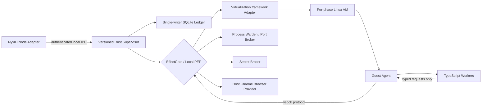

# FKST Hardened Local QA Runtime 实现设计

> 状态：未来 `hardened_untrusted_code` Profile 实现设计，尚未表示对应能力已经实现
> 当前 MVP 实现设计：`local-qa-host-mvp-design.zh-CN.md`
> 规范性合同：[hardened-local-qa-runtime-spec.zh-CN.md](./hardened-local-qa-runtime-spec.zh-CN.md)；本文后文的 “SPEC” 均指该文件。
> 未来部署范围：`fkst-hosted/apps/local-qa-runtime`，`hardened_untrusted_code`
> 文档范围：本文是未来 Hardened Runtime 的完整设计，包含 VZ、Grant、Fence、EffectGate、authority ledger、Warden、Secret Broker、Recovery 和 Update 语义。
> 与 MVP 的关系：MVP 只使用受信任输入、Compose、Host Chrome 和小型 Journal；不以本文的 Hardened 机制为前置条件。
> 流程图：Hardened Runtime 的完整拓扑和控制流直接以内文 Mermaid 代码块和流程表为准。

## 1. 文档定位与权威关系

本文只定义未来 `hardened_untrusted_code` Profile 的进程拓扑、模块边界、authority ledger、安全隔离和恢复算法。当前 `local_qa_agent_mvp` 的轻量实现由 `local-qa-host-mvp-design.zh-CN.md` 定义，不以本文的 VZ、Grant、Fence、EffectGate 或 signed recovery 为前置条件。本文重点回答以下 Hardened 问题：

- 恶意仓库、依赖脚本、开放式 Agent Action 和高价值 Secret 如何与宿主隔离。
- Design/Execution Grant、LocalLeaseBinding、Fence 和 EffectGate 如何形成唯一副作用授权路径。
- per-phase VZ VM、Process Warden、Secret Broker 和 Browser enforcement 如何协作。
- single-writer authority ledger、effect/event outbox、Inventory seal 和 CleanupCapability 如何收敛崩溃与部分副作用。
- Runtime 重启后如何在 hosted 签名 RecoveryDecision 前保持 admission closed 且绝不自动 resume。
- signed launcher、migration、anti-rollback 和 rollback 如何维护 Runtime 自身完整性。

本文不重复定义未来 Hardened 实现的完整 wire contract。后文明确引用 SPEC 的字段、strict union、枚举、状态机和 canonical payload 时，以保留的规范性合同为准；实现时仍必须在对应代码仓库中建立由机器校验的版本化 contract。本文独有的表名、列名、内部消息名和伪代码用于固定事务边界、所有权和安全不变量，可以在实现时调整，但不得改变这些语义。

本文只与 `local-qa-host-mvp-design.zh-CN.md` 共享 Profile 名称、Source/Plan/Runner/Evidence 等概念；两者的隔离、Journal、Recovery 和授权机制不可互相替代。本文的 Hardened 语义只对未来 `hardened_untrusted_code` 适用，不能反向扩大 MVP 范围。POC 只证明其真实运行过的 Cloud → Node → loopback service → Chrome 链路，不替代任何生产设计。

本文中的 Mermaid 代码块和流程表是 Hardened Runtime 的唯一语义来源。本仓库不单独维护 Excalidraw、SVG 或 PNG 副本；局部 Mermaid 只用于说明特定控制流，不能覆盖本文定义的 host/guest/worker/provider authority path。

## 2. Hardened v1 锁定决策

以下决策在 v1 中不再作为可选方案处理：

1. Runtime 是 **用户级签名部署目标**。当前登录用户的 `launchd` 固定启动一个最小 stable signed launcher；launcher 验证并选择 versioned Rust Supervisor release。v1 不安装系统级 LaunchDaemon，launcher 也不是第二个 Grant、EffectGate 或 Ledger 权威。
2. v1 **没有 root helper**、特权 XPC service、内核扩展或系统级常驻代理。缺少用户权限下可实现的隔离能力时，Runtime 必须拒绝对应 Plan，不能降级为不受控执行。
3. Rust Runtime Supervisor 是本地唯一 QA authority 和 SQLite writer。它拥有控制接口、Grant 验证、fencing、EffectGate、VM 生命周期、进程与端口所有权、Secret Broker helper 调用授权、Browser Provider 和 Cleanup；独立 Secret Broker helper 只执行已批准的 Secret request，不形成第二 authority。
4. testing modules 和 Backend 编排以 **TypeScript workers** 交付，但 worker 运行在每阶段新建的 Linux VM 内，不作为普通 macOS 宿主进程运行。
5. PR 代码、依赖安装、项目 lifecycle script、App、Middleware、Shell、测试框架和 Codex Action **禁止作为普通宿主进程执行**。Web 项目代码只可以作为 VM 内服务，或作为专用宿主 Chrome renderer 中的受控页面内容运行。
6. TypeScript worker **不能直接产生宿主副作用**。它不能直接访问宿主文件、创建宿主进程、绑定宿主端口、读取 Keychain、控制任意 Chrome、访问任意 CDP endpoint 或直接使用 NyxID 凭据。
7. Local Design Sandbox 与 Local QA Sandbox 都使用 Apple `Virtualization.framework` 创建的 Linux VM。每个 phase 和 generation 使用新的 VM identity、可写磁盘、Workspace、Environment 和资源账本。
8. **禁止跨 phase 或 generation 复用 VM。** Design VM 不能转为 Execution VM；Amendment 后不能恢复旧 Execution VM；Runtime 重启后不能重新接管旧 VM。可以复用只读、签名且按摘要寻址的 base image，但不能复用 VM 实例或可写状态盘。
9. Runtime 使用一个本地 **single-writer SQLite ledger**。只有 Rust Ledger Writer 可以写入；TypeScript worker、NyxID Adapter 和 helper 不得直接打开数据库。
10. 所有本地副作用都必须先经过 **EffectGate / Local PEP**，再由明确列出的 trusted adapter 执行。worker 返回的字符串、命令或路径不能被直接当作宿主操作。
11. 在 Hosted Authorization Authority 签发 Grant 之前，Runtime 先创建短期 **LocalLeaseBinding reservation**。Grant 到达后，reservation、Grant nonce、command acceptance、fence 和初始 effect 必须在同一 SQLite 事务中原子激活。
12. Runtime 重启时先关闭 admission、建立 local recovery latch、失效旧 session并执行只读 discovery/Snapshot。**禁止重启后自动 resume 测试执行或自行取得 takeover**。恢复执行必须取得 hosted 签名 RecoveryDecision、新 execution-purpose generation/fence、新 LocalLeaseBinding、Execution Grant 和 Recovery Resume command；恢复清理必须先取得 `control_quiesce_reconcile` Decision完成 reconcile/seal，再取得独立 `control_cleanup` takeover、匹配的 capability successor 与 Cleanup command。
13. 宿主 Chrome 只能由 Browser Provider 创建和控制。每 Run/generation 使用临时 profile 和受限 control channel，**禁止任意 CDP**、禁止附加用户现有 Chrome、禁止个人 profile、Keychain、cookies 和扩展继承。
14. 完整签名 CleanupCapability 与空 inventory lineage root 在第一个资源副作用前、同一 activation transaction 中建立。Grant 过期或撤销后，当前 capability 或其等权/更窄 successor 仍可以清理已登记资源，但不能创建 VM、进程、端口、Secret lease、browser session 或执行 Step。
15. Cancel、timeout、Grant revocation 和 amendment intent 一旦持久化，优先于普通完成事件、retry 和新 Step。

## 3. 术语与 Module 设计语言

本文保留以下严格区分：

| 术语 | 在 Runtime 中的准确含义 |
| --- | --- |
| Workspace | 某个固定 `effective_sha` 的文件视图。它可以是只读 source tree 或该 source 的 VM 内可写 overlay，但不是安全边界，也不是运行中的服务集合。 |
| Sandbox | 承载不受信任代码并实施隔离的安全边界。v1 中每个 Local Design Sandbox 和 Local QA Sandbox 都是一台独立 Linux VM。 |
| Environment | Sandbox 内由本次 phase 创建的 App、Middleware、数据库、端口、browser session、进程和临时数据等运行资源集合。 |
| Module | 隐藏内部复杂度并通过窄 Interface 提供能力的实现单元，例如 Ledger、EffectGate、VM Provider。 |
| Interface | Module 对外承诺的操作和结果语义，例如 `submitCommand`、`prepareExecution`、`cleanup`。 |
| Seam | 可以替换实现而不改变上层算法的边界，例如 Runtime Transport、Secret Source、Artifact Store。 |
| Adapter | 在某条 Seam 上对接具体系统的实现，例如 NyxID Transport Adapter、Virtualization.framework Adapter。 |
| Effect | 任何可能改变本地或外部世界的动作，例如创建 VM、绑定端口、启动 Chrome、注入 Secret、删除目录。 |
| Receipt | 一个 Effect 已完成、已存在、失败或进入不确定状态的结构化证据，不是普通日志。 |

Runtime 应设计为一个 deep Module：外部只暴露少量 Run 协议操作，内部吸收授权验证、SQLite 事务、VM、端口、进程、浏览器、Secret、Artifact 和崩溃恢复的复杂度。不得把这些复杂度泄漏为“调用方按顺序拼接十几个本地 API”。

## 4. 权威边界

### 4.1 唯一权威

| 事项 | 权威 | Runtime 的处理方式 |
| --- | --- | --- |
| Hosted workflow state | `apps/hosted-control-plane` | Runtime 只回传事件、Snapshot 和 Receipt，不自行宣布云端 terminal。 |
| Design/Execution Grant | Hosted Authorization Authority | Runtime 只验证和消费，不能签发、延长、换绑或扩大。 |
| Approval Evidence 和设备证明 | NyxID Approval/Device Provider 或其他 provider | 由 hosted 消费并形成 Grant；Runtime 可验证绑定摘要，但不能替用户批准。 |
| 本地命令接受、local fence、资源所有权 | Rust Runtime Supervisor + SQLite ledger | 仅 Ledger Writer 可以推进。 |
| 本地副作用允许/拒绝 | EffectGate / Local PEP | 对每个 effect 计算批准交集并记录决策。 |
| VM 内 Case Pass/Fail | `testing-runner` | TypeScript runner 根据结构化 assertion 计算，Runtime 只验证输出协议与绑定。 |
| Final Quality Outcome | hosted `quality-evaluation` | Runtime 不生成最终产品质量结论。 |
| Secret 明文与 lease material | Local Secret Broker | 不进入 Plan、Grant、普通事件、SQLite payload、Artifact 或 NyxID Transport。 |
| Cleanup 资源集合 | sealed ResourceInventory + CleanupCapability | 不按名称、路径或端口模糊搜索其他 Run。 |

### 4.2 Runtime 不信任传输来源

“请求来自 NyxID Node”只说明请求到达了本机，不说明请求被 FKST 授权。Runtime 对每个 mutating command 都必须独立验证：

- 本地 Adapter 身份和 request authentication。
- Runtime audience 和目标 `runtime_instance_id`。
- Hosted Authorization Authority 签名。
- RunSpec、Source、Plan、Policy 和 envelope 摘要绑定。
- device binding、generation、fence、command sequence 和 expected cursor。
- TTL、deadline、Grant sequence、nonce、撤销状态和重放记录。
- LocalLeaseBinding reservation 的绑定与有效期。
- Runtime 当前版本和 capability 是否满足 Plan。

任一失败都在创建副作用前结束，并产生安全审计事件。

## 5. 威胁模型

### 5.1 受防护对象

Runtime 重点保护：

- 用户主目录、其他仓库、SSH material、Keychain 和个人浏览器状态。
- 宿主网络、内网、生产环境和未批准目的地。
- FKST Grant、Runtime 本地身份、trusted key set 和本地 adapter credential。
- 其他 Run 的 VM、进程、端口、Artifact 和 lease。
- hosted workflow 对当前 generation、fence、cursor 和 Effect settlement 的判断。
- Evidence 的真实性、完整性和脱敏状态。

### 5.2 假设的攻击者

设计假设以下输入可能恶意或已被攻陷：

- 外部 Fork PR、仓库代码、构建脚本和依赖包。
- 项目配置、测试 fixture、selector、浏览器页面和下载内容。
- Codex 或其他 Backend 产生的命令、参数、路径和自然语言输出。
- 一个存在缺陷或被利用的 TypeScript worker。
- 延迟、重复、乱序或被重放的 transport message。
- 同一用户会话中的非授权本地进程对 Runtime socket 的探测。
- Runtime 或 macOS 在任意事务、VM、Chrome 或 Cleanup 中间点崩溃。

### 5.3 v1 不承诺抵御的对象

v1 不把以下情况作为完整安全边界：

- 已取得当前用户账户完整控制权的恶意本地用户。
- 已攻陷 macOS kernel、Virtualization.framework、硬件或 FKST 签名基础设施的攻击者。
- 具有 root 权限并主动篡改 Runtime 数据目录或进程的本地攻击者。
- 用户主动把敏感文件复制进批准的 Workspace 后产生的内容风险。

这些非目标不允许成为放宽 PR 代码、worker、浏览器或 Secret 边界的理由。

### 5.4 主要失败模式与设计响应

| 失败模式 | 设计响应 |
| --- | --- |
| 恶意项目脚本尝试读取宿主 home | 项目脚本只在 VM 内运行，VM 不挂载宿主 home。 |
| worker 请求未批准命令或路径 | EffectGate fail closed；超 envelope 时返回 policy block 或 amendment required。 |
| Node 重放旧 Execute command | Grant nonce、sequence、command idempotency、generation 和 fence 在事务内检查。 |
| Runtime 接受命令后崩溃 | command、初始 effects 和 event outbox 已在同一事务持久化；启动时 reconcile。 |
| effect 已发生但 Receipt 未写入 | effect 标记为 uncertain，adapter 按 ownership tag 和 idempotency key reconcile，不盲目重做。 |
| 端口检查后被其他进程占用 | 预先绑定并持有 socket FD，激活时转交 Port Proxy，不执行“先查后绑”。 |
| Grant 在排队时过期 | EffectGate 在 effect 执行前再次检查时效与撤销；拒绝启动新资源并进入 Cleanup。 |
| Chrome 控制通道泄漏 | Provider 使用私有 pipe/token，不暴露通用 TCP CDP；worker 只调用 typed Browser Interface。 |
| Runtime 重启后旧执行继续 | 旧 generation 本地 fence 失效；不自动 resume；扫描并清理已登记资源。 |

## 6. v1 部署与进程拓扑

### 6.1 宿主进程

用户电脑上长期存在一个由 LaunchAgent 固定启动的 stable signed launcher，以及 launcher 选择的 versioned Rust Supervisor `fkst-local-qa-runtime`。Launcher 只负责 release 指针验证、候选启动、health confirmation 和失败回滚；不处理 Run command、Grant、Effect 或 Ledger。Supervisor 是唯一 QA effect/lease/fence authority 和 SQLite writer。除独立非特权 Secret Broker helper 外，以下 Module 位于 Supervisor 进程内：

- Control API 与本地认证。
- NyxID Transport Adapter endpoint。
- Local Runtime Verifier。
- Ledger Writer 和 read projection。
- Command Coordinator。
- EffectGate / Local PEP。
- Effect Dispatcher 和 Event Outbox Dispatcher。
- Virtualization.framework VM Provider。
- User-space Network Gateway。
- Port Broker / Port Proxy。
- Process Warden。
- Secret Broker Client 与 helper lifecycle adapter；Secret Broker helper 本身是 Warden 管理的独立非特权 Rust 进程。
- Host Chrome Browser Provider。
- Artifact Manager 和 Redaction Gate。
- Health、observability、update、drain 与 rollback coordinator。

v1 让 QA control plane、local fence、数据库 writer、FD ownership、VZ VM handle 和 Process Warden 保持在一个 Supervisor 故障域。Secret Broker 是唯一预先锁定的进程拆分：它与 Runtime 同包签名和升级，由 Warden 启停，只暴露受认证的窄 Interface，不拥有独立授权语义、Grant key、Plan 解释权或 Ledger write access。这样既保持单一 authority，又避免 Secret 明文进入 Supervisor 地址空间。其他 helper 若后续拆分，必须满足相同约束。

### 6.2 VM 内进程

每台 phase VM 使用已签名、按摘要寻址的最小 Linux base image，至少包含：

- `fkst-guest-agent`：受信任的 guest supervisor，验证 host session、执行 guest policy、管理 cgroup/namespace、收发 Receipt。
- 固定版本 Node.js runtime。
- 编译后的 TypeScript worker bundles。
- 对应 Backend 所需的签名工具或已批准 runtime。
- 只读 policy snapshot、Plan/Grant digest 和 phase bootstrap manifest。

TypeScript worker 分为：

- Design Worker：调用 `testing-design` 生成 Structured Plan 和结构化 Diff。
- Runner Worker：调用 `testing-runner`，推进 Step、Assertion 和 Case 聚合。
- Deterministic Backend Worker：在 guest 内执行批准的命令或框架。
- Browser Client Worker：发出 typed Browser Action，不接触 CDP endpoint。
- Codex Backend Worker：在批准 envelope 内非交互执行，并只返回 Observation、建议或 amendment signal。
- Evidence Worker：整理 guest 日志、结构化 observation 和待脱敏 Artifact。

这些 worker 都以 VM 内非 root 用户运行。它们不能取得宿主文件描述符、宿主路径、Keychain handle、NyxID credential 或 Runtime SQLite 文件。

### 6.3 紧凑拓扑图



本文的 Runtime 内部流程已覆盖 DB writer、outbox、Adapter、VM channel、Recovery 和 Update 流。任何实现调整只更新本文中的 Mermaid 语义源。

### 6.4 Supervisor 内部 Module、Interface 与所有权

外部 `RuntimeService` 保持小而稳定；内部复杂度集中在以下 deep Module。调用方不应了解验证顺序、SQLite 表、effect claim、adapter retry 或 outbox 写入细节。

| Module | 唯一 Interface | 拥有的状态与行为 | 明确禁止 |
| --- | --- | --- | --- |
| AdmissionFacade | `admit(command) -> AdmissionOutcome` | 幂等 lookup、exact parse、Grant/binding/precondition/target 验证、nonce、quota hold、lease/fence、initial/takeover predecessor、environment/inventory/capability、initial effects 和 sequence=1 outbox 的单事务提交 | 返回未提交 acceptance；让 caller 分步推进 fence 或消费 nonce |
| EffectAuthority | `perform(effect, context) -> EffectOutcome` | Local PEP、EffectRecord、claim、adapter dispatch、uncertain reconcile、Receipt、inventory CAS 和 outbox | 返回可脱离调用使用的 allow token、FD、Secret 或 adapter handle |
| GenerationSettlementFacade | `settle(generation, authority) -> SettlementOutcome` | suppress/quiesce/terminate/revoke、非破坏性 reconcile、barrier、seal、post-seal cleanup 和 residual | 在 open inventory 上 release/delete；把 cancel ack 当完成证据 |
| RecoveryFacade | `snapshot()` / `applyDecision(decision)` | local recovery latch、只读 discovery、Snapshot、signed decision 验证和 purpose-specific takeover | Hosted Decision 前创建 lease/FenceTransition或执行破坏性 Cleanup；复用旧 VM |
| RuntimeJournal | `stream(position)` / `ack(cursor, digest)` | 不可变 Event、signed EventBatch、at-least-once outbox、ack 和 retention projection | 根据 transport ack 推进 workflow 或阻止本地 Cleanup |
| UpdateCoordinator | `stage(manifest)` / `requestActivation(staged)` | 下载、验签、drain、migration preflight、staged Receipt 和 activation request | 写 candidate/current/previous selection；直接激活或 rollback binary |
| LedgerWriter | typed transaction request | `BEGIN IMMEDIATE`、CAS、unique/FK/CHECK、sequence、lineage、Receipt/ref 和 read projection | 暴露 raw SQL 给其他 Module；调用外部 adapter |
| Effect/Event Dispatcher | 内部 queue claim | 从已提交 ledger claim effect/outbox，记录 attempt/discovery identity并交给 adapter/transport | 在 admission commit 前执行 effect；解释业务授权 |
| Trusted Adapter | `apply/reconcile/cleanup` 的适用子集 | OS/VZ/Chrome/port/process/artifact 的窄能力与 typed result | 读取 Plan 决定授权；直接写 Ledger |
| SecretBrokerClient | `execute(SecretBrokerRequest)` | 经 authenticated IPC 调用独立 broker，并只处理 opaque handle/ref 与签名 Receipt | 在 Supervisor 中接收或缓存 Secret 明文 |

`Atomic Admission Root` 是 `AdmissionFacade` 的事务提交结果，不是另一个可独立调用的 Module。`EffectGate.perform` 是 `EffectAuthority` 的 façade；Effect Dispatcher 与 adapter 是其内部实现，不形成 caller 可绕过的新 seam。`EnvironmentFactory` 协调资源准备，LedgerWriter 才持久化 inventory/version/ownership。

## 7. User LaunchAgent、Stable Launcher 与 Rust Supervisor

### 7.1 安装位置与权限

Runtime 应安装到当前用户可管理且不与项目仓库混合的位置。概念布局如下：

```text
~/Library/Application Support/FKST/LocalQARuntime/
├── launcher/fkst-local-qa-launcher
├── releases/<version>/
├── release-selection/{candidate,current,previous}.json
├── state/activation-journal.jsonl
├── state/runtime.sqlite3
├── state/runtime.lock
├── images/<digest>/
├── source-cache/<digest>/
├── artifacts/<run-token>/
├── artifact_staging/<run-token>/
├── logs/
└── sockets/runtime.sock

~/Library/LaunchAgents/<bundle-id>.plist
```

数据目录、socket 和 ledger 应限制为当前用户访问。外部接口不得绑定 `0.0.0.0`、局域网地址或公网地址。优先使用 Unix domain socket；确需 loopback HTTP 时也必须有相同的 request authentication 和 replay protection。

### 7.2 不使用 root helper

v1 安装和运行都不依赖 root helper。因此：

- 不修改系统 `pf`、系统路由、系统 DNS 或全局代理。
- 不创建系统用户、系统 LaunchDaemon 或特权端口 listener。
- 不向 `/Library`、`/usr/local` 或其他系统位置写运行状态。
- 不以 root 启动 Virtualization.framework VM、Chrome 或 worker。
- 不能在用户权限下可靠实施的 Plan capability 必须报告为 unsupported，并在授权前阻断。

网络隔离通过 Runtime 自有的 user-space Network Gateway 实现，而不是依赖系统级防火墙。资源隔离主要通过 VM 配额、guest cgroup、磁盘上限和 Warden deadline 实现。

### 7.3 Runtime identity

首次启动创建独立 `runtime_instance_id` 和本地 signing identity。Runtime identity 与 NyxID Node identity 分开：

- Node identity 证明哪个 NyxID Node 在调用本地 Adapter。
- Runtime identity 证明哪个 FKST Runtime 接受 command、持有 local lease 和产生 Receipt。
- device binding 同时引用二者的受信任关联，不把两种 identity 合并成一个字符串。

本地私钥必须是 device-bound、不可导出的 Keychain/Secure Enclave key，并由 stable signed launcher 在安装、启动和 rotation 时验证其与 Runtime 代码身份的绑定。Keychain item 的 access control 必须绑定 launcher/Supervisor 的 designated requirement、Team ID、bundle/signing identifier、`runtime_instance_id`、`installation_id` 和 `identity_epoch`；仅知道 Keychain label、key id 或当前用户身份不能取得签名能力。PR 代码、VM、worker、Node Adapter 和 Secret Broker 永远不能调用该 key。

Runtime identity lifecycle 使用 SPEC 的 `RuntimeIdentityStatement`、`RuntimePairingChallenge` 和 `RuntimePairingReceipt`：

1. 初次安装生成 `identity_epoch=1` 的 key 与 statement，`pairing_epoch=0`；配对成功后才进入 active pairing。
2. scheduled rotation 保持 `runtime_instance_id`、递增 `identity_epoch`，并由旧/新 key 证明 continuity；随后强制 re-pair、递增 pairing epoch 并 retire 旧 LocalIPC session。
3. 普通 re-pair 保持 identity epoch，只递增 `pairing_epoch`；旧 pairing-bound reservation、尚未消费 Grant、Artifact access 和 LocalIPC binding 立即失效。
4. pairing revocation 关闭 reservation、command、Artifact read 和 revocation ack，保留仅依赖已持久化 CleanupCapability 的最小本地 Cleanup。
5. key compromise 无法证明 continuity 时必须 reset：销毁旧 key/endpoint/session material，撤销旧 pairing，生成新的 `runtime_instance_id`、`installation_id`、identity epoch=1 和 pairing epoch=0；禁止沿用旧 Grant、nonce、IPC/revocation watermark 或 Ledger authority。

Ledger 只保存 public statement、Keychain opaque persistent ref 的 digest、code requirement digest、epoch、状态和 Receipt；不保存可导出私钥、Keychain access token 或可用于绕过代码绑定的 handle。启动时若 key 缺失、可导出、ACL/code requirement 不匹配、statement continuity 失败或 pairing epoch 回退，Runtime 进入 recovery-only/unhealthy，并在修复或 reset 前关闭普通 admission。

## 8. External Runtime Interface

### 8.1 Interface 形态

Runtime 对外保持 transport-neutral。v1 的逻辑 Interface 包含：

- `probeHealth`：只返回非敏感健康与 capability 摘要。
- `reserveLocalLeaseBinding`：在 Grant 签发前预留逻辑执行 slot 与 generation candidate，并绑定 phase/authorization input；不创建 VM、端口 FD 或其他 OS resource。
- `cancelReservation`：幂等取消尚未激活的 inert reservation并释放逻辑 quota hold；不改变 active lease、fence、cursor 或 OS resource。
- `submitCommand`：提交 Design、Execute、Resume、Cancel 或 Cleanup command。
- `getRun`：读取本地 Snapshot 和最后 cursor。
- `streamEvents`：从指定 cursor 读取 at-least-once event stream。
- `ackEvents`：确认 transport 已持久接收某个 outbox cursor，允许本地压缩投影。
- `getArtifact`：使用短期、scope-bound capability 读取允许的本地 Artifact。

字段和 exact method signature 应在未来 Hardened 实现仓库中建立版本化 contract；`ackEvents` 必须绑定 run、generation、cursor、event digest 与幂等键，只表示 hosted 已持久接收；`getArtifact` 必须验证短期 scope-bound access capability、actor、Artifact digest、range 和 expiry。健康只通过 `probeHealth` 查询，不再同时维护 `probe_health` command。Cancel 必须继续作为 fenced command 提交，不能增加绕过 sequence、cursor 和 fence 的快捷 API。

`RuntimeService` 必须且只能保持上述八个业务方法。撤销投递使用独立的 `RuntimeTransportControlInbox.deliverRevocations`，它不计入 `RuntimeService`，也不能演化成第九个通用业务方法。Control inbox 只接受 exact、签名、hash-linked `RevocationBatch`；禁止承载 RuntimeCommand、Grant、Plan、配置或任意 JSON payload。

### 8.2 本地认证

NyxID Adapter 调用 Runtime 时同时验证：

1. Unix socket peer UID 与 Runtime 当前用户一致。
2. Adapter service identity 已配对并处于有效状态。
3. 每个请求携带短期 signed local credential 或等价 challenge response。
4. credential 绑定 audience、method、request digest、TTL 和 nonce。
5. mutating command 还必须通过 Grant、fence、cursor 和 command sequence 验证。

peer UID 只是一层约束，不能替代消息认证。每个外部调用还必须绑定 caller ExecutableIdentity、runtime instance、method、canonical request digest、protocol version、TTL 与 directional nonce/sequence；Runtime 对 Adapter 也必须用已配对的 device-bound identity 完成双向认证，防止同 UID 进程替换 socket。生产环境禁止 `auth_method=none`。详细 Run、Artifact 和 mutation endpoint 都不能匿名访问。

每个 active `LocalIPCBinding` 对应一个 durable local IPC session。请求和响应是两条独立严格 hash chain，均从 sequence=1 开始；session row 持久化各方向 high watermark、last digest、nonce set、binding/identity/pairing/boot/session epoch 和状态。接收顺序固定为：

1. exact parse 并重算 `local_request/v1` 或 response digest。
2. 读取 active binding/session 与调用方 ExecutableIdentity，先查完全相同的 transport replay tuple。
3. 若 `(binding_ref, direction, sequence, digest, nonce, authentication_id)` 已有相同结果，直接返回原 durable response，不再进入业务幂等路径。
4. 首次消息必须严格等于 durable high watermark+1；sequence=1 不得带 previous digest，后续消息必须绑定上一条已接受同方向 digest。gap、rollback、同 sequence/nonce/authentication id 不同 digest全部 fail closed。
5. 在一个 `BEGIN IMMEDIATE` transaction 中写 replay row、推进该方向 high watermark/last digest、保留 response placeholder；随后才允许进入业务 handler。业务结果与 authenticated response bytes/digest 在同一 transaction family 中完成并冻结；连接断开或进程崩溃后重放返回同一结果。

Runtime restart、identity rotation、re-pair、pairing revocation、client binary replacement、protocol rekey 或 binding expiry 必须原子 retire 旧 session 并递增相应 epoch。启动恢复必须先验证 durable IPC watermarks 和 replay chain，再开放 authenticated traffic；内存中的 sequence cache 不具有权威性。

VM channel 使用独立的 boot-bound authenticated vsock session。Guest Agent 在 worker 启动前以每 VM/boot 唯一的 root-only bootstrap material 完成 challenge-response，并生成 guest ephemeral key。`GuestBootEvidence` 与 session transcript 必须绑定 bootloader/kernel/initrd/rootfs/kernel command line、VZSandboxDescriptor、VM identity、guest boot id、guest-agent executable digest、双方 ephemeral key、bootstrap nonce、run/phase/generation/fence、Runtime boot epoch、protocol version 与双向严格 sequence。该机制证明 host 验证的 boot manifest 和本次 boot 持有者，不宣称硬件 remote attestation。bootstrap/session key 在建立后擦除，CID/port、guest UID 或 image digest 单独均不构成认证；Runtime restart、guest reboot、generation rollover、transcript mismatch 或 sequence rollback 都使旧 session 失效。

### 8.3 事件语义

`streamEvents` 提供 at-least-once、有 cursor 的事件流：

- 单 generation 内 sequence 严格递增。
- reconnect 使用 `after_cursor`，Runtime 从 durable outbox 重放。
- 完全相同的 event 可重复返回。
- 同 cursor 不同 digest 是安全错误。
- transport ack 只表示对方已接收，不表示 hosted workflow 已完成状态迁移。
- outbox 未 ack 不能阻止本地 Cleanup，但必须保留到 retention 或显式 settlement。

## 9. NyxID Adapter 与授权验证

### 9.1 Adapter 责任

NyxID Adapter 只负责：

- 把 Node 主动出站通道上的请求送到 Runtime 本地 Interface。
- 将 NyxID Approval/Device 证明映射为 hosted 可消费的 Evidence。
- 透传 Hosted Authorization Authority 签发的 Grant。
- 回传 Event、Snapshot、Receipt 和 Artifact Pointer。
- 将 NyxID routing/auth error 与 Runtime application error 分开编码。

NyxID Adapter 不解析 Plan 来决定权限，不签 Grant，不重签 Grant，不替换 fence，不注入 Secret，不执行 Step，也不判断 Pass/Fail。

### 9.2 Grant 验证顺序

Local Runtime Verifier 按以下顺序验证，先识别幂等重放，再读取或修改任何可变授权状态：

1. 本地 IPC authentication、消息大小、exact schema 与 strict union。
2. canonical request digest；查询 `(idempotency_key, request_digest)`。同 key、同 digest 立即返回持久化的 CommandAdmissionReceipt，同 key、不同 digest 返回 conflict，均不得继续读取 reservation/cursor 或消费 nonce。
3. canonical object digest、签名 key、issuer、audience、device、runtime instance、source/profile binding。
4. 按 phase 选择验证公式：Design 校验 SourceObject、DesignPolicyDecision、DesignScope 与 Design Grant，并禁止 Plan/Execution Policy/envelope 字段；Execution 校验 Plan、PolicyDecision、approved envelope、Step/Action 与 Execution Grant。
5. 重算 strict Design/Execution authorization preimage，验证 LocalLeaseBinding、AdmissionRequirements、reservation epoch、Runtime capability/image/capacity fit。
6. generation、purpose-specific FenceTransition、hosted/local fencing token、command deadline、command sequence 和 expected cursor。
7. Grant `not_before`、expiry、sequence、nonce 和签名 revocation snapshot freshness。
8. 在单写 activation transaction 内消费 nonce并生成新的 CommandAdmissionReceipt。

第一条 generation event 固定为 sequence=1 的 `command_accepted`。同一 idempotency key、同一 request digest 在 admission 已提交、响应丢失、cursor 推进或 reservation 已激活后仍返回同一个 Receipt；合法重试不能因当前状态已变化而被误判为 stale command。

## 10. Pre-Grant LocalLeaseBinding Reservation

### 10.1 目的

Hosted 在批准和签发 Grant 时需要知道目标 Runtime 仍有能力接受本次 phase。若只在 Grant 到达后争抢本地 slot 和端口，会产生三个问题：

- 用户批准后设备已经被另一个 Run 占用。
- Grant 绑定的 generation 与 Runtime 实际 owner 不一致。
- “检查端口可用”与“真正绑定端口”之间发生 TOCTOU race。

因此 v1 在 Grant 签发前引入短期 LocalLeaseBinding reservation。它不是 Grant，不允许创建 VM、获取 Source、运行 worker、启动 Chrome或发放 Secret。

### 10.2 Reservation 内容

Reservation 使用 SPEC 定义的 exact Design/Execution strict variant，并至少绑定：

- run、phase、device、runtime instance、RunSpec digest 与 expected predecessor lease/fence。
- DesignAuthorizationPreimage：SourceObject、DesignPolicyDecision、DesignScope、project profile；禁止出现 Plan/Execution Policy 字段。
- ExecutionAuthorizationPreimage：StructuredPlan、PolicyDecision、approved envelope、project profile；禁止出现 Design-only 字段。
- digest-bound AdmissionRequirements：Runtime/protocol/guest image capability、VM/resource class、browser/Secret capability、并发 slot、port count、CPU/memory/disk/process/open-file/wall-clock 和 host storage budget。
- hosted workflow generation candidate、local generation candidate、reservation epoch 和 anti-replay nonce。
- Runtime 当前 authenticated capacity snapshot、disk pressure level、capability digest、版本、base image/worker/guest-agent compatibility set。
- reservation TTL、request digest、idempotency key，以及 Runtime 生成的 binding digest 和 device-bound signature。

`authorization_input_digest` 必须由 exact phase preimage 的 JCS bytes 重算，不能由调用方任意选择字段。Reservation 只持有逻辑容量，不绑定端口 FD、不创建目录/VM，也不推进 active fence。

Reservation 只持有逻辑容量：并发 slot 计数、SQLite row 和过期 timer。它不能绑定 socket、创建目录、启动项目代码或 VM，也不需要 CleanupCapability；取消或过期通过单写 Ledger transaction 直接 settle。

### 10.3 端口容量与激活后分配

Pre-Grant reservation 只验证所需 port count 是否落在设备容量和并发策略内，不执行 `bind`，也不记录真实 port/FD。这样保持 reservation 为 inert authorization prerequisite，不在用户批准和 Grant 签发前产生宿主资源。

Grant 与 command 原子激活后，Port Broker 才通过 EffectGate 分配端口：

1. EffectGate 先持久化 `allocate_port` intent 和当前 inventory version。
2. Port Broker 在 `127.0.0.1` 或 `::1` 上请求系统分配端口并保留真实 socket FD。
3. 配置 close-on-exec 和默认不接受连接，将 FD 注册到 Process Warden ownership handle。
4. 在新 inventory snapshot 中记录 opaque handle、port、protocol、owner environment/generation 和 process start epoch。
5. Port Proxy 接管同一 FD；中间禁止关闭后重新扫描/绑定。
6. 激活后的 prepare 失败、取消或 Cleanup 关闭 FD，并通过 EffectReceipt/CleanupReceipt settle。

端口本身不保证预批准时的具体数值；Plan 和 Approval 绑定的是 port count、protocol、exposure 与 destination policy。若必须批准固定端口，Runtime 必须在 activation 后发现不满足时进入可解释 blocked/cleanup，而不能在 Grant 前暗中占用宿主资源。

### 10.4 原子激活算法

Grant 到达后，Command Coordinator 执行以下事务。伪代码只表达顺序：

```text
authenticate local caller
exact-parse command and compute canonical request digest
lookup command by idempotency key
  same key + same digest -> return existing CommandAdmissionReceipt
  same key + different digest -> conflict with no state change

BEGIN IMMEDIATE

load LocalLeaseBinding reservation
verify reservation is RESERVED and not expired
verify exact phase authorization preimage and AdmissionRequirements
verify reservation/runtime/device/phase/capability/image/capacity matches Grant and command
verify expected predecessor lease, purpose-specific FenceTransition and expected cursor
verify Grant sequence, signed revocation snapshot and nonce are unused
recheck cancel/timeout/revocation/drain intent

create stable phase/environment/inventory identifiers
insert empty inventory lineage root version=1, state=OPEN
insert complete signed CleanupCapability bound to that lineage root
insert Grant acceptance and nonce consumption
transition immutable binding RESERVED -> CONSUMED
supersede predecessor LocalExecutionLease when applicable
insert new active LocalExecutionLease + FenceTransition + AdmissionPredecessor
  initial -> no PredecessorFencingRecord
  takeover -> append exact PredecessorFencingRecord
insert command record and immutable CommandAdmissionReceipt
insert initial effects in pending state, all referencing environment/root/capability
insert command_accepted event with cursor sequence=1 and event_outbox row

COMMIT
```

只有 commit 成功后 Effect Dispatcher 才能执行 initial effect。Design bootstrap effect 使用 SourceObject/DesignPolicy/DesignScope context；Execution prepare effect 使用 Plan/Policy/envelope context，但二者都只依赖已激活 lease、稳定 environment id、空 inventory root、完整 CleanupCapability 和 bootstrap descriptor，不要求 PreparedEnvironment 或尚未开始的 PlanStep。事务失败时不创建 VM、不启动进程、不分配端口、不注入 Secret。端口和其他 OS resource 都属于 activation 后的 Effect；若分配失败，effect 进入 failed/uncertain，随后按 ResourceInventory 清理，不把 binding 静默退回 `RESERVED`。

### 10.5 Reservation 过期与冲突

- Reservation TTL 到期后由 Ledger Writer 在单个事务中标记 `EXPIRED` 并释放逻辑 slot；因为 reservation 不拥有 OS resource，所以不触发 Cleanup effect。
- 同一 run/phase/generation 只允许一个 active binding。
- 同一 reservation 不能激活两种 Grant 或两个 command digest。
- device、Plan、source 或 generation 改变时必须创建新 reservation。
- Runtime drain、版本不兼容或 residual blocking 时拒绝 reservation，而不是先接受后降级。

## 11. Single-writer SQLite Ledger

### 11.1 单写原则

Runtime 只允许 Rust Ledger Writer 持有 SQLite write connection。其他 Module 通过内部 typed message 请求事务；任何 worker 或 adapter 不能自行执行 SQL。

建议配置：

- WAL mode，便于健康查询和 Snapshot read projection。
- `synchronous=FULL` 或经故障测试证明等价的 durability 设置。
- foreign key、strict table 和 checksum 校验开启。
- 每个 schema migration 有版本、digest 和 downgrade compatibility 标记。
- 数据库、WAL、SHM 和备份均位于权限受控目录。

Single-writer 的目标不是限制并发读取，而是保证 command acceptance、fence、resource ownership、effect 和 event sequence 只有一个排序点。

### 11.2 逻辑表

以下是 v1 建议的逻辑表，不规定 exact DDL：

| 表 | 作用 | 关键约束 |
| --- | --- | --- |
| `runtime_meta` | schema version、boot/recovery epoch、active release 与全局 transaction high watermark | 单行记录；不保存私钥。 |
| `runtime_identities` | `RuntimeIdentityStatement`、Keychain opaque ref digest、code requirement、identity epoch 与 lifecycle | statement/epoch 唯一；rotation continuity append-only；reset 使用新 runtime instance。 |
| `runtime_pairings` | `RuntimePairingChallenge`/`RuntimePairingReceipt` 与 pairing epoch | 每 identity epoch 单调；同一时刻最多一个 active pairing。 |
| `trusted_keys` | Hosted Grant、pairing、revocation、adapter、image/update key | 记录 purpose、有效期、revocation 与 rotation overlap。 |
| `local_ipc_sessions` | `LocalIPCBinding`、双向 high watermark/last digest、session epoch 与 retire reason | binding/session 唯一；请求/响应链独立；retired 不接受新消息。 |
| `local_ipc_replay` | transport authentication tuple、canonical request/response digest 与原结果 | `(session,direction,sequence)`、nonce、authentication id 唯一；完全相同 replay 返回原结果。 |
| `revocation_inbox` | exact `RevocationBatch`、sequence/previous digest、freshness 与幂等结果 | batch id+digest 幂等；同目标链无 gap/rollback。 |
| `revocation_state` | identity/pairing 目标上的 batch、Grant fact 和 Artifact fact durable watermark | 单行 CAS；watermark 只增不减。 |
| `revocation_entries` | 展开的 strict `RevocationFact` 与 effect/read suppression 结果 | fact id/类型/sequence 唯一；append-only。 |
| `revocation_delivery_receipts` | signed `RevocationDeliveryReceipt` | 每 batch 一个 original Receipt；重放引用原 Receipt。 |
| `run_records` | 每个本地 Run 的当前投影 | `run_id` 唯一；状态是 event/effect 的派生投影。 |
| `local_lease_bindings` | reservation、activation、expiry、release | run/phase/generation active 唯一；绑定 reservation digest。 |
| `grant_acceptances` | 已接受 Grant、sequence、nonce、plan digest | nonce 唯一；sequence 单调。 |
| `commands` | request digest、idempotency、precondition/target、acceptance | 同 key 同 digest复用；不同 digest conflict。 |
| `command_admission_receipts` | immutable acceptance、strict initial/takeover predecessor、first cursor | 每 command 唯一；device-bound signature与 outbox watermark固定。 |
| `fence_transitions` | purpose-specific predecessor/successor fence、authorization、initial cursor | append-only；同 successor fence/purpose唯一。 |
| `predecessor_fencing_records` | takeover predecessor lease/fence/cursor/effect/inventory事实 | 仅 takeover 创建；initial admission禁止伪造。 |
| `effects` | effect type、input digest、owner、状态、adapter | effect key 唯一；绑定 generation/fence。 |
| `effect_attempts` | 每次执行/reconcile 的开始与 Receipt | 追加式，不覆盖历史。 |
| `events` | 本地不可变 domain event | 单 generation sequence 唯一。 |
| `event_outbox` | 待传输 event、attempt、ack cursor | 与 event 在同一事务写入。 |
| `worker_jobs` | guest worker job、input/output digest、状态 | worker token 与 VM/phase/generation 绑定。 |
| `vm_instances` | VM identity、image、disk、phase、state | 不允许 phase/generation 复用。 |
| `process_domains` | guest/host process ownership 和 kill policy | 记录 PID identity、start time、owner epoch。 |
| `port_leases` | bound FD handle、port、proxy mapping、owner | 不按端口号单独认领所有权。 |
| `resource_inventory` | 所有可清理资源及 cleanup action | sealed digest 后追加变化需新 inventory version。 |
| `cleanup_capabilities` | cleanup scope、nonce、expiry、inventory digest | 只能收窄，不扩权。 |
| `credential_leases` | opaque lease metadata 和 settlement | 不保存 Secret 值或可导出 lease material。 |
| `dependency_acquisitions` | `DependencyAcquisitionPolicy`/`DependencyAcquisitionReceipt`、lockfile、registry/integrity/provenance 与 lifecycle script refs | 每次获取一个 immutable Receipt；拒绝结果也持久化。 |
| `resource_limit_bindings` | signed `RuntimeHardCeilings` 与逐字段最小值形成的 `ResourceLimitBinding` | 每 environment 一个 active binding；本地 hard ceiling 不可放宽。 |
| `resource_limit_receipts` | `ResourceLimitReceipt` applied/violated/released 与 usage/Termination refs | append-only；violation action 必须可对账。 |
| `network_flow_receipts` | 每次 DNS/redirect/connect/upload 的 `NetworkFlowReceipt` 与 direction/tenant/bytes/enforcement 状态投影 | 每个 flow stage 独立 Receipt；enforcement loss fail closed。 |
| `checkpoints` | cursor、active step、effect/receipt/resource refs | 每个 checkpoint 不可变。 |
| `artifacts` | opaque local token、digest、redaction、retention | 不向外暴露绝对路径。 |
| `browser_sessions` | Chrome process/profile/control token ownership | 每 run/generation 唯一临时 profile。 |
| `adapter_calls` | trusted adapter request/response digest | 用于 uncertain effect reconcile。 |
| `ledger_facts` | 每个 committed authority mutation 的 canonical fact digest、previous digest 与 local hash-MAC | 按 transaction sequence 无间隙 append-only；MAC key 是独立 code-bound Keychain key。 |
| `audit_events` | exact `AuditEvent` 与签名/hash link | `audit_sequence` 从 1 无间隙；禁止可选链。 |
| `audit_checkpoints` | signed `AuditCheckpoint` 连续区间与 previous checkpoint | checkpoint 只前进。 |
| `ledger_integrity_checkpoints` | `LedgerIntegrityCheckpoint` 覆盖 SQLite/WAL/audit/outbox/effect/inventory/nonce/IPC/revocation roots | clean transaction boundary 创建并形成 checkpoint chain。 |
| `ledger_integrity_verification_receipts` | strict `LedgerIntegrityVerificationReceipt` | 只有 passed 才可开放 ordinary admission。 |
| `update_state` | staged、activation request/journal/result 和 signed selection 的只读镜像 | Launcher journal/selection 是权威；Ledger 只幂等导入 Receipt 与审计引用。 |

### 11.3 状态与事实分离

`run_records.state` 是查询投影，不是唯一事实来源。恢复判断必须同时读取：

- accepted command。
- current fence 和 cursor。
- pending/running/uncertain effects。
- immutable Receipt。
- sealed inventory 和 CleanupCapability。
- worker job 与 VM/process ownership。
- event outbox delivery 状态。

禁止仅根据一个字符串状态推断“VM 没创建”“进程已停止”或“Cleanup 已完成”。

### 11.4 v1 SQLite DDL 与硬约束

跨语言 payload 仍以 SPEC exact schema/JCS 为准；SQLite 保存 canonical JSON bytes、digest 和索引列。v1 migration 必须生成下列约束的等价 DDL，禁止只靠 Rust assert：

```sql
CREATE TABLE runtime_meta (
  singleton INTEGER PRIMARY KEY CHECK (singleton = 1),
  schema_version INTEGER NOT NULL,
  runtime_instance_id TEXT NOT NULL,
  runtime_boot_epoch TEXT NOT NULL,
  state_version INTEGER NOT NULL CHECK (state_version >= 1),
  mirrored_release_selection_digest TEXT,
  mirrored_activation_journal_digest TEXT
) STRICT;

CREATE TABLE runtime_identities (
  runtime_instance_id TEXT NOT NULL,
  identity_epoch INTEGER NOT NULL CHECK (identity_epoch >= 1),
  installation_id TEXT NOT NULL,
  statement_digest TEXT NOT NULL UNIQUE,
  public_key_id TEXT NOT NULL,
  key_protection TEXT NOT NULL CHECK (key_protection IN ('secure_enclave','keychain_non_extractable')),
  keychain_persistent_ref_digest TEXT NOT NULL,
  launcher_code_requirement_digest TEXT NOT NULL,
  supervisor_code_requirement_digest TEXT NOT NULL,
  previous_identity_epoch INTEGER,
  previous_statement_digest TEXT,
  state TEXT NOT NULL CHECK (state IN ('active','rotated','reset','compromised')),
  canonical_payload BLOB NOT NULL,
  PRIMARY KEY (runtime_instance_id, identity_epoch),
  UNIQUE (runtime_instance_id, identity_epoch, statement_digest),
  FOREIGN KEY (runtime_instance_id, previous_identity_epoch, previous_statement_digest)
    REFERENCES runtime_identities(runtime_instance_id, identity_epoch, statement_digest),
  CHECK (
    (identity_epoch = 1 AND previous_identity_epoch IS NULL AND previous_statement_digest IS NULL)
    OR
    (identity_epoch > 1 AND previous_identity_epoch = identity_epoch - 1 AND previous_statement_digest IS NOT NULL)
  )
) STRICT;
CREATE UNIQUE INDEX one_active_runtime_identity
  ON runtime_identities(runtime_instance_id) WHERE state = 'active';

CREATE TABLE runtime_pairings (
  pairing_receipt_id TEXT PRIMARY KEY,
  runtime_instance_id TEXT NOT NULL,
  identity_epoch INTEGER NOT NULL,
  pairing_epoch INTEGER NOT NULL CHECK (pairing_epoch >= 1),
  challenge_digest TEXT NOT NULL UNIQUE,
  receipt_digest TEXT NOT NULL UNIQUE,
  status TEXT NOT NULL CHECK (status IN ('active','revoked')),
  is_current INTEGER NOT NULL CHECK (is_current IN (0,1)),
  expires_at TEXT NOT NULL,
  canonical_payload BLOB NOT NULL,
  FOREIGN KEY (runtime_instance_id, identity_epoch)
    REFERENCES runtime_identities(runtime_instance_id, identity_epoch),
  UNIQUE (runtime_instance_id, identity_epoch, pairing_epoch)
) STRICT;
CREATE UNIQUE INDEX one_current_runtime_pairing
  ON runtime_pairings(runtime_instance_id) WHERE is_current = 1;

CREATE TABLE local_ipc_sessions (
  session_id TEXT PRIMARY KEY,
  binding_digest TEXT NOT NULL UNIQUE,
  runtime_instance_id TEXT NOT NULL,
  identity_epoch INTEGER NOT NULL,
  pairing_epoch INTEGER NOT NULL,
  runtime_boot_epoch TEXT NOT NULL,
  session_epoch INTEGER NOT NULL CHECK (session_epoch >= 1),
  server_executable_identity_digest TEXT NOT NULL,
  client_executable_identity_set_digest TEXT NOT NULL,
  request_high_watermark INTEGER NOT NULL DEFAULT 0 CHECK (request_high_watermark >= 0),
  request_last_digest TEXT,
  response_high_watermark INTEGER NOT NULL DEFAULT 0 CHECK (response_high_watermark >= 0),
  response_last_digest TEXT,
  state TEXT NOT NULL CHECK (state IN ('active','retired')),
  retire_reason TEXT,
  state_version INTEGER NOT NULL CHECK (state_version >= 1),
  canonical_binding BLOB NOT NULL,
  CHECK ((request_high_watermark = 0 AND request_last_digest IS NULL) OR (request_high_watermark > 0 AND request_last_digest IS NOT NULL)),
  CHECK ((response_high_watermark = 0 AND response_last_digest IS NULL) OR (response_high_watermark > 0 AND response_last_digest IS NOT NULL)),
  CHECK ((state = 'active' AND retire_reason IS NULL) OR state = 'retired'),
  UNIQUE (runtime_instance_id, identity_epoch, pairing_epoch, session_epoch)
) STRICT;
CREATE UNIQUE INDEX one_active_local_ipc_session
  ON local_ipc_sessions(runtime_instance_id) WHERE state = 'active';

CREATE TABLE local_ipc_replay (
  session_id TEXT NOT NULL REFERENCES local_ipc_sessions(session_id),
  direction TEXT NOT NULL CHECK (direction IN ('client_to_runtime','runtime_to_client')),
  sequence INTEGER NOT NULL CHECK (sequence >= 1),
  authentication_id TEXT NOT NULL,
  nonce TEXT NOT NULL,
  message_digest TEXT NOT NULL,
  previous_message_digest TEXT,
  result_digest TEXT,
  result_payload BLOB,
  committed_transaction_sequence INTEGER NOT NULL CHECK (committed_transaction_sequence >= 1),
  PRIMARY KEY (session_id, direction, sequence),
  UNIQUE (session_id, direction, authentication_id),
  UNIQUE (session_id, direction, nonce),
  CHECK ((sequence = 1 AND previous_message_digest IS NULL) OR (sequence > 1 AND previous_message_digest IS NOT NULL)),
  CHECK ((result_digest IS NULL AND result_payload IS NULL) OR (result_digest IS NOT NULL AND result_payload IS NOT NULL))
) STRICT;

CREATE TABLE revocation_state (
  runtime_instance_id TEXT NOT NULL,
  identity_epoch INTEGER NOT NULL,
  pairing_epoch INTEGER NOT NULL,
  batch_sequence INTEGER NOT NULL DEFAULT 0 CHECK (batch_sequence >= 0),
  last_batch_digest TEXT,
  grant_fact_watermark INTEGER NOT NULL DEFAULT 0 CHECK (grant_fact_watermark >= 0),
  artifact_access_fact_watermark INTEGER NOT NULL DEFAULT 0 CHECK (artifact_access_fact_watermark >= 0),
  freshness_deadline_at TEXT,
  state TEXT NOT NULL CHECK (state IN ('current','stale','gap','pairing_revoked')),
  state_version INTEGER NOT NULL CHECK (state_version >= 1),
  PRIMARY KEY (runtime_instance_id, identity_epoch, pairing_epoch),
  CHECK ((batch_sequence = 0 AND last_batch_digest IS NULL) OR (batch_sequence > 0 AND last_batch_digest IS NOT NULL))
) STRICT;

CREATE TABLE revocation_inbox (
  batch_id TEXT PRIMARY KEY,
  runtime_instance_id TEXT NOT NULL,
  identity_epoch INTEGER NOT NULL,
  pairing_epoch INTEGER NOT NULL,
  batch_sequence INTEGER NOT NULL CHECK (batch_sequence >= 1),
  previous_batch_digest TEXT,
  batch_digest TEXT NOT NULL UNIQUE,
  nonce TEXT NOT NULL UNIQUE,
  issued_at TEXT NOT NULL,
  expires_at TEXT NOT NULL,
  disposition TEXT NOT NULL CHECK (disposition IN ('applied','rejected')),
  canonical_payload BLOB NOT NULL,
  UNIQUE (runtime_instance_id, identity_epoch, pairing_epoch, batch_sequence),
  CHECK ((batch_sequence = 1 AND previous_batch_digest IS NULL) OR (batch_sequence > 1 AND previous_batch_digest IS NOT NULL))
) STRICT;

CREATE TABLE revocation_entries (
  fact_id TEXT PRIMARY KEY,
  batch_id TEXT NOT NULL REFERENCES revocation_inbox(batch_id),
  fact_kind TEXT NOT NULL CHECK (fact_kind IN ('grant','artifact_access')),
  fact_sequence INTEGER NOT NULL CHECK (fact_sequence >= 1),
  effective_at TEXT NOT NULL,
  required_action TEXT NOT NULL CHECK (required_action IN ('quiesce_non_cleanup_effects','deny_future_reads')),
  target_ref_digest TEXT NOT NULL,
  suppression_transaction_sequence INTEGER NOT NULL CHECK (suppression_transaction_sequence >= 1),
  canonical_payload BLOB NOT NULL,
  UNIQUE (fact_kind, fact_sequence)
) STRICT;

CREATE TABLE revocation_delivery_receipts (
  receipt_id TEXT PRIMARY KEY,
  batch_id TEXT NOT NULL REFERENCES revocation_inbox(batch_id),
  receipt_digest TEXT NOT NULL UNIQUE,
  disposition TEXT NOT NULL CHECK (disposition IN ('applied','idempotent_replay')),
  original_receipt_id TEXT REFERENCES revocation_delivery_receipts(receipt_id),
  applied_grant_watermark INTEGER NOT NULL,
  applied_artifact_access_watermark INTEGER NOT NULL,
  canonical_payload BLOB NOT NULL,
  runtime_signature BLOB NOT NULL,
  CHECK ((disposition = 'applied' AND original_receipt_id IS NULL) OR (disposition = 'idempotent_replay' AND original_receipt_id IS NOT NULL))
) STRICT;
CREATE UNIQUE INDEX one_applied_revocation_receipt_per_batch
  ON revocation_delivery_receipts(batch_id) WHERE disposition = 'applied';

CREATE TABLE local_lease_bindings (
  binding_id TEXT PRIMARY KEY,
  run_id TEXT NOT NULL,
  phase TEXT NOT NULL,
  local_generation INTEGER NOT NULL CHECK (local_generation >= 1),
  reservation_epoch TEXT NOT NULL,
  request_digest TEXT NOT NULL,
  idempotency_scope TEXT NOT NULL,
  idempotency_key TEXT NOT NULL,
  authorization_input_digest TEXT NOT NULL,
  admission_requirements_digest TEXT NOT NULL,
  admission_snapshot_digest TEXT NOT NULL,
  quota_hold_digest TEXT NOT NULL,
  state TEXT NOT NULL CHECK (state IN ('reserved','consumed','cancelled','expired')),
  expires_at TEXT NOT NULL,
  canonical_payload BLOB NOT NULL,
  UNIQUE (idempotency_scope, idempotency_key),
  UNIQUE (run_id, phase, local_generation)
) STRICT;
CREATE UNIQUE INDEX one_active_binding_per_phase
  ON local_lease_bindings(run_id, phase)
  WHERE state = 'reserved';

CREATE TABLE commands (
  command_id TEXT PRIMARY KEY,
  run_id TEXT NOT NULL,
  generation INTEGER NOT NULL CHECK (generation >= 1),
  command_sequence INTEGER NOT NULL CHECK (command_sequence >= 1),
  idempotency_scope TEXT NOT NULL,
  idempotency_key TEXT NOT NULL,
  request_digest TEXT NOT NULL,
  command_type TEXT NOT NULL,
  target_fence_digest TEXT NOT NULL,
  admission_receipt_digest TEXT NOT NULL UNIQUE,
  canonical_payload BLOB NOT NULL,
  accepted_at TEXT NOT NULL,
  UNIQUE (idempotency_scope, idempotency_key),
  UNIQUE (run_id, generation, command_sequence)
) STRICT;

CREATE TABLE command_admission_receipts (
  receipt_id TEXT PRIMARY KEY,
  command_id TEXT NOT NULL UNIQUE REFERENCES commands(command_id),
  run_id TEXT NOT NULL,
  generation INTEGER NOT NULL,
  admission_kind TEXT NOT NULL,
  predecessor_kind TEXT NOT NULL CHECK (predecessor_kind IN ('initial','takeover')),
  first_event_sequence INTEGER NOT NULL CHECK (first_event_sequence = 1),
  outbox_high_watermark INTEGER NOT NULL CHECK (outbox_high_watermark >= 1),
  content_digest TEXT NOT NULL UNIQUE,
  canonical_payload BLOB NOT NULL,
  runtime_signature BLOB NOT NULL
) STRICT;

CREATE TABLE fence_transitions (
  transition_id TEXT PRIMARY KEY,
  run_id TEXT NOT NULL,
  purpose TEXT NOT NULL CHECK (purpose IN ('execution','control_quiesce_reconcile','control_cleanup')),
  predecessor_fence_digest TEXT,
  successor_fence_digest TEXT NOT NULL,
  authorization_digest TEXT NOT NULL,
  successor_initial_sequence INTEGER NOT NULL CHECK (successor_initial_sequence = 0),
  canonical_payload BLOB NOT NULL,
  UNIQUE (run_id, purpose, successor_fence_digest)
) STRICT;

CREATE TABLE predecessor_fencing_records (
  record_id TEXT PRIMARY KEY,
  transition_id TEXT NOT NULL UNIQUE REFERENCES fence_transitions(transition_id),
  predecessor_lease_id TEXT NOT NULL,
  predecessor_fence_digest TEXT NOT NULL,
  predecessor_cursor_generation INTEGER NOT NULL,
  predecessor_cursor_sequence INTEGER NOT NULL,
  predecessor_effect_set_digest TEXT NOT NULL,
  predecessor_inventory_digest TEXT NOT NULL,
  canonical_payload BLOB NOT NULL
) STRICT;

CREATE TABLE local_execution_leases (
  lease_id TEXT PRIMARY KEY,
  run_id TEXT NOT NULL,
  generation INTEGER NOT NULL CHECK (generation >= 1),
  purpose TEXT NOT NULL CHECK (purpose IN ('execution','control_quiesce_reconcile','control_cleanup')),
  fencing_token TEXT NOT NULL,
  status TEXT NOT NULL CHECK (status IN ('active','released','expired','superseded')),
  transition_id TEXT NOT NULL REFERENCES fence_transitions(transition_id),
  predecessor_kind TEXT NOT NULL CHECK (predecessor_kind IN ('initial','takeover')),
  predecessor_record_id TEXT REFERENCES predecessor_fencing_records(record_id),
  canonical_payload BLOB NOT NULL,
  CHECK ((predecessor_kind = 'initial' AND predecessor_record_id IS NULL) OR (predecessor_kind = 'takeover' AND predecessor_record_id IS NOT NULL)),
  UNIQUE (run_id, generation, purpose)
) STRICT;
CREATE UNIQUE INDEX one_active_lease_per_run
  ON local_execution_leases(run_id)
  WHERE status = 'active';

CREATE TABLE resource_inventory (
  inventory_id TEXT NOT NULL,
  lineage_id TEXT NOT NULL,
  environment_id TEXT NOT NULL,
  version INTEGER NOT NULL CHECK (version >= 1),
  previous_version INTEGER,
  state TEXT NOT NULL CHECK (state IN ('open','sealed')),
  is_current INTEGER NOT NULL CHECK (is_current IN (0,1)),
  inventory_digest TEXT NOT NULL,
  state_version INTEGER NOT NULL CHECK (state_version >= 1),
  canonical_payload BLOB NOT NULL,
  PRIMARY KEY (inventory_id, version),
  UNIQUE (inventory_id, version, lineage_id, environment_id),
  UNIQUE (inventory_id, previous_version),
  FOREIGN KEY (inventory_id, previous_version)
    REFERENCES resource_inventory(inventory_id, version),
  FOREIGN KEY (inventory_id, previous_version, lineage_id, environment_id)
    REFERENCES resource_inventory(inventory_id, version, lineage_id, environment_id),
  CHECK ((version = 1 AND previous_version IS NULL) OR previous_version = version - 1)
) STRICT;
CREATE UNIQUE INDEX one_current_inventory_per_environment
  ON resource_inventory(environment_id)
  WHERE is_current = 1;

CREATE TABLE effects (
  effect_id TEXT PRIMARY KEY,
  run_id TEXT NOT NULL,
  generation INTEGER NOT NULL,
  parent_command_id TEXT NOT NULL REFERENCES commands(command_id),
  idempotency_key TEXT NOT NULL UNIQUE,
  request_digest TEXT NOT NULL,
  state TEXT NOT NULL CHECK (state IN ('pending','dispatching','applied','denied','failed_retryable','failed_final','uncertain','reconciling','suppressed','settled')),
  state_version INTEGER NOT NULL CHECK (state_version >= 1),
  discovery_identity_digest TEXT,
  inventory_before_id TEXT NOT NULL,
  inventory_before_version INTEGER NOT NULL,
  receipt_digest TEXT,
  canonical_payload BLOB NOT NULL
) STRICT;

CREATE TABLE effect_attempts (
  effect_id TEXT NOT NULL REFERENCES effects(effect_id),
  attempt INTEGER NOT NULL CHECK (attempt >= 1),
  started_at TEXT NOT NULL,
  completed_at TEXT,
  request_digest TEXT NOT NULL,
  receipt_digest TEXT,
  PRIMARY KEY (effect_id, attempt)
) STRICT;

CREATE TABLE events (
  run_id TEXT NOT NULL,
  generation INTEGER NOT NULL CHECK (generation >= 1),
  sequence INTEGER NOT NULL CHECK (sequence >= 1),
  event_id TEXT NOT NULL UNIQUE,
  event_digest TEXT NOT NULL,
  canonical_payload BLOB NOT NULL,
  PRIMARY KEY (run_id, generation, sequence),
  UNIQUE (run_id, generation, event_digest)
) STRICT;

CREATE TABLE event_outbox (
  run_id TEXT NOT NULL,
  generation INTEGER NOT NULL,
  sequence INTEGER NOT NULL,
  event_digest TEXT NOT NULL,
  acknowledged INTEGER NOT NULL DEFAULT 0 CHECK (acknowledged IN (0,1)),
  attempt_count INTEGER NOT NULL DEFAULT 0,
  PRIMARY KEY (run_id, generation, sequence),
  FOREIGN KEY (run_id, generation, sequence) REFERENCES events(run_id, generation, sequence)
) STRICT;

CREATE TABLE cleanup_capabilities (
  capability_id TEXT PRIMARY KEY,
  run_id TEXT NOT NULL,
  lineage_id TEXT NOT NULL,
  capability_sequence INTEGER NOT NULL CHECK (capability_sequence >= 1),
  predecessor_capability_id TEXT,
  state TEXT NOT NULL CHECK (state IN ('active','superseded','expired','settled')),
  content_digest TEXT NOT NULL UNIQUE,
  canonical_payload BLOB NOT NULL,
  UNIQUE (run_id, lineage_id, capability_sequence)
) STRICT;

CREATE TABLE credential_leases (
  lease_id TEXT PRIMARY KEY,
  run_id TEXT NOT NULL,
  environment_id TEXT NOT NULL,
  broker_boot_epoch TEXT NOT NULL,
  sealed_handle_digest TEXT NOT NULL,
  state TEXT NOT NULL CHECK (state IN ('active','releasing','settled','unknown')),
  canonical_metadata BLOB NOT NULL,
  CHECK (length(sealed_handle_digest) > 0)
) STRICT;

CREATE TABLE dependency_acquisitions (
  receipt_id TEXT PRIMARY KEY,
  run_id TEXT NOT NULL,
  environment_id TEXT NOT NULL,
  effect_id TEXT NOT NULL UNIQUE REFERENCES effects(effect_id),
  policy_digest TEXT NOT NULL,
  lockfile_set_digest TEXT NOT NULL,
  registry_identity_set_digest TEXT NOT NULL,
  dependency_set_digest TEXT,
  lifecycle_script_binding_set_digest TEXT NOT NULL,
  network_flow_receipt_set_digest TEXT NOT NULL,
  disposition TEXT NOT NULL CHECK (disposition IN ('acquired','rejected')),
  reason TEXT,
  total_download_bytes INTEGER NOT NULL CHECK (total_download_bytes >= 0),
  canonical_payload BLOB NOT NULL,
  runtime_signature BLOB NOT NULL,
  CHECK ((disposition = 'acquired' AND dependency_set_digest IS NOT NULL AND reason IS NULL) OR disposition = 'rejected')
) STRICT;

CREATE TABLE resource_limit_bindings (
  binding_id TEXT PRIMARY KEY,
  environment_id TEXT NOT NULL UNIQUE,
  hard_ceilings_digest TEXT NOT NULL,
  admission_requirements_digest TEXT NOT NULL,
  approved_envelope_digest TEXT NOT NULL,
  effective_limits_digest TEXT NOT NULL,
  enforcement_config_digest TEXT NOT NULL,
  fence_digest TEXT NOT NULL,
  state TEXT NOT NULL CHECK (state IN ('pending_apply','active','violated','released')),
  canonical_payload BLOB NOT NULL,
  runtime_signature BLOB NOT NULL
) STRICT;

CREATE TABLE resource_limit_receipts (
  receipt_id TEXT PRIMARY KEY,
  binding_id TEXT NOT NULL REFERENCES resource_limit_bindings(binding_id),
  kind TEXT NOT NULL CHECK (kind IN ('applied','violated','released')),
  limit_name TEXT,
  limit_value INTEGER,
  observed_value INTEGER,
  enforcement_action TEXT CHECK (enforcement_action IN ('deny','throttle','terminate_process_domain','stop_vm')),
  usage_receipt_digest TEXT,
  termination_receipt_digest TEXT,
  receipt_digest TEXT NOT NULL UNIQUE,
  canonical_payload BLOB NOT NULL,
  runtime_signature BLOB NOT NULL,
  CHECK ((kind = 'violated' AND limit_name IS NOT NULL AND limit_value IS NOT NULL AND observed_value IS NOT NULL AND enforcement_action IS NOT NULL) OR (kind != 'violated' AND limit_name IS NULL AND limit_value IS NULL AND observed_value IS NULL AND enforcement_action IS NULL))
) STRICT;

CREATE TABLE network_flow_receipts (
  receipt_id TEXT PRIMARY KEY,
  environment_id TEXT NOT NULL,
  effect_id TEXT NOT NULL REFERENCES effects(effect_id),
  process_identity_digest TEXT NOT NULL,
  receipt_kind TEXT NOT NULL CHECK (receipt_kind IN ('allowed','denied')),
  flow_stage TEXT NOT NULL CHECK (flow_stage IN ('dns','redirect','connect','upload')),
  direction TEXT NOT NULL CHECK (direction IN ('egress','ingress')),
  tenant_digest TEXT,
  requested_destination_digest TEXT NOT NULL,
  resolved_address_set_digest TEXT NOT NULL,
  proxy_binding_digest TEXT NOT NULL,
  ingress_bytes INTEGER NOT NULL DEFAULT 0 CHECK (ingress_bytes >= 0),
  egress_bytes INTEGER NOT NULL DEFAULT 0 CHECK (egress_bytes >= 0),
  enforcement_state TEXT NOT NULL CHECK (enforcement_state IN ('enforced','lost_before_connect','lost_during_flow')),
  denial_reason TEXT,
  receipt_digest TEXT NOT NULL UNIQUE,
  canonical_payload BLOB NOT NULL,
  runtime_signature BLOB NOT NULL,
  CHECK ((receipt_kind = 'allowed' AND denial_reason IS NULL AND enforcement_state = 'enforced') OR receipt_kind = 'denied')
) STRICT;

CREATE TABLE ledger_facts (
  transaction_sequence INTEGER PRIMARY KEY CHECK (transaction_sequence >= 1),
  fact_type TEXT NOT NULL,
  subject_digest TEXT NOT NULL,
  canonical_fact_digest TEXT NOT NULL UNIQUE,
  previous_fact_digest TEXT,
  fact_mac BLOB NOT NULL,
  mac_key_epoch INTEGER NOT NULL CHECK (mac_key_epoch >= 1),
  committed_at TEXT NOT NULL,
  CHECK ((transaction_sequence = 1 AND previous_fact_digest IS NULL) OR (transaction_sequence > 1 AND previous_fact_digest IS NOT NULL))
) STRICT;

CREATE TABLE audit_events (
  audit_sequence INTEGER PRIMARY KEY CHECK (audit_sequence >= 1),
  audit_event_id TEXT NOT NULL UNIQUE,
  event_type TEXT NOT NULL,
  action TEXT NOT NULL,
  subject_kind TEXT NOT NULL CHECK (subject_kind IN ('run','runtime')),
  subject_id TEXT NOT NULL,
  previous_audit_event_digest TEXT,
  audit_event_digest TEXT NOT NULL UNIQUE,
  canonical_payload BLOB NOT NULL,
  authority_signature BLOB NOT NULL,
  CHECK ((audit_sequence = 1 AND previous_audit_event_digest IS NULL) OR (audit_sequence > 1 AND previous_audit_event_digest IS NOT NULL))
) STRICT;

CREATE TABLE audit_checkpoints (
  checkpoint_id TEXT PRIMARY KEY,
  first_audit_sequence INTEGER NOT NULL CHECK (first_audit_sequence >= 1),
  through_audit_sequence INTEGER NOT NULL CHECK (through_audit_sequence >= first_audit_sequence),
  audit_event_set_digest TEXT NOT NULL,
  previous_checkpoint_digest TEXT,
  ledger_transaction_high_watermark INTEGER NOT NULL CHECK (ledger_transaction_high_watermark >= 1),
  canonical_payload BLOB NOT NULL,
  authority_signature BLOB NOT NULL
) STRICT;

CREATE TABLE ledger_integrity_checkpoints (
  checkpoint_id TEXT PRIMARY KEY,
  runtime_boot_epoch TEXT NOT NULL,
  ledger_transaction_high_watermark INTEGER NOT NULL CHECK (ledger_transaction_high_watermark >= 1),
  wal_frame_high_watermark INTEGER NOT NULL CHECK (wal_frame_high_watermark >= 0),
  ledger_rows_digest TEXT NOT NULL,
  audit_checkpoint_digest TEXT NOT NULL,
  event_outbox_digest TEXT NOT NULL,
  effect_record_set_digest TEXT NOT NULL,
  inventory_head_set_digest TEXT NOT NULL,
  nonce_sequence_watermark_digest TEXT NOT NULL,
  previous_checkpoint_digest TEXT,
  checkpoint_digest TEXT NOT NULL UNIQUE,
  canonical_payload BLOB NOT NULL,
  runtime_signature BLOB NOT NULL
) STRICT;

CREATE TABLE ledger_integrity_verification_receipts (
  receipt_id TEXT PRIMARY KEY,
  checkpoint_id TEXT NOT NULL UNIQUE REFERENCES ledger_integrity_checkpoints(checkpoint_id),
  outcome TEXT NOT NULL CHECK (outcome IN ('passed','failed')),
  failed_component TEXT,
  recomputed_roots_digest TEXT,
  receipt_digest TEXT NOT NULL UNIQUE,
  canonical_payload BLOB NOT NULL,
  verifier_signature BLOB NOT NULL,
  CHECK ((outcome = 'passed' AND recomputed_roots_digest IS NOT NULL AND failed_component IS NULL) OR (outcome = 'failed' AND failed_component IS NOT NULL))
) STRICT;

CREATE TABLE update_state_mirror (
  activation_request_digest TEXT PRIMARY KEY,
  activation_journal_digest TEXT NOT NULL,
  release_selection_digest TEXT NOT NULL,
  activation_result_digest TEXT NOT NULL,
  mirrored_at TEXT NOT NULL
) STRICT;
```

附加硬约束：

- `local_lease_bindings` 和 `commands` 的 idempotency scope 由 Runtime 根据 operation、run、phase/generation 规范生成，不能直接信任 caller 字符串。两条 write path 都必须先按 `(idempotency_scope, idempotency_key)` 查 durable record：同 digest 返回原 Binding/CommandAdmissionReceipt，不同 digest 在 quota hold、nonce 消费、binding activation、lease/fence/cursor 变化之前以 conflict 零状态变更失败；数据库 `UNIQUE`/trigger 是并发竞态的最终防线。
- Runtime identity epoch 1 必须没有 predecessor；epoch > 1 必须同时引用相同 `runtime_instance_id` 的 `identity_epoch - 1` 和对应 statement digest，任何缺口、跨 runtime predecessor 或非相邻跳转都拒绝。
- generation 第一项 Event 必须是 sequence=1 `command_accepted`；后续 insert 必须等于当前 high-water mark + 1。
- inventory successor 必须通过 `(inventory_id, previous_version)` 自引用命中真实 predecessor；复合 FK 强制 lineage/environment 不变，`UNIQUE (inventory_id, previous_version)` 禁止同一 predecessor 分叉。推进 current head 必须在一个 `BEGIN IMMEDIATE` transaction 中先插入 `is_current=0` 的 successor，再以 `(inventory_id, expected_version, expected_state_version, is_current=1)` CAS 清除旧 head，最后以 expected successor `state_version` CAS 设置新 head；任一步 affected rows != 1 整笔 rollback。sealed version 不可修改，只能创建满足相同 lineage 约束的 reconcile descendant。
- effect state transition 必须符合 SPEC canonical transition graph；每次更新同时递增 `state_version` 并写 event/outbox。
- activation transaction 必须同时写 command、lease/fence、strict AdmissionPredecessor、empty inventory、CleanupCapability、initial effects 和 first event；`kind=initial` 禁止创建 predecessor record，`kind=takeover` 必须追加 exact PredecessorFencingRecord。任何 FK/CHECK/UNIQUE 失败整笔 rollback。
- Ledger 禁止保存 Secret 值、broker 可解封 handle、宿主绝对路径、raw observation 或 launcher activation journal 私有内容。
- release selection 与 activation journal 是 launcher authority；`runtime_meta` 和 `update_state_mirror` 只允许 Supervisor 按签名 journal/result幂等镜像。
- identity rotation/re-pair/revoke/reset 必须在同一 transaction 中追加 identity/pairing fact、retire 旧 LocalIPC session、失效旧 pairing-bound reservation/Grant/read capability 并推进 epoch；Keychain key 操作完成但 Ledger 未提交时必须保持 recovery-only并 reconcile，不能广告新 identity。
- LocalIPC 首次接收必须先命中 replay lookup，再以 session `state_version` CAS 推进单一方向 high watermark；业务幂等 lookup、nonce消费、reservation/fence/cursor读取都发生在 transport replay durable acceptance之后。response digest/payload一旦写入不可替换。
- RevocationBatch apply 必须原子写 inbox/entries/state/Receipt/Audit/outbox并 suppress受撤销 Grant约束的 pending effect；watermark、batch sequence和previous digest只允许前进。freshness失效必须关闭对应 effect/read path。
- 每个 authority-changing transaction 必须追加 `ledger_facts` hash-MAC link；每个 exact `AuditEvent` 必须追加签名 hash link。MAC key与 Runtime identity signing key分离，使用 code-bound non-exportable Keychain key并有独立 epoch。
- `AuditCheckpoint` 与 `LedgerIntegrityCheckpoint` 只能在 clean transaction boundary 创建；verification未 passed、chain gap、same-sequence different digest、checkpoint rollback或任一 root mismatch时，Runtime保持 recovery-only/unhealthy，禁止清空、跳行、重建空 Ledger或只依赖 `PRAGMA integrity_check` 恢复 admission。
- dependency、resource limit、network flow 的 canonical payload 必须继续使用 SPEC exact contract；表中的 flow stage/direction/tenant/enforcement列只是索引投影，不得被调用方当作扩展 wire 字段。

### 11.5 Fact chain、Audit 与 integrity checkpoint

SQLite 事务 durability、审计可验证性和 Runtime identity 签名承担不同职责：

- `ledger_facts` 是本机 authority mutation 的连续事实链。每个 committing transaction 先构造 canonical fact set digest，绑定前一 fact digest、transaction sequence、boot/identity epoch，再使用独立 code-bound Keychain MAC key 计算 hash-MAC。它用于发现数据库内删行、重排、回滚或跨文件拼接，不对外替代 `AuditEvent` signature。
- `AuditEvent` 使用 SPEC exact strict union、无间隙 `audit_sequence`、previous digest 和 producing authority signature。安全相关 action 缺少 required ref、出现不相关 ref 或 SafeErrorDetails 不安全时，不得写“近似审计”。
- `AuditCheckpoint` 覆盖连续 AuditEvent 区间并形成 checkpoint chain；`LedgerIntegrityCheckpoint` 在 clean transaction boundary 同时覆盖 SQLite/WAL、ledger fact head、Audit checkpoint、Event outbox、EffectRecord、inventory heads、nonce、LocalIPC 与 revocation watermarks。
- 独立 verifier 以受信 ExecutableIdentity 重算 roots并持久化 strict `LedgerIntegrityVerificationReceipt`。只有 outcome=`passed` 且 checkpoint/head/boot epoch全部匹配时，ordinary reservation/command admission才可打开。

checkpoint不替代每笔 transaction约束；WAL checkpoint也不等于 integrity checkpoint。任何 MAC/signature/sequence/previous/root mismatch、缺失前项、无法读取 row set/WAL或 verifier不可用都进入 recovery-only startup：只允许 public health、authenticated diagnostic、event/revocation delivery、只读 discovery，以及能够可靠写入 Receipt的最小 inventory-bound cleanup。禁止通过删除坏记录、导入旧备份覆盖新 facts、建立空 Ledger或忽略 audit gap恢复 healthy。

## 12. Transactional Command / Effect / Event Outbox

### 12.1 接受命令

每个 mutating command 采用 inbox + effect + event outbox 模式：

1. Control API 完成 request auth 和静态大小限制。
2. Verifier 完成 schema、digest、Grant、reservation、fence 和 capability 检查。
3. Ledger Writer 在一个事务中写 command、推进 cursor/state、创建 effects、创建 domain events 和 event outbox。
4. API 在 commit 后返回 accepted；commit 前不能返回成功。
5. Effect Dispatcher 从 ledger 读取 `PENDING` effect，交给指定 trusted adapter。
6. Adapter 完成后，Ledger Writer 在新事务中写 Receipt、更新 inventory/effect、创建后续 event/outbox 和下一批 effect。

### 12.2 Effect 状态

EffectRecord 直接使用 SPEC 的 canonical 状态：

- `pending`：已 admission，尚未被 dispatcher claim。
- `dispatching`：attempt 与外部 discovery identity 已持久化，准备调用 adapter。
- `applied`：有确定成功或 already-exists Receipt。
- `denied`：Local PEP 在副作用前拒绝。
- `failed_retryable`：确定失败，可按预算创建新 attempt。
- `failed_final`：确定不可重试失败。
- `uncertain`：adapter 可能已产生副作用，但尚无可信 completion。
- `reconciling`：adapter 正按 ownership/idempotency 查询事实。
- `suppressed`：在 dispatch 前被 cancel/timeout/revocation/drain intent 原子抑制。
- `settled`：Receipt/residual 已被本地投影消费，不表示一定成功。

Dispatcher claim `pending` 时必须在同一事务重新读取 current fence 和 cancel/timeout/revocation/drain intent；只有仍允许的 effect 才能进入 `dispatching`。每个资源创建 adapter 在调用前必须持久化可重发现 identity/tag，或使用 suspended-child/owned-handle handoff，避免“资源已创建但无 discovery identity”的窗口。Runtime 若在 adapter completion 前崩溃，启动恢复把 `dispatching` attempt 视为 `uncertain` 并调用 `reconcile`，禁止直接重复执行。

### 12.3 Adapter 幂等要求

每个 trusted adapter 必须实现 create/apply、reconcile 和 cleanup/undo 中适用的子集，并接受稳定 effect key。典型 reconcile：

- VM：按 VM identity、disk manifest 和 Runtime boot epoch 查询，不按进程名查找。
- process：同时校验 PID、start time、executable signature 和 owner token，防止 PID reuse。
- port：校验 Warden FD handle 和 proxy mapping，不仅检查端口是否监听。
- Chrome：校验 browser session token、profile token、PID identity 和 control pipe ownership。
- Secret：向 Secret Source 查询 opaque lease state，不重新获取 Secret。
- Artifact：按 byte digest 和 artifact id 查询，避免重复上传。

### 12.4 Event outbox

domain event 与 outbox row 在同一事务生成。Dispatcher 可以重复发送，不能跳过 sequence。ack 后可以压缩 transport attempt，但不可删除尚在审计或 Run retention 内的事实事件。

Event delivery failure 不回滚已经完成的本地 Cleanup。Runtime 通过 outbox 在通道恢复后继续回传。

### 12.5 Revocation control inbox

`RuntimeTransportControlInbox.deliverRevocations` 与普通 command transport 使用同一 Runtime identity/pairing code-bound trust root，但有独立 endpoint audience、inbox 表和单调链。处理顺序必须是：

1. exact parse、验签并验证目标 `runtime_instance_id`、identity epoch、pairing epoch、audience 和 TTL。
2. 先按 `(batch_id, content_digest)` 查询 durable inbox；同 id 同 digest 返回原 `RevocationDeliveryReceipt`，同 id 不同 digest 零状态变更拒绝。
3. 验证 batch sequence=当前 durable sequence+1、previous batch ref/digest、nonce 未使用，以及 Grant/Artifact access 两个 watermark 都不回退。
4. 验证 freshness。RuntimeHealth、Grant 或 ArtifactAccessCapability 声明的 revocation freshness 上限一旦超时、chain gap 存在或 pairing 已撤销，相应 Grant effect admission 与 Artifact read 必须关闭并请求 snapshot/re-delivery；“尚未收到撤销”不是继续授权的依据。
5. 在单个 `BEGIN IMMEDIATE` transaction 中写 `revocation_inbox`、展开 strict `RevocationFact` 到 `revocation_entries`、推进 `revocation_state`/nonce/watermark、写 exact AuditEvent 和 event outbox，并持久化签名 `RevocationDeliveryReceipt`。
6. 同一事务中把尚未 claim、受已撤销 Grant 约束的 ordinary effect 原子改为 `suppressed`；Artifact access fact 立即阻止后续 `getArtifact`。已 `dispatching` effect 不伪造取消完成，而是进入 uncertain/reconcile，随后按 control authority quiesce/seal/Cleanup。

Delivery receipt 只证明 batch 和 watermark 已经 durable apply，不证明取消、Termination 或 Cleanup 完成。Node 断线、ack 丢失或 Runtime restart 后必须返回同一幂等 Receipt。

### 12.6 原子责任矩阵

| 操作 | 单事务必须提交 | commit 后允许的外部动作 | crash/retry 规则 |
| --- | --- | --- | --- |
| LocalIPC request acceptance | replay tuple、request high watermark/previous digest/nonce、response placeholder | 进入对应业务 handler | transport replay先于业务幂等；gap/rollback不读取可变业务状态 |
| LocalIPC response completion | 原业务结果、response digest/bytes、response high watermark/previous digest | 返回 authenticated response | response丢失后完全相同 replay返回原结果 |
| revocation batch apply | inbox、fact entries、batch/fact watermarks、pending effect suppression、Artifact read deny、Audit/outbox、DeliveryReceipt | quiesce/reconcile或返回ack | 同 batch幂等；freshness/gap关闭相应 effect/read path |
| reservation create/cancel/expire | snapshot ref、requirements digest、logical slot/port-count quota hold、binding/idempotency、状态 | 无 | 同 key/digest 返回原结果；不绑定真实 port/FD，永不影响 active fence |
| command admission | nonce、binding consume、lease/fence、strict predecessor、environment、empty inventory、CleanupCapability、command、initial effects、sequence=1 outbox | Effect Dispatcher claim | 全有或全无；initial 不伪造 predecessor |
| effect claim | state=`dispatching`、attempt、fence/intent recheck、discovery identity | 调用一个 trusted adapter | crash 后转 uncertain并 reconcile，不直接重放 |
| effect completion | adapter Receipt、effect state、inventory CAS、新 Event/outbox | 依赖该资源的后续 effect | completion response 丢失返回相同 Receipt |
| termination intent | signed cancel/timeout authority、`control_quiesce_reconcile` lease/fence、pending suppression、quiesce effects、outbox | quiesce/terminate/revoke/non-destructive reconcile | first committed intent 获胜；迟到 completion只对账 |
| inventory seal | barrier/high-water mark、全部 pre-barrier effect判定、sealed snapshot、SealReceipt、outbox | 无 | unsettled/unknown 时拒绝 seal，不执行 release/delete |
| cleanup activation | `control_cleanup` transition、sealed ref/version/digest、successor capability、cleanup effects | release/delete/revoke | 只能在 seal commit 后；late resource 产生新 descendant/seal/attempt |
| recovery decision | Decision nonce、purpose-specific lease/fence/receipt | 新 VM 或 quiesce/cleanup，取决于 variant | startup 只读 discovery 不能替代 Hosted authority |
| update mirror | activation journal digest、selection/health/result refs、RuntimeUpdateReceipt | 无 | journal 是 release authority；Ledger mirror 幂等、不可反写 selection |

所有表内事务只由 LedgerWriter 执行。Command Coordinator/Recovery Coordinator/Update Module 只能提交 typed proposal；adapter completion 不得直接修改 inventory 或 outbox。

## 13. EffectGate / Local PEP

### 13.1 角色

EffectGate 是 Runtime 内所有副作用的唯一入口。Local PEP 是其中的授权计算部分。两者合并实现，但职责需可审计地区分：

- Verifier 判断 command 和 Grant 是否有效。
- Local PEP 判断具体 effect 是否落在批准交集内。
- EffectGate 把允许的 effect 转换为 trusted adapter 调用并持久化。
- Adapter 执行，不重新解释业务授权。

### 13.2 Effect request

worker 或 Coordinator 不能传递“任意 shell”。它只能提交 typed effect，例如：

- `CreatePhaseVM`
- `ImportSourceObject`
- `StartGuestJob`
- `OpenEgressFlow`
- `ActivatePortProxy`
- `IssueCredentialLease`
- `LaunchBrowserSession`
- `PerformBrowserAction`
- `RegisterArtifact`
- `TerminateProcessDomain`
- `DestroyPhaseVM`

EffectGate 先按 context discriminator 选择唯一授权公式：

```text
DesignBootstrapAllowed = DesignScope
                       ∩ DesignPolicyDecision
                       ∩ DesignGrant
                       ∩ active lease / fence / admission receipt
                       ∩ Runtime capability
                       ∩ design-local policy

ExecutionAllowed = PlanAction + Step envelope
                 ∩ PolicyDecision approved envelope
                 ∩ ExecutionGrant scope
                 ∩ active lease / fence / admission receipt
                 ∩ Runtime capability
                 ∩ execution-local policy
                 ∩ CredentialLease / ProcessLaunchBinding constraints, if applicable

ControlQuiesceReconcileAllowed = cancellation/timeout/recovery authority
                               ∩ open inventory ownership
                               ∩ control-quiesce-reconcile FenceTransition
                               ∩ { suppress, quiesce, reconcile, terminate, revoke }
                               ∩ control-local policy

CleanupAllowed = sealed inventory ownership
               ∩ InventorySealReceipt
               ∩ CleanupCapability current/successor scope
               ∩ normal-owner or control-cleanup FenceTransition
               ∩ { release, delete, revoke }
               ∩ cleanup-local policy
```

Design context 禁止出现 Execution Plan/Policy/envelope/Secret 字段；`control_quiesce_reconcile` 禁止资源创建和 release/delete；`control_cleanup` 禁止 Step execution、open inventory、资源创建或未 seal capability。任何无法解释的 context、PlanAction、BrowserAction、path root、command、destination、capability 或资源单位都 fail closed。

### 13.3 文件与路径判定

所有 authorization-bearing path 使用 SPEC 的 root-qualified model，root name 只能是 `source`、`workspace`、`artifact_staging` 或 `runtime_metadata`。root identity 在 environment 生命周期内固定，值只能是 canonical relative path 或 anchored pattern；browser download 也必须映射到 `artifact_staging` 下的独立 root identity，不能使用其他 spelling alias。宿主资源使用 opaque token；只有 trusted VZ descriptor 可以携带 guest absolute mount target，worker 不能提交绝对宿主或 guest 路径。Guest Agent：

- 先解析并验证 root identity，再逐 segment no-follow 解析 relative path。
- 拒绝 `..`、symlink/hardlink/mount escape、case/Unicode alias、device node 和 root replacement。
- 对 read/write/deny 取最窄交集，deny 优先。
- 在启动进程前冻结 working directory、ExecutableIdentity 与 ProcessLaunchBinding。
- 对运行中新增文件访问依赖 VM 边界与 guest policy，不能把未挂载宿主目录“动态开放”。

### 13.4 宿主效果禁止项

EffectGate 永远拒绝：

- worker 请求启动任意宿主 binary 或 shell。
- 把项目 Workspace 挂载到普通宿主进程。
- 访问用户 home、SSH、Keychain、个人 Chrome profile 或其他 repo。
- 把 VM 网络切换为 unrestricted NAT。
- 监听非 loopback host address。
- 直接返回 Chrome CDP URL、debugging port 或 pipe FD 给 worker。
- 在旧 generation 创建新 VM、端口、Secret lease 或 browser session。

## 14. Trusted Adapters

trusted adapter 是 Rust Supervisor 内或由其严格监管的窄能力实现。v1 列表如下：

| Adapter | 允许的能力 | 明确不允许 |
| --- | --- | --- |
| Virtualization Adapter | 创建、启动、停止、销毁 VZ Linux VM 和磁盘 | 解释 Plan、运行项目 shell。 |
| Source Object Adapter | 下载、校验、缓存 immutable source bytes | 跟随浮动 branch、执行 Git hook。 |
| Guest Channel Adapter | 建立 authenticated vsock session、传 typed message | 传宿主路径、泛化为任意 host RPC。 |
| User-space Network Gateway | DNS 和 egress allowlist、流量计量、阻断 | unrestricted NAT、修改系统防火墙。 |
| Port Broker/Proxy | 预绑定 loopback FD、转发批准端口 | wildcard listener、按端口号抢占其他 Run。 |
| Process Warden | 启停与终止受控 host/VM process domain | 杀死未登记或 ownership 不匹配的进程。 |
| Secret Broker helper | 经 authenticated IPC消费 exact SecretBrokerRequest，用 opaque secret ref 向 NyxID/其他 source申请 lease并向获准 proxy/injector/target domain交付 | 读取完整 Plan、决定业务授权、扩大目的地、向 Supervisor返回明文、把明文写入 Ledger。 |
| Browser Provider | 在有效 BrowserEnforcementCapability 下创建专用 Chrome、执行 typed actions、capture | 无 probe 时广告 Browser capability、任意 CDP、附加现有 Chrome、使用个人 profile或仅靠 Chrome flags声明 direct-socket denial。 |
| Artifact Store Adapter | 本地保存、脱敏后上传、删除 | 上传未通过 redaction gate 的内容。 |
| Runtime Transport Adapter | 发送/接收 command、event、Receipt | 修改签名 payload 或授权语义。 |
| Update Stager | 下载、验签、stage compatibility set、生成 staged Receipt与 signed activation request | 激活/rollback selection、运行未签名 installer、覆盖 active binary或直接写 launcher journal。 |

Adapter Interface 应窄而稳定。testing modules 不依赖具体 NyxID、VZ、Chrome 或 SQLite 实现，只依赖 `qa-contracts` 和 guest-side typed protocol。

## 15. 每 Phase Virtualization.framework Linux VM

### 15.1 VM 生命周期

每个以下阶段都创建新 VM：

- 初始 Design。
- 初始 Execution。
- 每次 Amendment Design。
- 每次 Amendment 后 Execution。
- RecoveryDecision 要求 resume 时的新 Execution generation。

纯 Cleanup repair 禁止创建旧 inventory 之外的新 VM。若 repair 确实需要隔离工具，必须先建立独立的 non-cleanup repair reservation、收窄 Grant 和 execution-purpose lease；该 VM 属于新的 repair inventory，不能借旧 CleanupCapability 创建，也不能执行测试 Step。

VM identity 至少绑定 run、phase、plan version、generation、image digest 和随机 instance token。禁止把 stopped VM 改标签后复用。

### 15.2 VM 基础镜像

base image 必须：

- 由 FKST 签名并按内容摘要寻址。
- 包含受信任 Guest Agent、Node.js 和对应 worker bundle。
- 使用只读 root image 或可验证 immutable base layer。
- 声明 protocol、worker、guest policy 和 architecture compatibility。
- 不含用户 Secret、项目 source 或前一 Run 数据。

每台 VM 创建独立 ephemeral writable disk。Cleanup 后销毁该 disk；需要保留的 Artifact 先经 guest channel 导出到受控 staging，再按 retention 处理。

### 15.3 Workspace

Source Object Adapter 在宿主只处理不可执行的 immutable bytes：

1. 从受控 source object location 获取 bundle/pack/snapshot。
2. 校验 object digest、effective SHA 和 resolver binding。
3. 放入 content-addressed cache，文件权限不可执行。
4. 为 phase 创建只读 source input disk或通过受控 block image导入 VM。
5. Guest Agent 在 VM 内构造 Workspace。

Design Workspace 默认 source 只读，只允许 plan/output scratch 写入；禁止执行 package lifecycle、动态项目配置或项目二进制。Execution Workspace 可以使用 VM 内 overlay 写入依赖和构建输出，但写入不回传被测仓库，也不成为下一 phase 的 source。

v1 默认不使用宿主项目目录的可写 virtiofs mount。若未来引入共享目录，也必须是 manifest 中声明的最小只读目录，并通过单独安全评审。

### 15.4 Sandbox

Sandbox 是整台 phase VM，不是 Workspace 目录。它提供：

- VM memory/CPU/disk 边界。
- guest cgroup、PID namespace、mount namespace 和 process count 限制。
- user-space gateway 管理的网络路径。
- authenticated vsock control channel。
- 无宿主 home、Keychain、个人 browser profile 和其他 repo mount。
- phase-specific guest policy。

若 Virtualization.framework、guest image 或 network attachment 无法提供 Plan 要求的隔离，Runtime 在 Grant 激活或首个 effect 前拒绝，不允许回退为宿主执行。

### 15.5 Environment

Environment 是 VM 内的运行资源集合，包括：

- App 和 Middleware process。
- VM 内监听端口。
- 数据库、cache、fixture 和临时目录。
- Dependency install 和 build output。
- Runner/Backend process。
- browser target endpoint 与 Browser Session reference。
- guest-side Secret injection handle。

ResourceInventory 必须分别登记 Sandbox、Workspace token 和 Environment resources，禁止把三者压成一个“workspace_id”。

## 16. Source、Mount、Network 与 Port

### 16.1 Source 不变量

- PR 使用 hosted 生成并持久化的 synthetic merge commit。
- 非 PR 使用 exact commit SHA。
- Runtime 不从 branch name 重新解析 source。
- Runtime 不执行仓库 Git hook、credential helper 或用户 Git config。
- Source digest 不匹配立即终止 phase 并 Cleanup。
- revision 变化创建新 Run，不走 Amendment。

### 16.2 Mount 策略

VM 只看到：

- 签名 base image。
- 本 phase source input。
- 本 phase ephemeral writable disk。
- 必要的 seed/config block，内容只含非 Secret digest-bound bootstrap data。
- vsock 与受控 network device。

默认没有宿主目录 mount。Artifact 通过 guest channel 以流式 bytes 输出，宿主以 opaque staging token 接收。这样避免 project code 通过共享文件系统探测宿主路径或留下可执行文件。

### 16.3 User-space Network Gateway

v1 不能依赖 root 防火墙，因此 VM network device 必须连接 Runtime 管理的 user-space gateway，而不是 unrestricted VZ NAT。Gateway：

- 默认 deny all。
- 只允许 Plan/Policy/Grant 交集中的 scheme、host、port 和 purpose。
- 自己处理或代理 DNS，阻止通过自定义 DNS 绕过 hostname policy。
- 记录 destination、bytes、duration 和 decision，不记录敏感 payload。
- 拒绝 link-local、multicast、宿主私网、metadata endpoint 和未批准 IP literal。
- 对 DNS rebinding 在连接时重新校验解析结果。
- Secret proxy mode 进一步把 lease 限制到批准 destination。

Gateway 不能只在连接结束时汇总一次流量。每个 DNS、CNAME/HTTP redirect、connect、WebSocket、dependency fetch、Artifact upload、Browser subresource 和受控 helper egress 都建立稳定 flow/attempt id，并持久化 strict `NetworkFlowReceipt`。Runtime 内部 receipt projection 至少索引 flow stage、direction、tenant/workload digest、requested/matched destination、DNS answer、redirect predecessor、proxy binding、ingress/egress bytes、upload attempt、open/close time和 enforcement state；canonical payload仍必须是 SPEC exact contract，不得把内部索引列伪装成 wire扩展。

redirect每一跳都重新执行 destination、tenant、purpose、TTL、DNS与private/link-local/metadata/host-loopback检查；direction必须显式，upload不得借普通 download/HTTP allowlist扩大目的地。bytes在流期间单调计量并与 `ResourceLimitBinding.network_egress_bytes` 原子对账。enforcer、proxy、meter或process-tree coverage丢失时必须先 deny new I/O、记录 denied `NetworkFlowReceipt(reason="enforcer_unavailable")` 或等价 enforcement-loss事实，再终止受影响 process domain；禁止在同一 flow降级为直连或继续上传。

若 user-space attachment 初始化失败，整个需要网络的 Plan 被拒绝；禁止切换到普通 NAT。

### 16.4 VM 到宿主服务

Guest 只能通过 authenticated vsock 访问 Guest Channel Interface。它不能扫描宿主 loopback，也不能直接连接 Runtime UDS、NyxID Node 或 Chrome control channel。

### 16.5 Host port 和 ingress

需要让宿主 Chrome 访问 VM 中 App 时：

1. Grant/command 原子激活后，EffectGate 持久化 `allocate_port` intent。
2. Port Broker 绑定真实 loopback FD，并把 ownership handle 写入新的 inventory snapshot。
3. Execution VM 启动后，Guest Agent 报告批准的 guest service port 和 readiness。
4. EffectGate 验证 Plan endpoint、generation、Environment 和 port ownership。
5. Port Proxy 接管同一 FD，激活 loopback → guest 转发；禁止关闭后重新扫描端口。
6. Browser Provider 只把这个 endpoint token 解析为 target URL。
7. Cleanup 先停止接收、关闭 proxy，再释放 FD并写 Receipt。

任何服务都不能绑定到公网或局域网接口。API/CLI/unit-only Plan 不需要 host ingress，也不应在 activation 后分配 browser port；pre-Grant reservation 对所有 Plan 都只记录容量，不持有真实端口。

## 17. Process Warden

### 17.1 责任

Process Warden 管理所有 Runtime 可直接控制的宿主资源：

- 独立 Secret Broker helper，以及其他 Runtime trusted helper。
- VZ VM handle 和 VM lifecycle task。
- User-space network gateway session。
- Port listener/proxy FD。
- Host Chrome browser process 和 renderer process domain reference。
- Artifact upload helper。
- update/drain child process。

VM 内项目进程由 Guest Agent 管理，但 Warden 持有 VM 级最终终止权。

### 17.2 Ownership identity

每个 process/resource 记录：

- run、phase、generation、environment。
- effect id 和 ResourceInventory version。
- PID、process start time、executable identity 或 VZ handle。
- Warden boot epoch 和 owner token。
- graceful deadline、hard deadline 和 cleanup action。

Warden 禁止仅按 PID 或 process name 终止。PID identity 不匹配时生成 residual 和安全审计，不误杀新进程。

### 17.3 Process domain

每个 Guest Agent、TypeScript Worker、App、Middleware、Backend、Chrome、Secret Broker 和受控 helper 都必须在启动前冻结 `ProcessDomainDescriptor`。Descriptor 至少声明 UID/GID、user/PID/mount/network namespace、cgroup/host limits、capability drop、`no_new_privs`、seccomp policy、允许 IPC audience、child/fork policy、Secret exposure domain、core-dump/ptrace policy 和 termination root。

- Guest Agent control domain 与项目 App/Worker/Backend/injector domain 使用不同 UID/namespace/IPC audience；同一 VM 不能因为“都在 guest”而共享无限权限。
- 项目 App compromise 不得读取 Guest Agent channel、worker task、Secret injector、sibling `/proc`、其他 domain FD/tmpfs或修改 gateway policy。
- `environment`/`file` Secret mode 只有 `target_and_declared_descendants` 可继承；未声明 fork/exec child在执行前被拒绝或剥离 Secret。
- 任一 namespace/cgroup/capability/seccomp/UID 设置失败时，在执行项目代码前拒绝整个对应 capability，不能按“低风险”降级。
- Warden 以 descriptor + ProcessLaunchBinding + actual ProcessIdentity 建立 termination tree；动态 child 必须原子登记到同一 inventory/domain。

### 17.4 终止顺序

取消、超时、amendment 或 Cleanup 时：

1. 停止调度新 worker job 和 effect。
2. 通过 Guest Agent 发送 quiesce/cancel。
3. 等待 Plan 定义或本地上限内的 graceful period。
4. 要求 guest 终止 Step cgroup/process domain并回传 Receipt。
5. 终止 Browser Session 和 Port Proxy。
6. 撤销 CredentialLease。
7. 请求 VM shutdown。
8. 超时后强制停止 VZ VM。
9. 关闭残留 FD、network session 和 staging writer。
10. 逐项更新 ResourceInventory 和 CleanupReceipt。

收到 cancel acknowledgement 不等于终止完成。必须有 SPEC `TerminationReceipt` 覆盖完整 `TerminationTargetScope`。Receipt 必须稳定绑定 termination idempotency key、target process/domain/VM identity、请求原因、graceful/hard deadline、实际 signal/stop动作、每个目标的 observed identity/outcome、inventory snapshot和完成时间；同一输入重试返回同一 Receipt。`partially_terminated`/`failed` 必须进入 Cleanup/repair，不能由新的空 target Receipt覆盖。Warden强制停止也必须先有 durable termination intent，并以可验证的 VZ/process handle事实形成 `performed` 或 `already_terminated` Receipt。

### 17.5 Deadline

Warden 使用 monotonic clock 执行本地 duration budget，并保留 command absolute deadline 做跨系统判断。clock skew 超过策略时拒绝时间敏感 Grant。deadline intent 持久化后，即使 Step completion 同时到达，也先按 timeout 路径收敛，再把迟到 completion 作为审计事实对账。

## 18. Secret Broker

### 18.1 边界

Secret Broker 是 `apps/local-qa-runtime` 同一签名部署目标内、由 Process Warden 管理的独立非特权 Rust helper，不是 Supervisor 内部 Module。Supervisor/EffectGate 是唯一授权方，只通过 `SecretBrokerClient.execute(SecretBrokerRequest)` 传递 opaque ref、EffectRecord、ProcessDomain/LaunchBinding、destination、fence 和幂等键；Broker 通过受认证 IPC 验证 executable identity、broker boot epoch、audience 和 request digest。Secret Source 通过 Broker 内 adapter 对接 NyxID credential broker、企业 vault 或本地批准来源。Broker 不能读取完整 Plan、签发 Grant、扩大业务 scope、写 Ledger 或成为第二 authority。

Secret 值不得出现于：

- RunSpec、Plan、Grant、RuntimeCommand、RuntimeEvent。
- SQLite command/effect payload、Checkpoint 或普通日志。
- worker input/output、CaseResult、ErrorEnvelope。
- Artifact、截图、GitHub/PQL publication。

### 18.2 Lease 算法

每次 issue/materialize：

1. EffectGate 验证 Step、secret ref、destination、inject mode、TTL、generation、fence、active Execution Grant 和当前 Secret Broker binding/health。
2. Process Warden 先冻结目标 `ProcessDomainDescriptor`、ExecutableIdentity、argv、working directory、role、process group、descendant policy 与 secret slots，创建不可变 ProcessLaunchBinding；Supervisor、TypeScript Worker 和 Guest Agent control process 永远不允许 Secret injection。
3. Ledger 创建 `credential_lease` 与 process-bound materialization intent，只保存 sealed handle digest、broker boot epoch、opaque refs 和状态，不保存 Broker 可解封 handle或 Secret 值。
4. Supervisor 通过 authenticated local IPC 发送 exact `SecretBrokerRequest`；Broker 重新验证 binding、boot epoch、EffectRecord、process domain/launch/executable/actual process identity 和 request digest，再由 Secret Source Adapter 使用 opaque ref 获取短期 lease/material。
5. 优先使用 proxy mode：只有 broker-owned proxy 持有明文，目标进程仅发起受 destination policy 约束的调用；每次调用重新校验实际 caller ProcessIdentity。
6. Environment/file injection 与 process spawn 必须是同一个 Warden-controlled operation：先创建 suspended/prepared process 或等价受控 launch，Broker 直接向受控 injector/FD 写入，核对实际 ProcessIdentity 后才允许执行。File injection 只使用目标 domain 私有 tmpfs/namespace/FD、严格权限和确定性 close/unlink；禁止写入 VM-wide 通用路径。
7. guest injection 使用与 Guest Agent 分离的受控 injector domain；明文不得进入 Guest Agent control loop、TypeScript worker memory、task payload 或普通 vsock/IPC。`ProcessDomainDescriptor.secret_exposure` 必须声明获准 target 与 descendants。
8. broker、injector 和 target domain 禁用 core dump，阻止 domain 外 ptrace；日志、crash report、swap/pageout 和 FD/environment inheritance 必须有平台可验证的 deny/擦除策略。不能证明时该 injection mode 不广告。
9. Process exit、Step completion、取消、超时、Grant 撤销、Runtime recovery 和 Cleanup 都立即 release materialization并 revoke/reconcile lease；Broker crash/restart使旧 boot epoch request失效。
10. Broker 返回签名 Receipt；Supervisor 原子持久化 Receipt digest/state并更新 inventory。任何 unknown/unreleased materialization 独立形成 blocking residual，禁止签发等价新 lease。

Secret degraded operation matrix 必须直接使用 `SecretBrokerRequest.kind` 的五个 canonical operation：`issue`、`materialize`、`release`、`revoke`、`reconcile`，不能以模糊的“Secret可用/不可用”布尔值替代。健康 broker可按EffectGate授权执行五者；broker unhealthy、boot epoch变化或binding过期时必须禁止 `issue`/`materialize`，只允许能够认证当前/前任binding并产生durable Receipt的 `release`/`revoke`/`reconcile`。无法证明旧materialization或lease状态时保持blocking residual，不把本地metadata删除视为release/revoke成功。

### 18.3 Destination binding

Secret 可用目的地是 Plan、PolicyDecision、Execution Grant、Gateway policy 和 CredentialLease 的最窄交集。即使 worker 获得环境变量，也不能通过未批准网络目的地外传；proxy mode 还应避免把 credential 暴露给项目进程。

### 18.4 撤销失败

revoke 响应丢失时，effect 进入 uncertain 并调用 reconcile。若无法证明 lease 已失效：

- ResourceInventory 产生 `credential_active` residual。
- Cleanup 不能标记 succeeded。
- Runtime 拒绝同 Run 新 Execution generation，直到 repair 或 lease 自然过期被权威确认。
- 触发最高优先级本地与 hosted 告警。

## 19. Host Chrome Browser Provider

### 19.1 为什么在宿主运行

某些 QA 需要系统 Google Chrome、真实字体、macOS 浏览器栈或设备集成。v1 保留宿主 Browser Provider，但这不是允许 worker 控制宿主浏览器的例外通道。

Browser Provider 是 EffectGate 后的 trusted adapter。项目 server 仍在 VM 内；Browser Provider 只访问 Port Proxy 暴露的批准 loopback endpoint 或其他明确 allowlist target。

### 19.2 Browser enforcement capability probe

Browser capability 不是静态编译开关。Runtime 启动、Chrome/enforcer 更新和每次 health refresh 都必须运行真实 probe，生成短 TTL `BrowserEnforcementCapability`：

- enforcer identity/version/config digest 可验证，且覆盖 Chrome browser、network-service、renderer、utility、GPU 和后续动态 descendants。
- IPv4/IPv6 TCP 与 UDP 只有 proxy/enforcer 拥有的路径可出网；direct socket、QUIC、WebRTC UDP、DoH、PAC、extension 和子进程旁路被阻断或显式中介。
- 对未批准公网、RFC1918、link-local、metadata、host loopback、CNAME/DNS rebinding 和 IPv4-mapped IPv6 的 deny 产生可关联 telemetry。
- probe 失败或过期时，`RuntimeHealth`/`RuntimeAdmissionSnapshot` 不广告 Browser capability；`reserveLocalLeaseBinding` 在 Grant 前拒绝 Browser Plan。API/CLI/unit 等不要求 Browser 的 Plan 可继续。
- active Session 的 enforcer identity、config 或 coverage 丢失时，先切换 deny-all，再由 Warden 终止整个 Chrome process domain并隔离 raw output；禁止仅依赖 Chrome flag继续或在同 Session 降级重试。

v1 不预写具体 Network Extension/root helper 实现。若普通用户权限下无法交付上述不可绕过机制，Browser E2E 保持 unsupported，而不是弱化 `direct_socket_denial` 的含义。

### 19.3 Browser Session

每个 Browser Step 默认创建独立 session；只有 Step authorization、credential scope、origin/network envelope 与 lease lifetime 完全相同时才允许共享：

- 启动前验证 Chrome bundle id、Google Team ID/designated requirement、版本、architecture、notarization 和 executable digest，并冻结 ExecutableIdentity、ProcessDomainDescriptor 与 ProcessLaunchBinding。
- 绑定当前未过期 `BrowserEnforcementCapability` 和 exact `NetworkProxyBinding`；Receipt 必须记录 enforcer identity/config、完整 covered process tree、allow/deny telemetry 和观测窗口，不能只写 `direct_socket_denied=true`。
- 创建新 Chrome process、新临时 user-data-dir 和独立 download 目录。
- 禁用个人 credential store、扩展继承、profile discovery、PAC、外部协议、QUIC 和未受控 WebRTC UDP。
- 绑定 run、environment、generation、Plan Step、ExecutableIdentity 和 fence 的 opaque session token。
- 使用私有 control pipe，以及 Browser Provider 拥有的 deny-by-default authenticated egress proxy；worker 不获得 endpoint、credential 或 proxy bypass。

profile、download、process、control handle、proxy session、network-policy receipt 和 executable identity 全部进入 ResourceInventory。Step 结束时必须清除 credential-derived cookies、storage、service worker、auth cache 和 client certificate 状态；无法证明清除时禁止把 session 共享给下一 Step。

### 19.4 Typed Browser Interface

Browser Client Worker 只能提交 SPEC `BrowserAction` strict union，例如 navigate、click、fill、DOM read、screenshot 和 trace start/stop。`BrowserProvider.performAction` 对每个 action：

1. 验证 BrowserSession、Step/PlanAction、origin、selector/action variant、deadline、fence、ExecutableIdentity 和 current network-policy receipt。
2. 对 navigation、redirect、subresource、DNS、WebSocket、download、service worker、popup 和后续连接逐次执行 envelope 检查；origin allowlist 不能替代真实连接 enforcement。
3. 经 EffectGate 持久化 PEP decision 与 BrowserAction intent。
4. 在 Provider 内部转换为浏览器控制协议，并强制所有连接经 session proxy；任何 direct-connect、QUIC/WebRTC/PAC 或 DNS bypass 使 session fail closed。
5. 原始 DOM/HTTP/browser output 先进入 bounded quarantine，经 Redaction Gate 产生 sanitized observation 或 post-redaction Artifact Pointer 后才可写普通 Ledger/Event。

禁止向 worker 返回 CDP WebSocket URL、debugging port、raw session id、proxy credential 或任意 protocol passthrough。v1 **不提供 arbitrary CDP**。若测试需要当前 typed API 不支持的浏览器能力，应触发 capability unsupported 或 Plan Amendment，而不是开放 raw CDP。

### 19.5 页面代码边界

项目 JavaScript 可能在 Chrome renderer 中运行，但：

- 它不是普通宿主 shell/process execution path。
- Chrome 使用专用临时 profile和浏览器 sandbox。
- target origin 受 allowlist 限制。
- 下载被隔离并作为 `artifact_staging` root 下的 Artifact staging resource 处理。
- 页面不能获得 Runtime UDS、Keychain、个人 cookies、扩展或其他标签页控制权。

### 19.6 Cleanup

Browser cleanup 顺序：停止新 action、停止 trace、capture 允许的最终 evidence、关闭页面/session、终止 Chrome process domain、关闭 control pipe、删除 profile/download 目录。不能 preserve 活跃 profile；需要保留的截图/trace 必须先脱敏并转为 Artifact。

## 20. Design Pipeline

### 20.1 输入

Design 只接受：

- 冻结的 RunSpec、immutable SourceObject reference 与 hosted source resolver 签发的一次性 `SourceObjectLease`。
- Design Policy Decision 和 approved DesignApprovalEvidence 的绑定结果。
- Hosted Authorization Authority 签发的 Design Grant。
- LocalLeaseBinding reservation。
- 版本化项目 profile 和 PQL input refs。

Design Grant 不含 Secret，也不能启动正式 App、Middleware、browser 或测试。

### 20.2 算法

1. Hosted 请求 `reserveLocalLeaseBinding(phase=design)`。
2. Runtime 预留 slot，返回 RuntimeAdmissionSnapshot-bound reservation。
3. Hosted 完成 Design Grant 签发并提交 Design command。
4. Runtime 按 phase-specific verifier 原子激活 reservation：先完成幂等 lookup，再创建 stable design environment id、空 inventory root、完整 CleanupCapability、LocalExecutionLease/FenceTransition、CommandAdmissionReceipt、initial effects 和 sequence=1 outbox。
5. EffectGate 使用 Design bootstrap context 创建全新 Design VM 和独立 ephemeral disk；该 context 不要求 StructuredPlan、Execution Policy 或 PreparedEnvironment。
6. Host Source Adapter 验证并一次性消费 `SourceObjectLease`，按 object ref/digest 获取 immutable source；它禁止使用 clone URL、用户 Git credential 或浮动 ref，并把已校验内容作为只读 input 导入 VM。
7. Guest Agent 验证 bootstrap digest、phase、generation 和 Design scope。
8. Design Worker 以非 root 用户执行静态读取和 Plan 生成。
9. Guest policy 禁止 package lifecycle、项目可执行配置、动态 plugin 和默认网络；只有显式批准的 static analysis tool 可以运行。
10. Worker 输出 Structured Plan candidate、输入摘要、diagnostic 和可选 amendment diff。
11. Guest Agent 校验输出大小与 schema，host Verifier 再校验 Plan DAG、aggregate envelope 和 source binding。
12. Ledger 持久化 plan reference、`plan_generated` event 和 outbox。
13. 无论成功或失败，都立即进入 Design Cleanup。
14. Cleanup 销毁 worker、Workspace、Design VM、disk、network session 和临时 source view，产生 CleanupReceipt。
15. 只有 Design Cleanup settled 后，hosted 才能进入 Policy Review。

### 20.3 Design 禁止项

- 不执行 `npm install`、`postinstall`、项目测试或 App startup。
- 不读取用户本机 repo、global config、home 或 credential。
- 不复用上一次 Design VM。
- 不把 Design VM 转为 Execution VM。
- 不因 Design Worker 建议而签发 Secret lease。

## 21. Execution Pipeline

### 21.1 准备

1. Policy Gate 和用户批准 Structured Plan。
2. Hosted 请求新的 `reserveLocalLeaseBinding(phase=execution)`，按 Plan 预留逻辑 slot 和 `AdmissionRequirements.port_count` 容量；不预留具体 host port、socket 或 FD。
3. Hosted Authorization Authority 签发绑定 reservation、Plan、Policy、device、generation 和 fence 的 Execution Grant。
4. Runtime 先按 idempotency key/request digest 查询既有 CommandAdmissionReceipt；首次请求才原子激活 reservation、创建 stable Execution Environment identity、空 inventory lineage root、完整签名 CleanupCapability、LocalExecutionLease/FenceTransition、initial effects 和 outbox。
5. 所有 initial effect 已绑定 environment/root/capability，只有 activation commit 后才可 dispatch。
6. Runtime 以 Execution prepare context 创建全新 Execution VM，禁止复用 Design VM。
7. Source 重新从相同 immutable object导入，校验 effective SHA 与 synthetic merge tree digest。
8. Guest Agent 通过 boot-bound authenticated vsock session 创建 Execution Workspace overlay，并验证预分配的 Environment identity。

### 21.2 Environment Prepare

- 依赖安装、build、App、Middleware 和数据库都在 VM 内运行。
- 每个 command 由 Plan Step 和 guest policy约束。
- network flow 经 user-space gateway。
- Secret 按 Step lease，优先 proxy。
- VM 进程进入 Environment cgroup/process domain。
- 每个 process、guest port、host port lease、file、credential 和 browser session登记到 ResourceInventory。
- prepare 部分失败也必须保留已登记资源并进入 Cleanup。

依赖获取必须是 `EffectRequest(kind="dependency_acquire")`，并在任何下载产物、项目配置或 lifecycle script 执行前完成：冻结 `DependencyAcquisitionPolicy` 与 lockfile refs，验证 package-manager ExecutableIdentity、registry identity/path prefix、每个 direct/transitive dependency 的固定 version 与 integrity/provenance，拒绝浮动 transitive/git branch、lockfile rewrite 和未验证 cache fallback。Design 默认 `lifecycle_scripts="deny"`；允许的 script 必须命中 `allowed_script_digests`，使用独立 ProcessLaunchBinding，并受同一 VM、network、ResourceLimitBinding 和 Receipt约束。成功或拒绝都写 strict `DependencyAcquisitionReceipt`，任何 integrity、redirect、budget 或 timeout失败在执行 bytes前 fail closed。

每个 Environment 在 untrusted binary前加载并验签 release-bound `RuntimeHardCeilings`，以 hard ceilings、AdmissionRequirements 和 Plan/Policy/Grant envelope逐字段最小值创建 `ResourceLimitBinding`。VZ configuration、host Warden、guest cgroup v2/rlimit、mediated network meter 和 storage quota必须全部产生 `ResourceLimitReceipt(kind="applied")` 后才可执行。hard ceiling是本地 immutable maximum，调用方、Plan、Grant、用户配置或 waiver均不能放宽；apply缺失或digest不一致直接拒绝 phase。

达到 CPU、memory、writable disk、process、open-file、wall-clock、network、dependency-download 或 quarantine ceiling时，Ledger先持久化 `ResourceLimitReceipt(kind="violated")` 和确定的 enforcement action，再由Warden执行 deny/throttle/terminate-process-domain/stop-VM，并以 generalized `TerminationReceipt` 对账完整 target scope。终止顺序、deadline、signal/forced-stop事实和残余资源必须 deterministic；仅写告警、依赖进程自退或返回 cancel ack均不满足限制执行。

### 21.3 Conditional Readiness

Runtime 只执行 Plan 声明的检查：

- process alive。
- guest TCP。
- 经 Port Proxy 的 host loopback HTTP。
- Browser readiness，仅在 Plan 有 Browser Step 时。

API、CLI、unit-only Plan 不启动 Chrome、不创建 browser profile，也不预留 browser ingress。

### 21.4 Execute

1. Runner Worker 根据 Plan DAG 选择 ready Step。
2. 每次 attempt 创建稳定 effect key 和 worker job token。
3. Deterministic/Codex command 在 VM 内执行；Browser action经 typed Browser Interface。
4. Guest Agent 和 host EffectGate 分别执行 guest/host policy。
5. Backend 只返回 Observation、exit、DOM、HTTP、Artifact refs 或 amendment signal。
6. Runner Worker 根据结构化 assertion 生成 AssertionResult 和 CaseResult。
7. Codex 自报 `passed` 或自然语言结论不参与 Pass/Fail。
8. Step completion、CaseResult 和 effect Receipt 在事务中更新，并产生 event outbox。
9. required Evidence 不足时 Case 不能默认为 passed。

### 21.5 Evidence 与结束

Execution 完成后：

- Evidence Worker 对每个 EvidenceRequirement 逐项结算。
- guest/browser/backend 原始输出只能进入有大小、类型和期限限制的 host quarantine；禁止先写普通 Ledger、Event、CaseResult 或 Snapshot。
- Redaction Gate 完成分类、脱敏和 sanitized schema validation 后，才计算最终 publishable bytes/observation digest，生成 BackendObservation、Assertion actual 或 Artifact Pointer。pre-redaction digest/reference 仅可作为本地 quarantine metadata。
- Artifact 注册完成、blocked 或 redaction failed 后都必须结算 quarantine，并进入补偿 Cleanup。
- Runtime 回传 CaseResult、EvidenceManifest、CleanupReceipt 和 Artifact Pointer，不生成 Final Quality Outcome。

## 22. Cancellation、Timeout 与 Race

### 22.1 Intent 优先

Cancel/timeout intent 在 ledger 中持久化后：

- 禁止启动新 Step、retry、VM、browser session 或 CredentialLease。
- 正在验证但未 commit 的普通 command 必须重新读取 intent 并拒绝。
- 迟到 step completion 可以登记为 observation，但不能恢复 executing 状态。
- Amendment 请求不再推进，直接按 cancel/timeout Cleanup。

### 22.2 Cancel

Cancel 使用两个严格 purpose，而不是把 open inventory 上的终止与 sealed inventory 上的删除压成一个 control-cleanup takeover。Hosted 先持久化 revoke/cancel 决定，签发 `CancellationIntent` 与 `FenceTransitionAuthorization(purpose=control_quiesce_reconcile)`；CancelCommand 携带完整 signed authority、CommandPrecondition/Target 和 sequence。接受流程：

1. 完成本地 authentication、exact parse 和 canonical digest；相同 idempotency key/digest 先返回既有 CommandAdmissionReceipt。
2. 验证 signed cancellation/revocation authority 精确观察当前 active execution lease/fence/cursor，并只授权 `control_quiesce_reconcile`。
3. 在同一事务持久化 cancel intent，创建 takeover predecessor/fence/lease，推进 target cursor，并把尚未 claim 的 ordinary effect 原子改为 `suppressed`。
4. 只创建 quiesce、terminate、credential/browser revoke 和非破坏性 inventory reconcile effects；此阶段禁止 release/delete。
5. 写 `state_changed(to=cancelling)`、`control_quiesce_reconcile_lease_activated`、CommandAdmissionReceipt 和 outbox。
6. commit 后 dispatcher claim effect 时仍必须重新检查 intent/fence；已 `dispatching` 的旧 effect转为 uncertain/reconcile，不能在 Cancel 后盲目继续。
7. pre-barrier effect 全部可判定后，LedgerWriter 原子创建 sealed inventory、InventorySealReceipt 和 outbox。
8. Hosted 或本地 owner authority基于该 seal 签发/激活独立 `control_cleanup` transition 与 current/successor CleanupCapability；此后才创建 release/delete effects。

重复 Cancel command 返回既有 acceptance，不创建第二套终止动作。Cancel、Timeout、completion 并发采用 first committed durable intent/fact；同一 transaction order 必须由 fixture/model test覆盖。

### 22.3 Timeout

Runtime 同时执行：

- command absolute deadline。
- phase wall-clock budget。
- Step timeout。
- Warden graceful/hard termination deadline。
- reservation、Grant、Secret lease 和 CleanupCapability expiry。

当 timeout 与 completion race 时，以最先持久化的 intent/effect事实为准。若 completion 已在 timeout intent 前完整 commit，可进入 Evidence/Cleanup；若 timeout intent 先 commit，completion 不能把 Run 变回成功执行路径。

### 22.4 终止不确定

如果 Guest Agent 或 Backend cancel 超时：

- Warden 强制停止 VM。
- 记录 `cancellation_unconfirmed` 或等价 error。
- 继续清理 host port、Chrome、Secret 和 staging。
- 无法确认的资源形成 CleanupResidual，不把 ack 当 Receipt。

## 23. Plan Amendment

Amendment 使用 hard-revoke 和新 generation：

1. worker 请求超 envelope PlanAction/Effect。
2. EffectGate 在副作用前 deny，并持久化 `amendment_required`。
3. Hosted 撤销旧 Execution Grant并签发 `control_quiesce_reconcile` transition authority；reservation 本身不得 fence 旧 generation。
4. Runtime quiesce 新 Step，冻结 cursor、Checkpoint、Artifact refs，终止当前 Backend/process domain并取得 generalized TerminationReceipt；reconcile 所有 pre-barrier effect 后 seal 精确 inventory version。
5. Hosted 或合法 owner authority基于 seal 激活独立 `control_cleanup` transition；两种 purpose 不可互换。
6. Runtime 使用旧 capability 或合法 successor、sealed inventory 和 amendment cleanup command 清理旧 VM、Environment、browser、port、process 和 CredentialLease。
7. 旧 Cleanup 有 blocking residual 时禁止创建新 phase VM。
8. Policy/Approval 产生 amendment Design Evidence；Hosted **先 reserve Design binding，再签 amendment Design Grant**。
9. Runtime 通过 Design command admission 原子激活该 binding，创建全新 Design VM，生成 Plan vN 和结构化 Diff，并完成 Design Cleanup。
10. Hosted 对 Plan vN 完成 Policy/Execution Approval，**先 reserve Execution binding，再签 Execution Grant**。
11. 只有旧 revocation/termination/cleanup、新 Design Evidence/binding/Grant/Plan/Diff/cleanup、新 Execution Evidence/binding/Grant 和 Amendment ResumeDirective 全部 digest-bound 后，才冻结完整 PlanAmendment。
12. Hosted 提交 amendment variant ResumeCommand；Runtime 原子激活新 Execution binding后创建全新 Execution VM 和 Environment。
13. 只复用 Checkpoint 明确标记、Receipt 已确认、在新 Plan 下仍有效且没有不确定外部副作用的逻辑结果。

禁止恢复旧 Execution VM、旧 Workspace overlay、旧 browser profile、旧 CredentialLease 或旧 port proxy。**VM 不跨 Amendment generation 复用。**

Source revision 变化不是 Amendment，必须创建新 Run。

## 24. Startup Recovery

### 24.1 启动序列

每次 LaunchAgent 启动：

1. stable launcher 获取 activation lock，验证 release selection、路径 containment、Apple/FKST 签名、Team ID、anti-rollback epoch 和 compatibility manifest，再启动候选 Supervisor；候选 binary 不拥有自己的 release selection 权限。
2. Supervisor 获取 single-writer 文件锁，拒绝第二个 Runtime writer，生成新的 Runtime boot epoch并保留 stable runtime instance identity。
3. 打开 SQLite/WAL，验证 schema compatibility、`ledger_facts` hash-MAC chain、AuditEvent/AuditCheckpoint chain、最新 `LedgerIntegrityCheckpoint` 的全部 roots，以及独立 `LedgerIntegrityVerificationReceipt`。若缺项、gap、rollback、MAC/signature/root mismatch、无法读取 row set/WAL、无法写入恢复事实或磁盘低于 emergency headroom，保持 recovery-only/unhealthy；禁止清空历史、跳过坏行或新建空 Ledger恢复。
4. 在任何 authenticated traffic前恢复 durable LocalIPC/revocation nonce、sequence和high watermark；原子 retire所有旧 guest/local IPC/vsock session，关闭 reservation、ordinary mutating admission以及受 stale/gapped revocation状态影响的Grant effect/Artifact read。
5. 建立仅本机生效的 recovery latch，关闭 ordinary EffectGate path；该 latch 不是 Hosted lease、FenceTransition 或 Cleanup authority。integrity mismatch时只允许只读诊断、event/revocation delivery、Snapshot、identity validation和能够可靠持久化Receipt的最小inventory-bound cleanup。
6. 将前一 boot epoch 中 `dispatching`/running effect 标为 `uncertain`，但不自行创建 successor lease/fence。
7. 扫描 Warden ownership metadata、port FD、Chrome/ExecutableIdentity、proxy、quarantine、materialization、staging、lease、inventory seal 和 VM record。
8. Virtualization.framework VM 无论是否仍可观察，都不重新绑定为 active execution。
9. 只执行**只读 discovery 与非破坏性 reconcile**，补齐已存在/不存在/unknown 事实；Hosted Decision 前禁止 terminate/revoke/release/delete 或创建 capability successor。
10. 对每个未 settled Run 生成 RecoveryLedgerSnapshot、RuntimeRunSnapshot、RuntimeAdmissionSnapshot 和 startup recovery event，并记录 inventory/effect high-water mark。
11. 经 NyxID Transport 回传 Snapshot，等待与 snapshot/checkpoint/admission snapshot/old fence/cursor/TTL/nonce 绑定的 signed RecoveryDecision。
12. `reconcile_and_seal` 才允许激活 `control_quiesce_reconcile` takeover并执行 quiesce/reconcile/terminate/revoke；seal 完成后，独立 `replay_cleanup` Decision 才允许 `control_cleanup` successor capability与 release/delete。`resume` 必须 new reservation/new Grant/new recovery ResumeCommand/new VM；`advance_from_receipt` 只消费权威 Receipt。
13. 全局 recovery latch 释放前 health=`recovering`，只允许 health、diagnostic、snapshot/event delivery 和只读 discovery；已取得 signed Decision 后才按其 purpose 开放受限 effect，禁止任何新普通 reservation 或 execution mutation。

### 24.2 禁止自动 resume

Runtime 重启后 **不得自动继续**：

- 当前 Step。
- dependency install。
- App/Middleware。
- Browser action。
- Codex session。
- Artifact upload以外的测试执行副作用。

即使本地 Checkpoint 显示 Step 可重试，也必须等待 hosted 显式决定。合法 resume 使用新 generation/fence、兼容 Grant 和新 Execute/Resume command，并创建新 Execution VM。

### 24.3 RecoveryDecision

RecoveryDecision 是 Hosted Authorization Authority 签名的 strict contract，必须绑定 run、RuntimeRunSnapshot、RecoveryLedgerSnapshot、Checkpoint、predecessor fence、expected cursor、decision id、nonce、issued/expiry time和目标动作。Runtime 接受的方向：

- `wait`：保持 recovery latch，按 decision deadline 继续上报 Snapshot；过期后必须重新取得 Decision，不能无限静默占用容量。
- `resume`：Decision 绑定新 Execution reservation、Grant 和 execution-purpose fence。Hosted 提交 recovery variant ResumeCommand，Runtime 原子 admission 后创建新 VM，从已确认 Checkpoint 恢复。
- `reconcile_and_seal`：Decision 绑定 `control_quiesce_reconcile` transition，只允许 suppress/quiesce/reconcile/terminate/revoke；完成后生成新的 sealed inventory/InventorySealReceipt并再次请求 cleanup Decision。
- `advance_from_receipt`：Decision 列出允许消费的权威 Receipt refs，Runtime 验证 producer/fence/digest 和目标 WorkflowState allowlist 后推进投影而不重做。
- `replay_cleanup`：Decision 绑定 `control_cleanup` FenceTransition、sealed inventory、SealReceipt 和等权或更窄 CleanupCapability successor，只允许 release/delete/revoke 既有资源。
- `irreconcilable`：停止执行，按 Decision 进入显式 repair/cleanup 路径，并把 execution lost 的结构化输入回传 hosted。

RecoveryDecision 本身不能复活旧 Grant、旧 VM 或旧 lease；execution 和 cleanup takeover 不能互换 purpose。

## 25. Cleanup 与 Repair

### 25.1 Cleanup 触发

以下情况都触发 Cleanup：

- Design 成功或失败。
- Execution 成功或失败。
- 用户取消。
- timeout。
- Runtime lost/restart recovery。
- Grant revoked。
- Amendment pause。
- prepare 部分完成。
- policy/approval 拒绝前已经创建本地资源。

### 25.2 Inventory sealing

每个资源创建 effect 成功后，先以 CAS 更新 ResourceInventory，再允许依赖该资源的下一 effect。进入 Cleanup 前执行固定 barrier：

1. 持久化 quiesce/seal intent 与 effect/cursor high-water mark，禁止 admission 新资源 effect。
2. 将未 claim effect 标为 suppressed；等待 `dispatching` effect完成或转为 uncertain。
3. 对全部 uncertain effect 执行 adapter reconcile；发现的资源必须先追加到 open inventory descendant，unknown 必须形成显式 blocking residual。
4. 只有 pre-barrier effect 全部进入可判定状态时，原子创建 sealed snapshot、InventorySealReceipt 和 `inventory_sealed` outbox event。
5. CleanupCommand 精确绑定该 snapshot ref、lineage、version、digest、seal receipt 和 current/successor capability。

Cleanup success 对 current inventory version 做 CAS；seal 后若发现 late resource，必须创建新的 reconcile descendant 和新的 seal/cleanup attempt，旧 success 不能覆盖新事实。Cleanup 只处理 owner run/phase/generation、lineage 和 ownership identity 匹配、inventory 中存在且 capability 允许的 action/reason。不能按进程名、端口号或目录前缀模糊删除。

### 25.3 清理顺序

推荐依赖顺序：

```text
stop new work
→ terminate guest step/process domain
→ stop browser action and Chrome
→ stop host port proxy
→ revoke/reconcile CredentialLease
→ stop VM/network gateway
→ close port FD
→ delete VM disks/profile/download/staging
→ settle Artifact retention
→ produce CleanupReceipt
```

实际 action 可以在无依赖时并行，但每项有独立 effect、attempt 和 Receipt。

### 25.4 幂等与 residual

- 已不存在且 ownership 可确认的资源视为幂等 `not_found` success。
- inventory digest 不匹配时停止破坏性动作，先 reconcile。
- `credential_active`、network-reachable process 或无法识别 owner 的资源是 blocking residual。
- 合法 preserved resource 只能是受 retention 管理的 Artifact/审计对象，不能是活跃 VM、进程、port、profile 或 credential。
- retry budget 耗尽后创建 repair responsibility 和不可变 Receipt，Run 可以 settled_with_repair，但不能把 cleanup outcome伪装为 succeeded。

### 25.5 Terminal 后 repair

Local Runtime 只承担本地 Cleanup repair。每次 repair 使用 signed RepairOperation、control-cleanup FenceTransition、新 repair attempt/generation/fence、稳定 repair key和不可变 RuntimeRepairReceipt。若原 CleanupCapability 已过期，Runtime cleanup authority 只能签发绑定同一 environment/inventory lineage、等权或更窄 action/reason 的 successor；successor 必须引用 predecessor 并使用新 nonce/expiry。Repair 不能：

- 重开原 Run或重跑测试。
- 修改 CaseResult、QualityEvaluation 或 terminal snapshot。
- 创建超出旧 inventory 的 VM、进程、端口、browser session 或 CredentialLease。
- 使用 cleanup takeover authority 执行任何 PlanAction。

需要新隔离工具时必须走独立、明确授权的 non-cleanup repair reservation/Grant，并使用自己的 inventory；这不属于纯 Cleanup repair。

## 26. Artifact 与 Observability

### 26.1 Artifact pipeline

1. guest、Browser Provider 或 Backend 生成 raw 日志、截图、trace、report 或 structured observation。
2. Guest Agent/Provider 按 EvidenceRequirement 限制 type 和 size，raw bytes 只写入有 quota/TTL 的 host quarantine，不进入普通 Ledger/Event。
3. Quarantine record 绑定 producer、run/step/generation/fence、media type、size limit 和 local-only pre-redaction digest。
4. Redaction Gate 扫描 Secret、token、cookie、Authorization header、用户绝对路径和未批准个人数据，并对 structured observation 执行 schema/field allowlist。
5. 只有 redaction succeeded 的最终不可变 bytes/observation 才计算 publishable byte/content digest、Artifact idempotency key 和 Artifact Pointer。
6. 脱敏失败产生 safe RedactionReceipt 与 blocked Evidence fulfillment；raw 内容不得进入 ErrorEnvelope、CaseResult、Snapshot、Event 或 publication allowlist。
7. 根据 `qa.artifact-retention-policy/v1` 选择 local、encrypted object 或受限 inline；local/object bytes 必须使用每 Artifact 独立 DEK 的 AES-256-GCM envelope encryption，外部只得到 sanitized observation ref 或 opaque Artifact Pointer。Pointer 不授予读取权，读取必须验证最长 15 分钟、可撤销且绑定单一 audience/Artifact 的 `ArtifactAccessCapability`。
8. quarantine 在成功、失败或 timeout 后由 inventory-bound cleanup 删除并产生 Receipt；`raw_quarantine` 默认 1 小时且最长 24 小时。Publishable Artifact 到 `delete_after` 时使用独立 cleanup effect，先撤销 access capability，再删除 bytes 与 wrapped DEK，并以 `ArtifactDeletionReceipt` 证明 `deleted`、`already_absent`、`legal_hold_active` 或 `failed`。

`RedactionPolicy` 是 Runtime redactor直接执行的 exact contract，不是提示词或 best-effort配置。Redaction Gate 在读取 raw bytes前验证 media type、rule set digest、RE2/JSON path/header/cookie/image detector固定规则、redactor ExecutableIdentity、HMAC opaque key ref、input/output/decompression/archive/finding/time限制、second-pass scan与output schema。任一规则不可执行、detector不可用、limit超界、second pass仍命中 forbidden class或schema失败都只能产生 `RedactionReceipt(kind="failed")`，不得释放部分 sanitized output。只有 completed Receipt、post-redaction digest和quarantine disposition在同一 transaction durable后，才可创建 SanitizedObservation/ArtifactPointer或开始upload。

所有对外/普通持久化错误都经过 safe error gate。Gate只允许SPEC exact `SafeErrorDetails` variant，JCS后最多4096 bytes、数组最多16项、字符串最多256 UTF-8 bytes，并禁止URL/query/header value/cookie/argv/environment/file content/raw provider body、用户绝对路径和任意nested map。校验失败时以 `error.safe_details_invalid` 替换为无details的安全错误并追加AuditEvent；禁止截断敏感前缀、把raw adapter错误写入Ledger/Event，或先记录后补脱敏。

### 26.2 日志

Runtime 使用结构化日志，至少包含：

- timestamp、severity、module、event code。
- run、phase、generation、cursor、command/effect id。
- adapter、attempt、duration、outcome。
- safe error code 和 correlation id。

禁止记录 Secret、raw Grant、Authorization header、cookie、lease material、worker完整环境变量或用户绝对路径。路径对外使用 token 或 workspace-relative form。

### 26.3 Metrics

建议本地聚合：

- active/reserved runs。
- command acceptance/rejection by code。
- effect pending/uncertain/reconcile latency。
- VM boot、prepare、readiness、cleanup duration。
- residual count 和 exposure。
- credential revoke failure。
- outbox backlog 和 event delivery lag。
- browser launch/action failure。
- update/rollback result。

Metrics 不携带 repo 内容、Secret 或 Artifact payload。

### 26.4 Tracing 与审计

内部 trace 以 run/command/effect/adapter spans 关联，但审计事件单独持久化。审计至少覆盖 identity/pair/re-pair/revoke/reset、LocalIPC replay rejection、RevocationBatch/watermark/ack、Grant、fence、PEP decision、dependency/network/limit Receipt、lease、VM、process、port、Secret、browser、Artifact/redaction、Cleanup、recovery 和 update。

AuditEvent 必须是 exact strict union、从 sequence=1 无间隙 append-only并绑定 previous digest与producing authority signature；hash chain属于强制不变量。Runtime定期创建 signed AuditCheckpoint，并在同一 clean transaction boundary创建 LedgerIntegrityCheckpoint，覆盖SQLite/WAL、ledger fact MAC head、audit、outbox、effect、inventory和nonce/IPC/revocation watermarks。Checkpoint chain或独立verification失败立即关闭ordinary admission并进入recovery-only。

### 26.5 健康状态

Health 至少区分并显式报告 `admission_mode`：

- `healthy`：全部 safety gate 通过，可按 authenticated capacity 接受 reservation。
- `degraded`：非关键 capability 不可用，只接受明确匹配剩余 capability 且不触及失败 adapter 的请求，或受限 Cleanup。
- `recovering`：全局 recovery latch 未释放；只允许 health、diagnostic、snapshot/event、reconcile、revocation 和 inventory-bound Cleanup，禁止所有 reservation 与普通 mutation。
- `draining`：升级/卸载前不接受新 reservation，active Run 只可完成、checkpoint/quiesce 或 Cleanup。
- `unhealthy`：签名、DB、image、fence、launcher 或安全 adapter 失败，只允许诊断以及能够可靠持久化 Receipt 的受限 Cleanup。

允许操作不得由代码中的散落条件推导，而由 `RuntimeDegradedOperationMatrix` 和 `fixtures/runtime-degraded-operation-matrix-v1.json` 共同定义。最低规则：

| 条件 | 允许 | 拒绝 |
| --- | --- | --- |
| Browser enforcement unavailable/expired | health、非 Browser reserve/execute、cleanup | Browser reservation/session/action |
| Secret Broker unhealthy/boot changed | health、无 Secret Plan、quiesce/cleanup；`SecretBrokerRequest` 仅允许可验证的 `release`/`revoke`/`reconcile` | `issue`/`materialize`，以及无法绑定当前 broker boot epoch 的 release/revoke |
| guest capability unavailable | health、event/artifact、既有宿主 cleanup | 新 Design/Execution VM 和 reservation |
| outbox warning | execution 与 cleanup可继续，降低新 admission | 大批 Artifact/高事件量 reservation |
| disk/ledger/outbox critical | health、已授权 quiesce/cleanup、必要 event delivery | reservation、新资源 effect、update staging |
| recovering | health、snapshot/event、只读 discovery；signed Decision 后开放对应 control purpose | ordinary execution 与自行 takeover |
| update draining | health、checkpoint/quiesce/cleanup、event delivery | reservation 与新 execution effect |

Authenticated health 还必须报告 reason codes、since、Runtime/recovery boot epoch、component gates、active/reserved capacity、VM/port/browser slots、host free space、disk pressure level、reserved ledger/WAL/Cleanup headroom、outbox backlog 和 current release/launcher activation evidence。达到 soft disk watermark 时拒绝高磁盘 reservation和新 Artifact；达到 hard watermark 时停止新资源 effect并 quiesce active work。Runtime 必须保留足够空间或等价机制写入 fence、inventory、Cleanup intent/Receipt 和 recovery facts；`SQLITE_FULL` 不能通过继续执行或删除权威 Ledger 来“恢复”。回收顺序固定为 expired staging/cache、已授权 retention deletion、旧非 active diagnostics；禁止静默删除 Ledger、active inventory、credential metadata、current/previous verified release 或 audit hold。

## 27. Signed Install、Update 与 Rollback

### 27.1 分发物

v1 分发物包括：

- 签名并 notarized 的 macOS Rust Runtime/launcher。
- 用户级 LaunchAgent plist 或由受信任 installer 注册的等价配置。
- FKST signed release manifest。
- 按 digest 寻址并签名的 Linux base image。
- worker bundle、Guest Agent 和 protocol compatibility manifest。

Runtime 同时验证 Apple code signature/Team ID 和 FKST release manifest。任一失败拒绝激活。

### 27.2 用户级安装

安装器：

1. 检查 OS、architecture、Virtualization.framework 和磁盘能力。
2. 把 release 安装到用户 Application Support 的 versioned directory。
3. 初始化 state 目录权限和 Keychain identity。
4. 写入用户级 LaunchAgent。
5. 启动 Runtime，完成 health/self-check。
6. 与 NyxID Node Adapter进行显式配对。

不请求或安装 root helper。若企业策略要求系统级安装，应作为后续独立产品形态，不在 v1 中隐式加入。

### 27.3 Update

更新流程分离 staging authority 与 release-selection authority。权威状态机固定为：

```text
staged
→ activation_intent_durable
→ candidate_started
→ migration_committed
→ health_evidence_durable
→ selection_committed
→ ledger_mirrored
```

任一步失败只允许进入 `rolled_back` 或 `failed/recovery-only`。Independent Activation Journal + signed RuntimeReleaseSelection 是 release authority；SQLite `runtime_meta/update_state_mirror` 只是下一可用 Supervisor 写入的幂等镜像。

具体流程：

1. Supervisor Update Module 下载到 staging，不覆盖 current/previous release。
2. 验证 manifest chain、security epoch/版本单调性、hash、Apple/FKST 签名、notarization、launcher compatibility、image/worker/guest/browser set和 migration metadata。
3. 写 `RuntimeUpdateReceipt(kind=staged)`；没有 staged Receipt 的候选禁止请求 activation。
4. Runtime 进入 drain，拒绝新 reservation；active Run 必须完成/取消，或按 signed recovery protocol checkpoint、quiesce、reconcile、seal 和 Cleanup，不能热替换持有 VM/Chrome/FD 的 Supervisor。
5. 使用 SQLite backup API 或经验证的等价一致性机制生成备份，绑定 schema、WAL/checkpoint state、digest、activation attempt 和 migration metadata；验证 source/target schema reader/writer range、forward migration digest、rollback boundary 和 inverse migration availability。
6. Update Module 生成 signed `RuntimeActivationRequest`，绑定 staged Receipt/inventory、predecessor selection、schema state、deadline 和 nonce，提交 stable launcher；不直接修改 release selection。
7. Launcher 先 fsync `LauncherActivationJournalEntry(state=activation_intent_durable)`，再重新验证 path containment、签名与 anti-rollback floor并启动 candidate。每个状态转换追加签名 journal entry，禁止覆盖历史。
8. 候选 Supervisor 完成 local auth、SQLite integrity/migration、Ledger/EffectGate、VZ、Warden、disk headroom 和 recovery self-check，并生成 `RuntimeActivationHealthEvidence`。Browser probe 是条件 capability：失败只移除 Browser support；核心安全 gate 失败则 activation失败。
9. 只有 health evidence durable 后 launcher 才原子 commit signed RuntimeReleaseSelection并写 `selection_committed`；失败、crash-before-health 或 timeout 时根据 reader/writer compatibility 执行 rollback或进入 recovery-only。
10. 下一可用 Supervisor 按 activation journal/result digest幂等写 `ledger_mirrored` 与 RuntimeUpdateReceipt；Launcher 不直接打开 Run Ledger。
11. rollback 后不得自动恢复 execution；Runtime 进入 recovering/recovery-only，先 local recovery latch/只读 discovery/Snapshot，再等待 hosted RecoveryDecision。

### 27.4 DB migration

升级 manifest 必须声明可机器验证的兼容窗口。迁移采用 expand/contract：

- 声明 source/target schema、reader/writer range、每步 migration id/digest、forward-only 或 reversible、inverse migration ref 和 destructive boundary。
- 新版本先能读取旧 schema；destructive migration 延后到 rollback 窗口结束。
- launcher 在 activation 前验证 candidate 与 previous release 对 migration 前后 schema 的 reader **和 writer** range，不能只信任 target schema version或“可读”声明。自动 rollback 只有 previous 对当前 schema 同时可读、可写且不会丢弃新字段时允许。
- migration 每步有 durable marker，可重入并进入 activation/recovery audit；destructive contract step 必须延后到 rollback window 关闭。
- signed reverse migration 必须由 manifest 指定 digest、执行者、pre/post schema、journal marker 和失败恢复；半完成 reverse migration 进入 recovery-only，不允许继续尝试旧 writer。
- 旧版本无法安全读写新 schema/checkpoint，或 inverse migration 未经验证时，rollback 只能恢复 selection 审计并保持 stopped/recovery-only，禁止用旧 binary 打开 Ledger或猜测恢复。

### 27.5 Rollback

Rollback 由 stable launcher 执行：

- 仅切回 manifest 声明且未被安全撤销、schema-compatible 的 previous verified release；不得突破 anti-rollback security floor。
- 不重用候选版本已接受但旧版本不兼容的 active execution state。
- previous Supervisor 启动后进入 recovering/recovery-only，只建立 local recovery latch、失效旧 session、执行只读 discovery并上报 Snapshot；收到 signed RecoveryDecision 后才可激活 `control_quiesce_reconcile`，seal 后再取得 `control_cleanup` authority。
- launcher activation journal 与 RuntimeUpdateReceipt 必须记录 candidate crash/timeout、health evidence、schema before/after、selection before/after 和 rollback result；主 Ledger 暂时不可写时也不能丢失该审计事实。

### 27.6 卸载

卸载先 drain，取消 active Run，执行 Cleanup，撤销 adapter credential 和 runtime registration，再移除 LaunchAgent。只删除 Runtime 自有目录；Artifact/log 保留或删除由用户可见 retention 选项决定。禁止删除任何项目文件。

## 28. 兼容性策略

### 28.1 Compatibility manifest

Runtime health 报告：

- stable launcher version、activation attempt 和 selected release digest。
- Runtime semver/build id、anti-rollback security epoch。
- 支持的 Runtime protocol major 与 canonical RuntimeService methods。
- ledger schema version、reader/writer compatibility range 和 migration state。
- Guest Agent/worker protocol version、GuestBootEvidence boot-chain digest 与 boot-bound authenticated vsock capability。
- VM boot-chain manifest/image digest 和 architecture。
- supported Effect/PlanAction/BrowserAction/Secret capabilities。
- NyxID Adapter/LocalIPCBinding compatibility range。
- admission mode、capacity/disk/outbox pressure 与 recovery epoch。

Hosted 在 reservation 和 Grant 前检查 compatibility，不能把不支持的 capability 交给本地后再希望降级。

### 28.2 安全边界解析

Grant、PlanAction、BrowserAction、Policy、ActionEnvelope、RuntimeAdmissionSnapshot/AdmissionRequirements、Runtime reservation/command/event、CommandAdmissionReceipt、CancellationIntent、TimeoutIntent、FenceTransitionAuthorization、EffectContext、FenceTransition、RecoveryDecision、InventorySealReceipt、CleanupCapability/successor、LocalIPCBinding、GuestBootEvidence、BootBoundAuthenticatedVsockSession、ProcessDomainDescriptor、SecretBrokerRequest、CredentialLease、BrowserEnforcementCapability/Receipt、RedactionReceipt 和 update/activation/release-selection contract 使用 exact parsing。未知安全字段、enum、root identity 或 capability fail closed。

普通 observability 的 optional 扩展可以在同 major 内透传，但不能影响授权、状态迁移或 Cleanup ownership。

### 28.3 多版本运行

v1 不在同一用户会话并行运行多个 writer 版本。update 时旧 Runtime drain 退出，新 Runtime取得单实例锁。重复 LaunchAgent 或手工启动实例只能成为只读诊断失败，不能抢占 writer。

## 29. 测试策略

### 29.1 Unit tests

Rust Module：

- Design/Execution phase verifier、authorization preimage、Grant、nonce/sequence/fence/cursor 正反例。
- strict reservation/AdmissionRequirements、expiry、same-key replay、atomic activation、CommandAdmissionReceipt 和 conflict。
- SQLite transaction、sequence=1 outbox、canonical EffectState、cancel/revocation suppression、crash point 和 migration。
- RuntimeIdentityStatement/Pairing lifecycle、code-bound Keychain key、LocalIPC双向durable chain/replay和RevocationBatch inbox/watermark/freshness。
- ledger fact hash-MAC、exact AuditEvent/AuditCheckpoint、LedgerIntegrityCheckpoint/VerificationReceipt和recovery-only mismatch。
- EffectGate bootstrap/step/cleanup context、canonical root-qualified path、PlanAction/BrowserAction/network/Secret/resource 交集。
- DependencyAcquisitionPolicy/Receipt、immutable RuntimeHardCeilings/ResourceLimitBinding/Receipt、逐DNS/redirect/connect/upload NetworkFlowReceipt和deterministic TerminationReceipt。
- Warden ExecutableIdentity、ProcessLaunchBinding、PID reuse、FD epoch、deadline 和 ownership。
- Inventory reconcile/seal barrier、InventorySealReceipt、CleanupCapability successor、not_found、late discovery 和 residual。
- LocalIPCBinding、GuestBootEvidence、boot-bound authenticated vsock、ProcessDomainDescriptor、独立 Secret Broker binding/boot epoch、Browser enforcement probe/forced proxy、Redaction quarantine。
- stable launcher、update signature/staged receipt、ActivationRequest/Journal/HealthEvidence、reader/writer migration compatibility、anti-rollback 和 rollback。

TypeScript worker：

- Plan DAG、aggregate envelope、Assertion/Case/Evidence 聚合。
- worker protocol malformed output。
- Backend observation 与 amendment signal。
- Codex 自报 pass 无法覆盖 assertion。

### 29.2 Contract tests

- Rust、TypeScript 和 hosted 对 canonical bytes/digest/signature 使用共享 golden vectors。
- 每个 strict union 覆盖合法 variant、未知 discriminator、mixed fields、unknown security/root/capability field。
- Design context 混入 Plan/Execution Policy、`control_quiesce_reconcile` 混入 resource creation/release/delete、`control_cleanup` 混入 open inventory 或 Step 均被拒绝。
- 同一 command/event/Receipt 在多版本中保持兼容；same-key/same-digest 在 commit 后响应丢失仍返回同一 CommandAdmissionReceipt。
- reservation preimage/AdmissionRequirements、binding、Grant、FenceTransition 和 admission receipt round trip。
- RuntimeIdentityStatement/RuntimePairingChallenge/Receipt、LocalIPCBinding/GuestBootEvidence/BootBoundAuthenticatedVsockSession、RevocationFact/Batch/DeliveryReceipt、ProcessDomainDescriptor、SecretBrokerRequest、BrowserEnforcementCapability/Receipt、ExecutableIdentity/ProcessLaunchBinding、DependencyAcquisitionReceipt、ResourceLimitReceipt、NetworkFlowReceipt、InventorySealReceipt/capability successor、RedactionPolicy/Receipt、AuditEvent/Checkpoint和LedgerIntegrityCheckpoint/VerificationReceipt round trip。

### 29.3 Durability 与 failpoint tests

R0 从 model/transaction failpoint 开始，R1 增加真实 adapter/process kill，R2 增加生命周期 chaos，R3 增加 update/migration/disk/outbox matrix。测试分为 SQLite authority、adapter uncertainty、launcher activation 三组，在以下点强制 kill 或注入写失败：

- idempotency lookup、command insert、CommandAdmissionReceipt commit 与响应返回前后。
- stable environment/empty inventory root/complete CleanupCapability、nonce consumption、binding activation 与 predecessor fencing 之间。
- initial effects/sequence=1 outbox insert 前后。
- cancel/timeout intent 与 pending effect suppression/dispatcher claim 之间。
- effect `dispatching` identity 持久化后、adapter 调用前，以及 adapter 成功后、Receipt commit 前。
- inventory barrier、uncertain reconcile、sealed snapshot/InventorySealReceipt/cleanup_started commit 之间。
- capability successor activation、old capability supersede 与 cleanup takeover 之间。
- raw quarantine、redaction、post-redaction digest/ArtifactPointer commit 之间。
- LocalIPC request watermark推进、业务commit、response digest冻结和返回之间；RevocationBatch inbox、watermark、effect suppression、Receipt/ack之间。
- event发送后、ack commit 前。
- ledger fact/AuditEvent append、AuditCheckpoint、WAL checkpoint、LedgerIntegrityCheckpoint/VerificationReceipt之间。
- dependency archive校验、limit apply/violation、per-flow receipt和deterministic termination各边界。
- SQLite backup/WAL checkpoint 前后，以及 migration marker 每一步。
- activation journal 部分写/fsync失败；activation intent、candidate start、migration commit、health evidence、selection commit、Ledger mirror之间。
- launcher crash而 candidate 存活、`SQLITE_FULL` 同时影响 Ledger 与 journal、previous reader兼容但writer不兼容、reverse migration半完成。

期望结果：没有未记账副作用；合法重试返回同一 Receipt；不重复消费 nonce或激活 reservation；Cancel 后不创建新资源；uncertain effect与 late inventory discovery通过 reconcile/new seal收敛；event 可重放；候选 Runtime crash-before-health 仍可由 launcher 回滚。

### 29.4 真实 macOS/VZ integration

必须在支持 Virtualization.framework 的真实 arm64 和计划支持的 x86_64 Mac 上运行：

- user LaunchAgent 登录启动、crash restart 和 single-instance。
- Design VM 与 Execution VM identity/disk不同。
- phase/generation 之间无 VM reuse。
- source digest mismatch fail closed。
- guest home escape、symlink/mount escape 被阻断。
- user-space network deny/allowlist、DNS rebinding、私网阻断。
- activation 后 Port Broker 持有同一 loopback FD 完成 proxy handoff，不发生关闭重绑抢占；pre-Grant reservation 不创建 FD。
- VM process、Chrome、port、credential 在 cancel/timeout/restart 后settled。

### 29.5 Security tests

- forged/stale/replayed Grant、RecoveryDecision、FenceTransition 和 command。
- 合法签名但 device/Plan/reservation preimage、snapshot/cursor 或 takeover purpose替换。
- 本地未配对/错误 executable进程替换 Runtime/Secret Broker socket；替换 bootloader/kernel/initrd/rootfs/Guest Agent，重放旧 bootstrap nonce/transcript/vsock session，回滚 sequence 或克隆 writable disk。
- worker 尝试访问宿主 path root、Node socket、CDP、proxy credential 和 Keychain。
- project lifecycle script 尝试 escape VM、root alias 或 boot-bound authenticated guest channel。
- unrestricted NAT、第二 NIC、IPv6/link-local/host-loopback 旁路，以及 Chrome TCP/UDP/QUIC/WebRTC/DoH/PAC/direct-connect 被禁止。
- Browser Provider 拒绝错误 Team ID/digest、个人 profile、现有 Chrome 和 raw CDP；enforcer 中途退出先断网再终止完整 process domain。
- Secret 注入 Supervisor/TypeScript worker、错误 Broker boot epoch/ProcessDomain/LaunchBinding/PID 或 sibling `/proc`/ptrace/tmpfs/FD access 被拒绝；fork/exec、core dump、swap/crash report 和日志不泄漏明文。
- Secret 出现在 raw observation、DOM/HTTP actual、日志/Artifact 的检测、quarantine 与 publication block。
- cleanup capability successor 扩权、seal/lineage/version mismatch、late resource 和跨 Run 删除尝试。
- tampered release selection、security epoch downgrade、candidate crash-before-health 和 incompatible rollback。

### 29.6 End-to-end scenarios

至少覆盖：

- Design Approval → Design VM → Plan → Design Cleanup。
- Execution Approval → fresh QA VM → prepare/readiness/runner/evidence/Cleanup。
- API/CLI/unit Plan 不启动浏览器。
- Browser Plan 使用 host Chrome + VM App + loopback proxy。
- cancel/timeout/completion race。
- amendment hard-revoke、旧 VM Cleanup、新 Design VM、新 Execution VM。
- Runtime 在每个 phase 重启：local recovery latch → signed RecoveryDecision wait/resume/reconcile_and_seal/advance/replay_cleanup/irreconcilable，不自动 resume或自行 takeover。
- Node 断线，outbox 重连重放与 ackEvents digest/cursor idempotency。
- Secret materialization/revoke response lost 后按 process identity reconcile。
- Chrome/VM/Artifact effect 已发生但 DB completion 未写入；raw quarantine 在 redaction 前后 crash。
- Cancel 与 pending/dispatching effect race；inventory seal 后发现 late resource。
- Cleanup partial failure、capability expiry/successor 与 terminal repair。
- signed update staged/activated、candidate crash-before-health、健康失败 rollback、DB compatibility/recovery-only block。
- host disk soft/hard pressure、SQLITE_FULL、Artifact quota 和 A/B staging headroom。

### 29.7 不变量断言

自动测试必须直接断言：

- 没有 root helper 或系统 LaunchDaemon。
- 没有项目 code、dependency installer、test runner 或 Codex 作为普通 host process。
- TypeScript worker 没有直接 host effect Interface。
- 没有 `auth_method=none` mutation endpoint。
- 没有 raw/arbitrary CDP Interface。
- 没有 phase/generation VM reuse。
- Runtime restart 后没有自动执行 Step，也没有在 signed RecoveryDecision 前创建 takeover lease/fence。
- `control_quiesce_reconcile` 不能 release/delete，`control_cleanup` 不能消费 open inventory。
- Secret 明文不进入 Supervisor 地址空间；Broker binding/boot epoch变化使旧 request失效。
- 无有效 BrowserEnforcementCapability 时 health/admission 不广告 Browser capability。
- Grant 过期后 Cleanup 仍可执行，但新 execution effect 被拒绝。

## 30. Runtime R0-R3 实施计划（映射系统 M0-M5）

Runtime 编号只表达本地交付增量，并非系统里程碑的一一映射：R0 交付系统 M0 与 M1 的 Ledger foundation；R1 完成 M1 launcher/control plane并交付 M2；R2 完成 M3；R3 提供 M4 输入并补齐横跨 M1-M3 的生产运维 Gate。每个 Exit Gate 必须产出 SPEC `VerificationGateResult`，记录 gate id、suite、platform、failpoint、直接断言的不变量、Artifact 和 waiver；canonical/signature、fencing、Guest channel、Secret、Browser enforcement、Ledger durability 与 Cleanup ownership Gate 不允许 waiver。

### R0：契约、Seam 与可验证账本

目标：先冻结 Runtime 的语言和一致性边界，不启动真实项目代码。

交付：

- Runtime protocol、RuntimeAdmissionSnapshot-bound reservation 和 LocalLeaseBinding 语义。
- Rust/TypeScript shared canonical digest、strict validator 和 golden vectors。
- single-writer SQLite schema、migration、command/effect/event outbox。
- ExecutionFence、cursor、nonce、idempotency 和 conflict算法。
- Effect/Receipt/ResourceInventory/CleanupCapability 内部 Interface。
- trusted adapter traits 与 fake adapters。
- crash simulator 和 ledger model tests。

Exit Gate `R0-CONTRACT-LEDGER`：共享 corpus 全通过；所有 command acceptance failpoint可恢复；同 key不同 digest fail closed；initial/takeover、first cursor、reservation activation 和 Ledger约束不产生双 owner。

### R1：签名 Runtime、本地安全执行与最小崩溃收敛

目标：在真实 macOS 上建立不可绕过的用户级 Runtime、VM 和 host capability 边界，并保证任何崩溃都先收敛到 admission-closed、no-auto-resume 的最小恢复状态。

交付：

- User LaunchAgent 固定启动 Stable Signed Launcher、launcher选择 Versioned Rust Supervisor；code-bound Keychain Runtime identity、pair/re-pair/revoke/reset、durable LocalIPC session/replay和独立 Revocation control inbox。
- Virtualization.framework Adapter、signed Linux image、Guest Agent 与 TypeScript Design/Runner workers。
- Local Design Sandbox、Local QA Sandbox、immutable source import。
- frozen-lockfile dependency policy、signed RuntimeHardCeilings/ResourceLimitBinding、per-flow NetworkFlowReceipt、user-space Network Gateway、Port Broker/Proxy和Process Warden。
- EffectGate/Local PEP、ProcessDomainDescriptor、独立 Secret Broker helper、probe-gated Host Chrome Browser Provider。
- RawQuarantineArtifact、可执行 RedactionPolicy、RedactionReceipt/SanitizedObservation和safe error gate作为首段untrusted flow前置条件。
- exact AuditEvent、ledger fact hash-MAC、Audit/Ledger integrity checkpoints与verification gate。
- Design/Execution pipelines、补偿 Cleanup，以及Runtime/worker/VM/process crash后的最小startup convergence：retire旧session、关闭admission、只读discovery/Snapshot、绝不自动resume。R1不交付完整Recovery Resume或Amendment。

Exit Gate `R1-LOCAL-SECURITY`：真实项目服务、测试和依赖全部只在 VM；dependency/hard-limit/egress/redaction/audit Gate在首个untrusted byte执行前全部成立；Guest/LocalIPC/revocation replay被拒；Secret明文不进入Supervisor；Browser E2E仅在direct-socket enforcement suite通过时启用；任一Runtime/VM/process crash后只进入recovery-only/read-only discovery且不自动resume；无root helper；所有资源进入inventory。

### R2：完整 Resume、取消、超时与 Amendment

目标：在R1最小崩溃收敛基础上，交付Hosted授权的完整恢复执行与Amendment生命周期，且不重复副作用。

交付：

- hosted/local generation/fence、Snapshot、Checkpoint、Effect uncertain/reconcile与purpose-specific takeover。
- signed RecoveryDecision 的 wait/resume/reconcile_and_seal/advance_from_receipt/replay_cleanup/irreconcilable完整处理。
- Recovery Resume的新reservation、Execution Grant、ResumeCommand、新generation/fence、新Execution VM；禁止复用旧VM/overlay/profile/lease。
- cancel/timeout/revocation/completion race priority、deterministic TerminationReceipt、CleanupResidual和repair。
- 完整Amendment hard-revoke、旧generation quiesce/seal/Cleanup、amendment Design/reapproval、新Design VM、新Execution VM与amendment Resume。
- Node断线、LocalIPC/event/revocation重放和生命周期failure injection suite。

Exit Gate `R2-RECOVERY-SETTLEMENT`：Runtime在Design/prepare/execute/evidence/cleanup中被kill后先保持R1 recovery-only；signed Decision前无takeover、不自动重跑Step、不复用VM。完整Recovery Resume与Amendment必须重新授权并创建新VM，旧fence不能提交completion，execution/quiesce/seal/cleanup purpose不混用，Cleanup最终有明确Receipt/residual。

### R3：高级 Artifact、生产运维与 Update

目标：在R1已具备最小quarantine/redaction/audit安全面的基础上，交付高级Artifact分发、长期运维和可回滚更新。

交付：

- 完整EvidenceRequirement fulfillment、Artifact retention/legal hold/deletion、range-bound ArtifactAccessCapability与revocation-aware读取。
- local encrypted store、encrypted object upload/reconcile、每Artifact DEK envelope和高级Artifact repair。
- Runtime metrics、trace、长期audit/checkpoint retention、health和operator diagnostics。
- signed install、compatibility-set image/update、drain、migration、activation journal、A/B rollback和anti-rollback。
- CaseResult/EvidenceManifest/CleanupReceipt向 `quality-evaluation` 的兼容输出。
- 长时间运行、磁盘压力、outbox backlog、Artifact upload response loss、update failure和security tests。

Exit Gate `R3-OPERATIONS-UPDATE`：required Evidence缺失或脱敏失败不能标记sufficient；Artifact upload/read/delete在重试与撤销后可对账；activation journal/migration每个crash point可恢复；previous只有reader+writer兼容才自动rollback；rollback不自动恢复旧执行；Runtime输出可以被hosted Quality Evaluation重放验证。

PQL promotion 属于系统 M5，不由 Local QA Runtime 实现。Runtime 在 R3 只提供经质量裁决可引用的 Evidence 和 Receipt，不直接创建 PQL Proposal 或修改 Project Pack。

## 31. 实现验收清单

- [ ] LaunchAgent 固定启动 stable signed launcher；launcher 选择并健康确认 versioned Rust Supervisor，v1 无 root helper、LaunchDaemon、特权 XPC 或系统防火墙修改。
- [ ] RuntimeService 只暴露八个 canonical Interface：probeHealth/reserveLocalLeaseBinding/cancelReservation/submitCommand/getRun/streamEvents/ackEvents/getArtifact；reservation cancellation 不绕过 fenced CancelCommand。独立 `RuntimeTransportControlInbox.deliverRevocations` 只收 RevocationBatch，不是第九个业务方法。外部调用使用 LocalIPCBinding + peer ExecutableIdentity，生产无 `auth_method=none`。
- [ ] RuntimeIdentityStatement/PairingChallenge/PairingReceipt覆盖pair/re-pair/revoke/rotation/reset；signing key与ledger MAC key均为不可导出、code-bound Keychain/Secure Enclave key，旧identity/pairing epoch不能复活。
- [ ] LocalIPC request/response各自使用durable sequence/previous digest/nonce chain；transport replay lookup先于业务幂等与可变状态检查。Revocation inbox/state/entries/DeliveryReceipt在同一事务推进watermark、effect suppression与Artifact read deny，freshness/gap时fail closed。
- [ ] ledger fact hash-MAC、exact AuditEvent/AuditCheckpoint和LedgerIntegrityCheckpoint/VerificationReceipt覆盖SQLite/WAL、outbox/effect/inventory与nonce/IPC/revocation watermarks；mismatch只进入recovery-only，不能清空历史恢复。
- [ ] Guest Agent 只通过 GuestBootEvidence + VM/boot/generation/fence/transcript-bound BootBoundAuthenticatedVsockSession 通信；旧 boot、旧 sequence、旧 key 或 worker 冒充均被拒绝，且文档不把它误报为硬件 attestation。
- [ ] NyxID 只提供 Approval/Device 证明、Transport 和 credential source Adapter；Hosted Authorization Authority 是唯一 Grant issuer。
- [ ] Design/Execution reservation 使用 strict preimage 与 AdmissionRequirements，在任何 VM、Source、Chrome 或 Secret effect 前完成；只扣减logical slot与`port_count`容量，不绑定具体port/socket/FD。
- [ ] same-key/same-digest 在响应丢失后返回同一 CommandAdmissionReceipt；不同 digest 不消费 nonce或修改 fence/cursor。
- [ ] activation 原子创建 stable environment、empty inventory root、完整 CleanupCapability、lease/FenceTransition、initial effects 和 sequence=1 outbox。
- [ ] SQLite 只有 Rust Ledger Writer 写入；canonical EffectState、command/effect/event outbox 在 crash、重试和响应丢失后可 reconcile。
- [ ] EffectGate 按 Design bootstrap、Execution prepare/step、Cleanup/repair context 使用不同授权公式；TypeScript worker 不能直接做 host effect。
- [ ] PlanAction、BrowserAction 和 root-qualified path exact parsing fail closed；root name只允许source/workspace/artifact_staging/runtime_metadata。项目 code、依赖、App、Shell、runner 和 Codex 不作为普通 host process运行。
- [ ] Design、Execution、Amendment 和 recovery resume 各自使用新的 VZ Linux VM；VM、overlay、Environment、profile 和 CredentialLease 不跨 phase/generation 复用。
- [ ] Workspace、Sandbox、Environment 语义分离；Source 使用 immutable synthetic merge/exact SHA，并验证 tree/object digest。
- [ ] VM 默认无宿主目录 mount，网络经 deny-by-default gateway；frozen lockfile/integrity/lifecycle policy、immutable RuntimeHardCeilings、ResourceLimitBinding apply和每次DNS/redirect/connect/upload NetworkFlowReceipt在untrusted code前成立，enforcement loss先断流再产生deterministic TerminationReceipt。host port仅在activation后使用预绑定FD，不降级为unrestricted NAT或检查后重绑。
- [ ] Process Warden 使用 ExecutableIdentity、ProcessLaunchBinding、PID/start token、owner token和真实 handle，不能误杀其他 Run/用户进程。
- [ ] Secret 只通过独立非特权 Broker helper 和 process-bound CredentialLease/materialization；degraded matrix明确区分`issue`/`materialize`/`release`/`revoke`/`reconcile`，故障时禁止前两者且只在可验证Receipt下允许后三者。Supervisor只保存opaque refs/digests/receipts，明文不进Supervisor、普通Ledger/Event/Artifact/publication。
- [ ] Host Chrome 验证 bundle/Team ID/digest，使用临时 profile、typed BrowserAction 和 forced proxy；只有 BrowserEnforcementCapability 证明全 process tree direct TCP/UDP denial 时才广告 Browser capability，enforcement 丢失先断网再终止，无个人状态或 arbitrary CDP。
- [ ] raw observation/Artifact 先 quarantine/redact/sanitize，最终 post-redaction bytes 才计算 digest并进入 Ledger/Event/ArtifactPointer。
- [ ] cancel/timeout/revocation/amendment intent 原子 suppress pending effect；dispatcher invocation 前重检 intent/fence，迟到 completion只用于 reconcile。
- [ ] Inventory 经过 quiesce/reconcile/seal barrier并生成 InventorySealReceipt；CleanupCommand 精确绑定 lineage/ref/version/digest。
- [ ] CleanupCapability 在首个资源 effect前完整建立；过期后只允许同 lineage、等权或更窄 successor，Grant 失效后仍能清理既有资源。
- [ ] startup recovery 先进入 local latch/read-only discovery；signed RecoveryDecision 到达后才激活 execution/control_quiesce_reconcile/control_cleanup FenceTransition，Resume/Seal/Cleanup command完整区分；Runtime restart/rollback不自动 resume或自行 takeover。
- [ ] Terminal repair 使用 RepairOperation、stable key、新 attempt/fence 和不可变 RuntimeRepairReceipt，不创建旧 inventory 外资源或重跑测试。
- [ ] RuntimeHealth 明确 recovering/admission/capacity/disk/outbox pressure；保留 ledger/WAL/Cleanup emergency headroom并定义 SQLITE_FULL 收敛。
- [ ] update 先 staged Receipt/drain/ActivationRequest，launcher以独立 journal完成 candidate migration/health/selection/rollback；manifest声明 reader+writer migration compatibility与 anti-rollback floor，Ledger只镜像结果，rollback进入 recovery-only。
- [ ] Runtime R0-R3 的 contract/security/真实 VZ/Secret/Browser enforcement/disk pressure/launcher/fault injection Gate覆盖所有锁定不变量，并映射系统 M0-M5。

## 32. 结论

Local QA Runtime v1 的核心不是“在 Mac 上远程执行一条测试命令”，而是建立一个本地、可验证的 effect authority。User LaunchAgent 固定启动 Stable Signed Launcher，再由 launcher 选择 Versioned Rust Supervisor；Supervisor 通过 single-writer Ledger、LocalLeaseBinding、fencing、EffectGate 和 trusted adapters控制所有宿主能力。TypeScript workers 和项目代码在每 phase、每 generation 新建的 Linux VM 内完成 Design 与 Execution；Process Warden、独立 Secret Broker helper、probe-gated Browser Provider 和补偿 Cleanup 把端口、进程、凭据、Chrome 和 Artifact 收敛为可审计资源。

该设计以更高的 VM 创建成本换取明确的权限与恢复边界。v1 不复用 VM、不自动 resume、不开放 arbitrary CDP、不运行普通宿主项目进程，也不使用 root helper。这些限制是生产安全模型本身，不是暂时缺少优化。只有在测试证明新的优化不破坏授权、隔离、fencing、幂等和 Cleanup 不变量后，后续版本才能改变实现策略。
